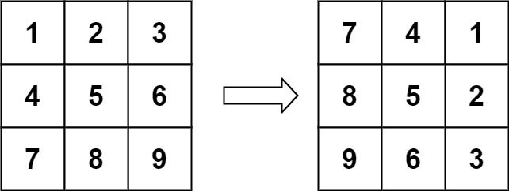
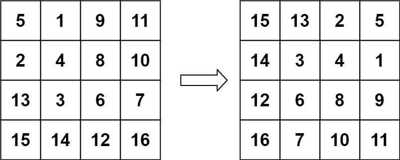

# [48. 旋转图像](https://leetcode.cn/problems/rotate-image)

## 题目描述

给定一个 *n* × *n* 的二维矩阵 `matrix` 表示一个图像。请你将图像顺时针旋转 90 度。

你必须在**原地** 旋转图像，这意味着你需要直接修改输入的二维矩阵。**请不要** 使用另一个矩阵来旋转图像。

**示例 1：**



```
输入：matrix = [[1,2,3],[4,5,6],[7,8,9]]
输出：[[7,4,1],[8,5,2],[9,6,3]]
```

**示例 2：**



```
输入：matrix = [[5,1,9,11],[2,4,8,10],[13,3,6,7],[15,14,12,16]]
输出：[[15,13,2,5],[14,3,4,1],[12,6,8,9],[16,7,10,11]]
```

**提示：**

- `n == matrix.length == matrix[i].length`
- `1 <= n <= 20`
- `-1000 <= matrix[i][j] <= 1000`

## 解法一：两步变换

### 1. 转置矩阵（Transpose）

- 把 `matrix[i][j]` 和 `matrix[j][i]` 互换
- 本质是把行列互换

示例：

```
原始：
1 2 3
4 5 6
7 8 9

转置后：
1 4 7
2 5 8
3 6 9
```

### 2：左右翻转每一行（Horizontal reverse）

```
1 4 7   →   7 4 1
2 5 8   →   8 5 2
3 6 9   →   9 6 3
```

最终得到顺时针旋转 90 度的图像！

### 实现代码

```typescript
function rotate(matrix: number[][]): void {
    const n = matrix.length
    // Step 1: 转置矩阵
    for (let i = 0; i < n; i++) {
        for (let j = i + 1; j < n; j++) {
            [matrix[i][j], matrix[j][i]] = [matrix[j][i], matrix[i][j]];
        }
    }

    // Step 2: 每一行进行翻转
    for (let i = 0; i < n; i++) {
        matrix[i].reverse();
    }
};
```

### 复杂度分析

| 类型       | 复杂度                      |
| ---------- | --------------------------- |
| 时间复杂度 | O(n²) 两层循环              |
| 空间复杂度 | O(1) 原地操作，没有额外空间 |

### 拓展

如果题目要求：

- **逆时针旋转 90 度**：
  - 步骤变为：**转置后上下翻转（reverse 行的顺序）**
- **顺时针 180 度**：
  - 先水平翻转，再垂直翻转（或一次 swap 4 个角）
- **顺时针 270 度（逆时针 90 度）**：
  - 转置后再垂直翻转

## 解法二：按圈旋转

### 核心思想

将矩阵按层（外圈 → 内圈）分解，每一圈旋转时，每次移动 4 个数的位置，实现原地旋转。

对于一个元素 `matrix[i][j]`，将它顺时针移动：

```
top → right → bottom → left → top
```

这个过程等价于 **4 次值交换**：

```
// 每一圈中的每个元素 (i, j)，对应的四个位置为：

matrix[i][j]                 // top-left
matrix[j][n - 1 - i]         // top-right
matrix[n - 1 - i][n - 1 - j] // bottom-right
matrix[n - 1 - j][i]         // bottom-left
```

我们需要把：

```
bottom-left → top-left  
bottom-right → bottom-left  
top-right → bottom-right  
top-left → top-right
```

这样 4 个位置的数据进行 **顺时针旋转交换**。

### 代码实现

```typescript
function rotate(matrix: number[][]): void {
    const n = matrix.length;

    // 一圈一圈地处理：总共 Math.floor(n / 2) 圈
    for (let layer = 0; layer < Math.floor(n / 2); layer++) {
        const first = layer;
        const last = n - 1 - layer;

        for (let i = first; i < last; i++) {
            const offset = i - first;

            // 保存 top-left
            const top = matrix[first][i];
            // 左 → 上
            matrix[first][i] = matrix[last - offset][first];
            // 下 → 左
            matrix[last - offset][first] = matrix[last][last - offset];
            // 右 → 下
            matrix[last][last - offset] = matrix[i][last];
            // top → 右
            matrix[i][last] = top;
        }
    }
}
```

### 复杂度分析

| 项目       | 复杂度                      |
| ---------- | --------------------------- |
| 时间复杂度 | O(n²) — 每个元素访问 1 次   |
| 空间复杂度 | O(1) — 原地操作，无额外结构 |
