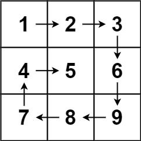
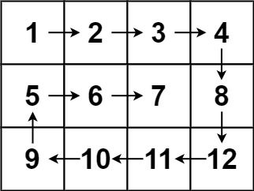

# [54. 螺旋矩阵](https://leetcode.cn/problems/spiral-matrix)

## 题目描述

给你一个 `m` 行 `n` 列的矩阵 `matrix` ，请按照 **顺时针螺旋顺序** ，返回矩阵中的所有元素。

**示例 1：**



```
输入：matrix = [[1,2,3],[4,5,6],[7,8,9]]
输出：[1,2,3,6,9,8,7,4,5]
```

**示例 2：**



```
输入：matrix = [[1,2,3,4],[5,6,7,8],[9,10,11,12]]
输出：[1,2,3,4,8,12,11,10,9,5,6,7]
```

**提示：**

- `m == matrix.length`
- `n == matrix[i].length`
- `1 <= m, n <= 10`
- `-100 <= matrix[i][j] <= 100`

## 解法一：按层模拟

### 思路分析

我们可以把螺旋遍历看成是：**从外向内一圈一圈地遍历**。

每一圈的顺序如下：

1. 👉 向右遍历最上边一行
2. 👇 向下遍历最右边一列
3. 👈 向左遍历最下边一行（如果未重复）
4. ☝️ 向上遍历最左边一列（如果未重复）

**逐步缩小边界**，使用四个变量来维护边界：

- `top`：当前上边界
- `bottom`：当前下边界
- `left`：当前左边界
- `right`：当前右边界

每遍历一条边，就缩小相应的边界，直到所有元素都被访问。

### 代码实现

```typescript
function spiralOrder(matrix: number[][]): number[] {
    const result: number[] = [];

    if (matrix.length === 0 || matrix[0].length === 0) return result;

    let top = 0;
    let bottom = matrix.length - 1;
    let left = 0;
    let right = matrix[0].length - 1;

    while (top <= bottom && left <= right) {
        // 👉 从左到右
        for (let col = left; col <= right; col++) {
            result.push(matrix[top][col]);
        }
        top++; // 上边界下移

        // 👇 从上到下
        for (let row = top; row <= bottom; row++) {
            result.push(matrix[row][right]);
        }
        right--; // 右边界左移

        // 👈 从右到左（注意：此时还需要判断是否越界）
        if (top <= bottom) {
            for (let col = right; col >= left; col--) {
                result.push(matrix[bottom][col]);
            }
            bottom--; // 下边界上移
        }

        // ☝️ 从下到上（同样需要判断）
        if (left <= right) {
            for (let row = bottom; row >= top; row--) {
                result.push(matrix[row][left]);
            }
            left++; // 左边界右移
        }
    }

    return result;
}
```

#### 疑惑解答

为什么第 3 步（从右到左）和第 4 步（从下到上）需要判断？

原因：**有可能已经越界了**

当矩阵比较“扁”或者“长”的时候，有可能在执行完前两步后，**当前的上下/左右边界已经交错**，即：

```
top > bottom   或   left > right
```

如果这时你还继续去执行“从右到左”或“从下到上”的遍历，就会**重复访问已经访问过的元素**，甚至**访问无效区域**。

举个例子来说明：

```
matrix = [
  [1, 2, 3],
  [4, 5, 6]
]
```

这是一个 **2 行 3 列** 的矮胖矩阵。顺时针遍历过程如下：

- 👉 右：1, 2, 3
- 👇 下：6
- 👈 左：5, 4
- ☝️ 上：❌ ❗越界了

**为什么？**

- 此时 `top = 1`，`bottom = 1`，再 `bottom--` → `bottom = 0`
- 下一步若不判断就执行 `row = bottom to top`，即 `0 → 1`，方向错误，重复访问。

同理特别瘦高的矩阵就需要往左遍历是进行判断，更本质的原因是：

| 步骤       | 是否一定需要判断 | 原因               |
| ---------- | ---------------- | ------------------ |
| 👉 从左到右 | ❌ 不需要判断     | 总是起始新的一圈   |
| 👇 从上到下 | ❌ 不需要判断     | 总是起始新的一圈   |
| 👈 从右到左 | ✅ 需要判断       | 上下边界可能已交错 |
| ☝️ 从下到上 | ✅ 需要判断       | 左右边界可能已交错 |

### 复杂度分析

| 类型 | 复杂度                        |
| ---- | ----------------------------- |
| 时间 | ✅ O(m × n) — 每个元素访问一次 |
| 空间 | ✅ O(1)（不算返回结果）        |

### 总结技巧

| 技巧     | 描述                                      |
| -------- | ----------------------------------------- |
| 边界变量 | `top`, `bottom`, `left`, `right` 控制每圈 |
| 顺序方向 | 右 → 下 → 左 → 上                         |
| 越界判断 | 每次都要判断 top ≤ bottom, left ≤ right   |
| 类型归类 | 属于“矩阵模拟类”题，练逻辑循环控制        |