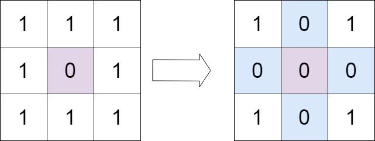
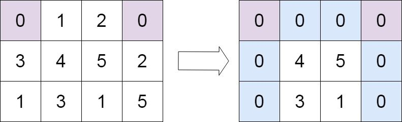

# [73. 矩阵置零](https://leetcode.cn/problems/set-matrix-zeroes)

## 题目描述

给定一个 `m x n` 的矩阵，如果一个元素为 **0** ，则将其所在行和列的所有元素都设为 **0** 。请使用**原地**算法。

**示例 1：**



```
输入：matrix = [[1,1,1],[1,0,1],[1,1,1]]
输出：[[1,0,1],[0,0,0],[1,0,1]]
```

**示例 2：**



```
输入：matrix = [[0,1,2,0],[3,4,5,2],[1,3,1,5]]
输出：[[0,0,0,0],[0,4,5,0],[0,3,1,0]]
```

**提示：**

- `m == matrix.length`
- `n == matrix[0].length`
- `1 <= m, n <= 200`
- `-231 <= matrix[i][j] <= 231 - 1`

**进阶：**

- 一个直观的解决方案是使用  `O(mn)` 的额外空间，但这并不是一个好的解决方案。
- 一个简单的改进方案是使用 `O(m + n)` 的额外空间，但这仍然不是最好的解决方案。
- 你能想出一个仅使用常量空间的解决方案吗？

## 解法一：暴力解法

### 核心思想

用一个等大的空间把给定的矩阵存起来，然后遍历这个矩阵，遇到 0 就把原矩阵的当前行，当前列全部变作 0，然后继续遍历。

### 代码实现

```typescript
export const violent = (matrix: number[][])=> {
    const row = matrix.length;
    const col = matrix[0].length;
    const matrix_copy: number[][] = Array.from({ length: row }, () => []);
    //复制矩阵
    for (let i = 0; i < row; i++) {
        for (let j = 0; j < col; j++) {
            matrix_copy[i][j] = matrix[i][j];
        }
    }
    //第 col 列全部置为 0
    const  setColZeroes = (matrix: number[][],  col: number) => {
        for (let i = 0; i < matrix.length; i++) {
            matrix[i][col] = 0;
        }
    }
    //第 rol 行全部置为 0
    const setRowZeroes =  (matrix: number[][], row: number)=> {
        for (let i = 0; i < matrix[row].length; i++) {
            matrix[row][i] = 0;
        }
    }
    for (let i = 0; i < row; i++) {
        for (let j = 0; j < col; j++) {
            // 找到 0 的位置
            if (matrix_copy[i][j] == 0) {
                //将当前行，当前列置为 0
                setRowZeroes(matrix, i);
                setColZeroes(matrix, j);
            }

        }
    }
}
```

### 复杂度分析

+ 时间复杂度：O(mn)。

+ 空间复杂度：O(mn)。m 和 n 分别是矩阵的行数和列数。

## 解法二：原地标记

### 核心思想

利用矩阵的 **第一行和第一列** 作为“标记数组”，来记录哪些行和列需要被置零。

### 步骤详解

1. **先遍历第一列**，记录是否要将第一列清零（用变量 `isCol`）

2. **从 `[0][1]` 开始遍历矩阵**（跳过第一列）：

   - 如果 `matrix[i][j] == 0`，说明第 `i` 行、第 `j` 列要清零

   - 用 `matrix[i][0] = 0` 和 `matrix[0][j] = 0` 来记录这个信息

3. **再次遍历矩阵（从后往前）**：

   - 如果 `matrix[i][0] == 0` 或 `matrix[0][j] == 0`，就把 `matrix[i][j] = 0`

   - 特别注意顺序：**从后往前遍历，避免提前覆盖第一行/列的标记**

4. **最后根据 `isCol` 变量决定是否清空第一列**

5. **第一行是否清零？由 `matrix[0][0] == 0` 决定**

### 代码实现

```typescript
function setZeroes(matrix: number[][]): void {
    const m = matrix.length;
    const n = matrix[0].length;
    let isCol = false; // 标记第一列是否清零

    // 第一步：先用第一行第一列做标记
    for (let i = 0; i < m; i++) {
        if (matrix[i][0] === 0) isCol = true;

        for (let j = 1; j < n; j++) {
            if (matrix[i][j] === 0) {
                matrix[i][0] = 0; // 标记第 i 行
                matrix[0][j] = 0; // 标记第 j 列
            }
        }
    }

    // 第二步：根据标记置零（从后往前避免提前覆盖标记）
    for (let i = m - 1; i >= 0; i--) {
        for (let j = n - 1; j >= 1; j--) {
            if (matrix[i][0] === 0 || matrix[0][j] === 0) {
                matrix[i][j] = 0;
            }
        }
        if (isCol) {
            matrix[i][0] = 0;
        }
    }
}
```

### 实例解析

我们以这个矩阵为例：

```
[
  [1, 1, 1],
  [1, 0, 1],
  [1, 1, 1]
]
```

#### 步骤 1：首次遍历并标记（使用第一行和第一列）

我们用：

- 第一列记录**哪一行**需要清零
- 第一行记录**哪一列**需要清零

逐行检查：

- `matrix[1][1] == 0` → 所在行 `1` 和列 `1` 要置零
  - 所以我们设置：
    - `matrix[1][0] = 0`（标记第1行）
    - `matrix[0][1] = 0`（标记第1列）

标记后的矩阵：

```
[
  [1, 0, 1],
  [0, 0, 1],
  [1, 1, 1]
]
```

------

#### 步骤 2：从后向前遍历，应用标记

从右下角 `(2,2)` 开始倒序遍历。我们忽略第一列 `j = 0` 的处理，最后单独处理。

我们现在根据 `matrix[i][0] == 0` 或 `matrix[0][j] == 0` 来决定是否把 `matrix[i][j]` 置为 0。

逐个检查：

- `matrix[2][2]`：
  - `matrix[2][0] = 1` ✅
  - `matrix[0][2] = 1` ✅ → 保持不变
- `matrix[2][1]`：
  - `matrix[0][1] = 0` ❌ → 置为 0
- `matrix[2][0]`：
  - 稍后处理
- `matrix[1][2]`：
  - `matrix[1][0] = 0` ❌ → 置为 0
- `matrix[1][1]`：
  - 原本就是 0
- `matrix[1][0]`：
  - 稍后处理
- `matrix[0][2]`：
  - `matrix[0][2] = 1` ✅
  - `matrix[0][0] = 1` ✅ → 保持不变
- `matrix[0][1] = 0` → 所在列标记为 0 → `matrix[0][1]` = 0

✅ 传播后的矩阵变成：

```
[
  [1, 0, 1],
  [0, 0, 0],
  [1, 0, 1]
]
```

------

#### 步骤 3：处理第一列

我们之前用了一个变量 `isCol` 记录是否第一列有 0。

- 原始矩阵中第一列：`[1, 1, 1]` → 没有 0 → `isCol = false`
- 所以第一列不需要清零。

------

#### 最终结果

```
[
  [1, 0, 1],
  [0, 0, 0],
  [1, 0, 1]
]
```

#### 总结图解流程

| 步骤         | 图形描述                               |
| ------------ | -------------------------------------- |
| 初始矩阵     | `[[1,1,1],[1,0,1],[1,1,1]]`            |
| 标记位置     | `matrix[1][0] = 0`, `matrix[0][1] = 0` |
| 标记后的矩阵 | `[[1,0,1],[0,0,1],[1,1,1]]`            |
| 根据标记置零 | 中间和右下被置为 0，逐步修改           |
| 检查第一列   | 不是 0，不处理                         |
| 最终结果     | `[[1,0,1],[0,0,0],[1,0,1]]`            |

### 复杂度分析

+ 时间复杂度  O(m × n) ： 遍历矩阵两次
+ 空间复杂度  O(1) ： 没有额外数组，只用了几个变量

### 总结技巧

| 重点                     | 说明                                   |
| ------------------------ | -------------------------------------- |
| 标记行列用哪里？         | 用矩阵第一行和第一列                   |
| 如何避免提前污染？       | 从后往前遍历，保住第一行/列的标记作用  |
| 是否需要单独标记第一列？ | 需要 — 用 `isCol` 来处理第一列是否清零 |
| 第一行怎么判断是否清零？ | 看 `matrix[0][0]` 是否为 0             |