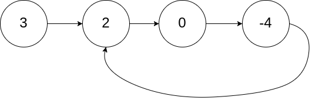
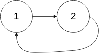
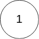

# [142. 环形链表 II](https://leetcode.cn/problems/linked-list-cycle-ii)

## 题目描述

给定一个链表的头节点  `head` ，返回链表开始入环的第一个节点。 *如果链表无环，则返回 `null`。*

如果链表中有某个节点，可以通过连续跟踪 `next` 指针再次到达，则链表中存在环。 为了表示给定链表中的环，评测系统内部使用整数 `pos` 来表示链表尾连接到链表中的位置（**索引从 0 开始**）。如果 `pos` 是 `-1`，则在该链表中没有环。**注意：`pos` 不作为参数进行传递**，仅仅是为了标识链表的实际情况。

**不允许修改** 链表。

**示例 1：**



```
输入：head = [3,2,0,-4], pos = 1
输出：返回索引为 1 的链表节点
解释：链表中有一个环，其尾部连接到第二个节点。
```

**示例 2：**



```
输入：head = [1,2], pos = 0
输出：返回索引为 0 的链表节点
解释：链表中有一个环，其尾部连接到第一个节点。
```

**示例 3：**



```
输入：head = [1], pos = -1
输出：返回 null
解释：链表中没有环。
```

**提示：**

- 链表中节点的数目范围在范围 `[0, 104]` 内
- `-105 <= Node.val <= 105`
- `pos` 的值为 `-1` 或者链表中的一个有效索引

**进阶：**你是否可以使用 `O(1)` 空间解决此题？

## 解法

### 方法一：快慢指针

我们先利用快慢指针判断链表是否有环，如果有环的话，快慢指针一定会相遇，且相遇的节点一定在环中。

如果没有环，快指针会先到达链表尾部，直接返回 `null` 即可。

如果有环，我们再定义一个答案指针 $ans$ 指向链表头部，然后让 $ans$ 和慢指针一起向前走，每次走一步，直到 $ans$ 和慢指针相遇，相遇的节点即为环的入口节点。

为什么这样能找到环的入口节点呢？

我们不妨假设链表头节点到环入口的距离为 $x$，环入口到相遇节点的距离为 $y$，相遇节点到环入口的距离为 $z$，那么慢指针走过的距离为 $x+y$，快指针走过的距离为 $x+y+k×(y+z)$，其中 $k$ 是快指针在环中绕了 $k$ 圈。


由于快指针速度是慢指针的 2 倍，因此有 $2×(x+y)=x+y+k×(y+z)$，可以推出 ， $x+y=k×(y+z)$，即 $x=(k−1)×(y+z)+z$ 。

根据上式分析，$k \ge 1$ 即快指针必须绕一圈才能和慢指针相遇，且在环内会存在相遇多次的情况。

不妨取第一次相遇时，即绕环第一圈 $k=1$时，存在 $x = z$，也即是说，如果我们定义一个答案指针 $ans$ 指向链表头部，快慢指针相遇后，然后 $ans$ 和慢指针一起向前走，那么它们一定会在环入口相遇。

时间复杂度 $O(n)$，其中  $n$ 是链表中节点的数目。空间复杂度  $O(1)$。

```typescript
function detectCycle(head: ListNode | null): ListNode | null {
    let [slow, fast] = [head, head];
    while (fast && fast.next) {
        slow = slow.next;
        fast = fast.next.next;
        if (slow === fast) {
            let ans = head;
            while (ans !== slow) {
                ans = ans.next;
                slow = slow.next;
            }
            return ans;
        }
    }
    return null;
}
```

