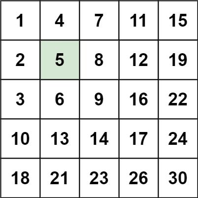
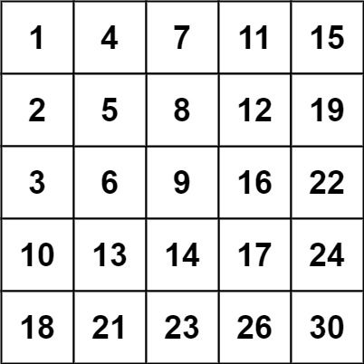

# [240. 搜索二维矩阵 II](https://leetcode.cn/problems/search-a-2d-matrix-ii)

## 题目描述

编写一个高效的算法来搜索 `m x n` 矩阵 `matrix` 中的一个目标值 `target` 。该矩阵具有以下特性：

- 每行的元素从左到右升序排列。
- 每列的元素从上到下升序排列。

**示例 1：**



```
输入：matrix = [[1,4,7,11,15],[2,5,8,12,19],[3,6,9,16,22],[10,13,14,17,24],[18,21,23,26,30]], target = 5
输出：true
```

**示例 2：**



```
输入：matrix = [[1,4,7,11,15],[2,5,8,12,19],[3,6,9,16,22],[10,13,14,17,24],[18,21,23,26,30]], target = 20
输出：false
```

**提示：**

- `m == matrix.length`
- `n == matrix[i].length`
- `1 <= n, m <= 300`
- `-109 <= matrix[i][j] <= 109`
- 每行的所有元素从左到右升序排列
- 每列的所有元素从上到下升序排列
- `-109 <= target <= 109`

## 解法一：二分查找

由于每一行的所有元素升序排列，因此，对于每一行，我们可以使用二分查找找到第一个大于等于 `target` 的元素，然后判断该元素是否等于 `target`。如果等于 `target`，说明找到了目标值，直接返回 `true`。如果不等于 `target`，说明这一行的所有元素都小于 `target`，应该继续搜索下一行。

如果所有行都搜索完了，都没有找到目标值，说明目标值不存在，返回 `false`。

### 代码实现

```typescript
function searchMatrix(matrix: number[][], target: number): boolean {
    const n = matrix[0].length;
    for (const row of matrix) {
        const j = binarySearch(row, target);
        if (j < n && row[j] === target) {
            return true;
        }
    }
    return false;
}

function binarySearch(nums: number[],  target: number) {
    let start = 0;
    let end = nums.length - 1;
    while (start <= end) {
        const mid = (start + end) >>> 1;
        if (nums[mid] == target) {
            return mid;
        } else if (nums[mid] < target) {
            start = mid + 1;
        } else {
            end = mid - 1;
        }
    }
    return -1;
}
```

### 复杂度分析

+ 时间复杂度 `O(mlog⁡n)`，其中 m 和 n 分别为矩阵的行数和列数
+ 空间复杂度 `O(1)`

## 解法二：剪枝搜索

从矩阵的 **右上角** 开始看：

```
当前元素 matrix[row][col]：

- 如果 target < 当前元素：说明当前列太大了，向左移动（col--）
- 如果 target > 当前元素：说明当前行太小了，向下移动（row++）
- 相等 → 找到目标，返回 true
```

### 代码实现

```typescript
function searchMatrix(matrix: number[][], target: number): boolean {
    const [m, n] = [matrix.length, matrix[0].length];
    if(m === 0 || n === 0) return false;
    let [i, j] = [m - 1, 0];
    while (i >= 0 && j < n) {
        if (matrix[i][j] === target) {
            return true;
        }
        if (matrix[i][j] > target) {
            --i;
        } else {
            ++j;
        }
    }
    return false;
}
```

### 复杂度分析

| 项目       | 复杂度                     |
| ---------- | -------------------------- |
| 时间复杂度 | `O(m + n)` — 最多走 m+n 步 |
| 空间复杂度 | `O(1)` — 原地比较          |