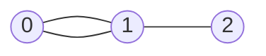

## 基础概念

### 什么是图

**图（Graph）** 是一种由 **节点（Node/Vertex）** 和 **边（Edge）** 组成的数据结构，用来描述事物之间的 **关系**。

- **节点（Vertex）**：代表事物本身（例如：人、城市、网页）。
- **边（Edge）**：代表事物之间的关系（例如：好友关系、道路、超链接）。

#### **例子1：社交网络**

- **节点**：每个用户（Alice、Bob、Charlie...）。
- **边**：用户之间的好友关系（Alice 和 Bob 是好友，Bob 和 Charlie 是好友）。

> 其中，每个用户有多少个好友，就叫作顶点的**度**（degree），就是跟顶点相连接的边的条数。

#### **例子2：交通路线**

- **节点**：城市（北京、上海、广州...）。
- **边**：城市之间的公路或航线（北京到上海的高铁，上海到广州的航班）。

### 图的关键特性

#### 有向图 vs 无向图

- **无向图**：边没有方向，关系是双向的。例如：微信好友（如果 Alice 是 Bob 的好友，Bob 也是 Alice 的好友）。
- **有向图**：边有方向，关系是单向的。例如：微博关注（Alice 关注了 Bob，但 Bob 不一定关注 Alice）。

> 在有向图中，我们把度分为**入度**（In-degree）和**出度**（Out-degree）。
>
> + 顶点的入度，表示有多少条边指向这个顶点；
> + 顶点的出度，表示有多少条边是以这个顶点为起点指向其他顶点。
>
> 对应到微博的例子，入度就表示有多少粉丝，出度就表示关注了多少人。

#### **权重图 vs 无权图**

- **无权图**：边只表示关系是否存在（例如：是否好友）。
- **权重图**：边有数值（权重），表示关系的强度或代价。例如：QQ 好友中好友间有亲密度的概念。

### 图的代码表示



#### 邻接矩阵（Adjacency Matrix）

用二维数组 `matrix[i][j]` 表示节点 `i` 和 `j` 是否相连（或权重）：

```python
# 无权图的邻接矩阵
graph = [
    [0, 1, 0],  # 节点 0 连接到节点 1
    [1, 0, 1],  # 节点 1 连接到节点 0 和 2
    [0, 1, 0]   # 节点 2 连接到节点 1
]
```

#### 邻接表（Adjacency List）

用哈希表或数组存储每个节点的邻居：

```python
# 邻接表（更节省空间）
graph = {
    0: [1],
    1: [0, 2],
    2: [1]
}
```

### 图的应用场景

1. **路径问题**：
   - 导航软件（最短路径：Dijkstra 算法）
   - 社交网络中的好友推荐（共同好友）
2. **网络分析**：
   - 网页排名（PageRank 算法）
   - 传染病的传播路径
3. **依赖关系**：
   - 课程选修顺序（拓扑排序）
   - 任务调度（检测循环依赖）
