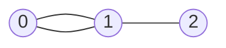

## 基础概念

### 什么是图

**图（Graph）** 是一种由 **节点（Node/Vertex）** 和 **边（Edge）** 组成的数据结构，用来描述事物之间的 **关系**。

- **节点（Vertex）**：代表事物本身（例如：人、城市、网页）。
- **边（Edge）**：代表事物之间的关系（例如：好友关系、道路、超链接）。

#### **例子1：社交网络**

- **节点**：每个用户（Alice、Bob、Charlie...）。
- **边**：用户之间的好友关系（Alice 和 Bob 是好友，Bob 和 Charlie 是好友）。

> 其中，每个用户有多少个好友，就叫作顶点的**度**（degree），就是跟顶点相连接的边的条数。

#### **例子2：交通路线**

- **节点**：城市（北京、上海、广州...）。
- **边**：城市之间的公路或航线（北京到上海的高铁，上海到广州的航班）。

### 图的关键特性

#### 有向图 vs 无向图

- **无向图**：边没有方向，关系是双向的。例如：微信好友（如果 Alice 是 Bob 的好友，Bob 也是 Alice 的好友）。
- **有向图**：边有方向，关系是单向的。例如：微博关注（Alice 关注了 Bob，但 Bob 不一定关注 Alice）。

> 在有向图中，我们把度分为**入度**（In-degree）和**出度**（Out-degree）。
>
> + 顶点的入度，表示有多少条边指向这个顶点；
> + 顶点的出度，表示有多少条边是以这个顶点为起点指向其他顶点。
>
> 对应到微博的例子，入度就表示有多少粉丝，出度就表示关注了多少人。

#### **权重图 vs 无权图**

- **无权图**：边只表示关系是否存在（例如：是否好友）。
- **权重图**：边有数值（权重），表示关系的强度或代价。例如：QQ 好友中好友间有亲密度的概念。

### 图的代码表示



#### 邻接矩阵（Adjacency Matrix）

用二维数组 `matrix[i][j]` 表示节点 `i` 和 `j` 是否相连（或权重）：

```python
# 无权图的邻接矩阵
graph = [
    [0, 1, 0],  # 节点 0 连接到节点 1
    [1, 0, 1],  # 节点 1 连接到节点 0 和 2
    [0, 1, 0]   # 节点 2 连接到节点 1
]
```

#### 邻接表（Adjacency List）

用哈希表或数组存储每个节点的邻居：

```python
# 邻接表（更节省空间）
graph = {
    0: [1],
    1: [0, 2],
    2: [1]
}
```

### 图的应用场景

1. **路径问题**：
   - 导航软件（最短路径：Dijkstra 算法）
   - 社交网络中的好友推荐（共同好友）
2. **网络分析**：
   - 网页排名（PageRank 算法）
   - 传染病的传播路径
3. **依赖关系**：
   - 课程选修顺序（拓扑排序）
   - 任务调度（检测循环依赖）


## 图的遍历

用邻接表（Adjacency List）存储图，每个节点维护一个邻居列表：

```typescript
class Graph<T> {
  // 使用 Map 存储节点及其邻居列表
  private adjacencyList: Map<T, T[]>;

  constructor() {
    this.adjacencyList = new Map();
  }

  // 添加节点
  addNode(node: T): void {
    if (!this.adjacencyList.has(node)) {
      this.adjacencyList.set(node, []);
    }
  }

  // 添加边（无向图）
  addEdge(node1: T, node2: T): void {
    if (!this.adjacencyList.has(node1)) this.addNode(node1);
    if (!this.adjacencyList.has(node2)) this.addNode(node2);
    
    this.adjacencyList.get(node1)?.push(node2);
    this.adjacencyList.get(node2)?.push(node1); // 有向图则删除此行
  }

  // 获取所有节点
  getNodes(): T[] {
    return Array.from(this.adjacencyList.keys());
  }

  // 获取邻居
  getNeighbors(node: T): T[] {
    return this.adjacencyList.get(node) || [];
  }
}
```

### 深度优先遍历（DFS）

从起点出发，尽可能深地探索分支，使用**栈**或**递归**实现。

#### 递归实现（隐式栈）

```typescript
class Graph<T> {

  // DFS 递归实现
  dfs(start: T): T[] {
    const visited = new Set<T>();
    const result: T[] = [];

    const dfsVisit = (node: T) => {
      if (visited.has(node)) return;
      visited.add(node);
      result.push(node);
      const neighbors = this.getNeighbors(node);
      for (const neighbor of neighbors) {
        dfsVisit(neighbor);
      }
    };

    dfsVisit(start);
    return result;
  }
}
```

#### 栈实现（显式栈）

```typescript
class Graph<T> {
  // DFS 栈实现
  dfsStack(start: T): T[] {
    const stack: T[] = [start];
    const visited = new Set<T>();
    const result: T[] = [];

    while (stack.length > 0) {
      const node = stack.pop()!; // 弹出栈顶
      if (!visited.has(node)) {
        visited.add(node);
        result.push(node);
        // 将邻居逆序入栈，保证顺序与递归一致
        const neighbors = this.getNeighbors(node).reverse();
        for (const neighbor of neighbors) {
          stack.push(neighbor);
        }
      }
    }
    return result;
  }
}
```

### 广度优先遍历（BFS）

按层探索，使用**队列**实现，适合最短路径问题。

```typescript
class Graph<T> {

  // BFS 队列实现
  bfs(start: T): T[] {
    const queue: T[] = [start];
    const visited = new Set<T>();
    const result: T[] = [];

    visited.add(start);

    while (queue.length > 0) {
      const node = queue.shift()!; // 从队列头部取出
      result.push(node);
      const neighbors = this.getNeighbors(node);
      for (const neighbor of neighbors) {
        if (!visited.has(neighbor)) {
          visited.add(neighbor);
          queue.push(neighbor);
        }
      }
    }
    return result;
  }
}
```

### **测试代码**

假设有以下无向图：

```
A —— B
|    |
C —— D
```

[[traverse.view|图的遍历]]
#### **构建图并测试遍历**

```typescript
const graph = new Graph<string>();
graph.addEdge('A', 'B');
graph.addEdge('A', 'C');
graph.addEdge('B', 'D');
graph.addEdge('C', 'D');

// DFS 递归
console.log(graph.dfs('A'));      // 输出: ['A', 'B', 'D', 'C']

// DFS 栈
console.log(graph.dfsStack('A')); // 输出: ['A', 'B', 'D', 'C']

// BFS
console.log(graph.bfs('A'));      // 输出: ['A', 'C', 'B', 'D']
```

### **关键差异总结**

| **特性**       | **DFS（深度优先）**          | **BFS（广度优先）**          |
| :------------- | :--------------------------- | :--------------------------- |
| **数据结构**   | 栈（递归或显式栈）           | 队列                         |
| **遍历顺序**   | 深入到底再回溯               | 按层逐层扩展                 |
| **适用场景**   | 路径存在性、拓扑排序、连通块 | 最短路径（无权图）、层序遍历 |
| **空间复杂度** | O(H)（H为树的高度）          | O(W)（W为树的最大宽度）      |

### **常见问题**

1. **如何处理有向图？**
   在 `addEdge` 方法中只单向添加边即可。
2. **如何避免循环图中的无限循环？**
   必须用 `visited` 集合记录已访问节点。
3. **权重图如何处理？**
   邻接表可存储对象，例如：`Map<T, { node: T; weight: number }[]>`。

## 拓扑排序

拓扑排序（Topological Sorting）是处理**有向无环图（Directed acyclic graph, DAG）** 的重要算法，核心思想是找到一种节点顺序，使得图中所有边的方向都保持一致（即若存在边 `A → B`，则排序中 `A` 必须出现在 `B` 前面）。它在任务调度、依赖关系处理中非常有用（如课程选修顺序、编译顺序）。

### **拓扑排序的前提条件**

- **图必须是有向无环图（DAG）**，若图中有环，则无法进行拓扑排序。
- **输出结果不唯一**：可能存在多种合法顺序。

### **算法实现**

#### 方法一：Kahn 算法（基于入度）

通过不断删除入度为 0 的节点，并维护一个队列实现：

```typescript
class Graph<T> {

  // 添加边（有向图）
  addDirectedEdge(from: T, to: T): void {
    if (!this.adjacencyList.has(from)) this.addNode(from);
    if (!this.adjacencyList.has(to)) this.addNode(to);
    this.adjacencyList.get(from)?.push(to); // 只添加单向边
  }

  // Kahn算法实现拓扑排序
  topologicalSort(): T[] | null {
    // 初始化入度表
    const inDegree = new Map<T, number>();
    const queue: T[] = [];
    const result: T[] = [];

    // 初始化所有节点的入度为0
    this.adjacencyList.forEach((_, node) => inDegree.set(node, 0));

    // 计算所有节点的入度
    this.adjacencyList.forEach((neighbors, node) => {
      neighbors.forEach(neighbor => {
        inDegree.set(neighbor, (inDegree.get(neighbor) || 0) + 1);
      });
    });

    // 将入度为0的节点加入队列
    inDegree.forEach((degree, node) => {
      if (degree === 0) queue.push(node);
    });

    // 处理队列中的节点
    while (queue.length > 0) {
      const node = queue.shift()!;
      result.push(node);

      // 减少所有邻居的入度
      this.getNeighbors(node).forEach(neighbor => {
        const newDegree = (inDegree.get(neighbor) || 0) - 1;
        inDegree.set(neighbor, newDegree);
        if (newDegree === 0) queue.push(neighbor);
      });
    }

    // 检查是否存在环（结果长度是否等于节点总数）
    return result.length === this.adjacencyList.size ? result : null;
  }
}
```

#### 方法二：DFS 后序遍历反转

通过 DFS 遍历图，按后序完成顺序的反转得到拓扑排序：

```typescript
class Graph<T> { 

  // DFS实现拓扑排序
  topologicalSortDFS(): T[] | null {
    const visited = new Set<T>();
    const stack: T[] = [];
    const result: T[] = [];
    let hasCycle = false;

    const dfs = (node: T, visiting: Set<T>) => {
      if (visiting.has(node)) { // 发现环
        hasCycle = true;
        return;
      }
      if (visited.has(node)) return;

      visiting.add(node);
      this.getNeighbors(node).forEach(neighbor => dfs(neighbor, visiting));
      visiting.delete(node);
      visited.add(node);
      stack.push(node); // 后序压栈
    };

    this.getNodes().forEach(node => {
      if (!visited.has(node)) dfs(node, new Set<T>());
    });

    return hasCycle ? null : stack.reverse(); // 反转后序结果
  }
}
```

### **测试拓扑排序**

#### **测试用例1：课程表（无环）**

[[topological.view|图的拓扑排序]]

假设课程依赖关系如下（LeetCode 207题）：

- 课程 1 依赖课程 0（边 `0 → 1`）
- 课程 2 依赖课程 1（边 `1 → 2`）
- 课程 3 依赖课程 1（边 `1 → 3`）

```typescript
const graph = new Graph<number>();
graph.addDirectedEdge(0, 1);
graph.addDirectedEdge(1, 2);
graph.addDirectedEdge(1, 3);

console.log(graph.topologicalSort());        
// 输出: [0, 1, 2, 3] 或 [0, 1, 3, 2]
console.log(graph.topologicalSortDFS());    
// 输出: [0, 1, 3, 2] 或类似
```

#### **测试用例2：有环图**

若存在环（例如 `0 → 1 → 0`），则无法排序：

```typescript
const cyclicGraph = new Graph<number>();
cyclicGraph.addDirectedEdge(0, 1);
cyclicGraph.addDirectedEdge(1, 0);

console.log(cyclicGraph.topologicalSort());    // 输出: null
console.log(cyclicGraph.topologicalSortDFS()); // 输出: null
```

------

### 关键点总结

| **特性**         | **Kahn算法**            | **DFS后序法**         |
| :--------------- | :---------------------- | :-------------------- |
| **数据结构**     | 队列 + 入度表           | 递归栈 + 后序栈       |
| **检测环的方式** | 最终结果长度 < 节点总数 | 在递归中发现重复访问  |
| **适用场景**     | 直观易懂，适合动态更新  | 适合需要DFS的其他操作 |
| **时间复杂度**   | O(V + E)                | O(V + E)              |

------

### 常见应用场景

1. **课程表问题**：判断能否完成所有课程（LeetCode 207）。
2. **任务调度**：确定任务执行顺序，避免循环依赖。
3. **编译顺序**：确定源代码文件的编译顺序（如 Makefile）。

------

### 结合 LeetCode 实战

**题目**：[207. 课程表](https://leetcode.com/problems/course-schedule/)
**题意**：判断是否能完成所有课程（即图是否为DAG）。
**解法**：直接使用拓扑排序，若存在环则返回`false`。

```typescript
function canFinish(numCourses: number, prerequisites: number[][]): boolean {
  const graph = new Graph<number>();
  prerequisites.forEach(([to, from]) => graph.addDirectedEdge(from, to));
  return graph.topologicalSort() !== null;
}
```

## 最短路径

最短路径算法用于在**加权图**中找到两个节点之间的**路径权重和最小**的路径。不同算法适用于不同场景。

### **算法分类**

| **算法**           | **适用场景**                        | **时间复杂度** | **特点**               |
| :----------------- | :---------------------------------- | :------------- | :--------------------- |
| **Dijkstra**       | 非负权重的有向/无向图（如地图导航） | O((V+E) log V) | 贪心思想，优先队列优化 |
| **Bellman-Ford**   | 含负权重的图，检测负权环            | O(VE)          | 松弛所有边，支持负权重 |
| **Floyd-Warshall** | 所有节点对的最短路径                | O(V³)          | 动态规划，适合小规模图 |

### Dijkstra 算法

#### **实际场景**

假设你在北京，想坐高铁去上海，途经多个城市，每个城市间的高铁票价不同（均为正数）。Dijkstra 算法帮你找到**总票价最低**的路线。

#### **核心思想**

- 贪心策略：每次选择**当前距离起点最近**的节点，更新其邻居的最短距离。
- **仅适用于非负权重边**（权重 ≥ 0）。

#### **关键步骤**

1. 初始化起点距离为 0，其他节点距离为无穷大。
2. 使用优先队列选择当前距离最小的节点。
3. 更新该节点所有邻居的距离。
4. 重复直到所有节点处理完毕。

#### 代码实现

首先，需要实现权重图：

```typescript
export class WeightedGraph<T> {
  protected adjacencyList: Map<T, { node: T; weight: number }[]>;

  // 添加带权重的边（无向图）
  addWeightedEdge(node1: T, node2: T, weight: number): void {
    if (!this.adjacencyList.has(node1)) this.addNode(node1);
    if (!this.adjacencyList.has(node2)) this.addNode(node2);

    this.adjacencyList.get(node1)?.push({ node: node2, weight });
    this.adjacencyList.get(node2)?.push({ node: node1, weight }); // 有向图则删除此行
  }

}
```

然后实现 Dijkstra 算法：

```typescript
export class Dijkstra<T> extends WeightedGraph<T> {
  // 获取从 start 到所有节点的最短距离
  shortestPath(start: T) {
    const distances = new Map<T, number>();
    const predecessors = new Map<T, T>();
    const priorityQueue = new PriorityQueue<T>(
      (a, b) => distances.get(a)! - distances.get(b)!
    );

    // 初始化距离为无穷大，起点距离为0
    // graph.forEach((_, node) => distances.set(node, Infinity));
    this.getNodes().forEach((node) => {
      if (node !== start) {
        distances.set(node, Infinity);
      }
    });
    distances.set(start, 0);
    priorityQueue.enqueue(start);
    const processed = new Set<T>();

    while (!priorityQueue.isEmpty()) {
      const current = priorityQueue.dequeue()!;
      if (processed.has(current)) continue;
      processed.add(current);
      
      const currentDist = distances.get(current)!;

      this.adjacencyList.get(current).forEach(({ node: neighbor, weight }) => {
        const newDist = currentDist + weight;
        if (newDist < (distances.get(neighbor) ?? Infinity)) {
          distances.set(neighbor, newDist);
          predecessors.set(neighbor, current);
          priorityQueue.enqueue(neighbor); // 可能需要重复入队，但优先队列会处理
        }
      });
    }

    return { distances, predecessors };
  }

  // 重构路径（从终点回溯到起点）
  static getPath<T>(predecessors: Map<T, T>, end: T): T[] {
    const path: T[] = [];
    let current: T | undefined = end;
    while (current !== undefined) {
      path.unshift(current);
      current = predecessors.get(current);
    }
    return path;
  }
}

// 优先队列实现（需自行实现或使用第三方库）
class PriorityQueue<T> {
  private elements: T[];
  private compare: (a: T, b: T) => number;

  constructor(compare: (a: T, b: T) => number) {
    this.elements = [];
    this.compare = compare;
  }

  enqueue(element: T): void {
    this.elements.push(element);
    this.elements.sort(this.compare);
  }

  dequeue(): T | undefined {
    return this.elements.shift();
  }

  isEmpty(): boolean {
    return this.elements.length === 0;
  }
}
```

#### 测试用例

[[dijkstra.view]]

```typescript
const graph = new Dijkstra<number>();
// 构建测试图
/*
    0---4---1
    |   | / 
    2---3
*/
graph.addWeightedEdge(0, 2, 1);
graph.addWeightedEdge(0, 4, 2);
graph.addWeightedEdge(2, 3, 1);
graph.addWeightedEdge(3, 1, 3);
graph.addWeightedEdge(4, 1, 5);
graph.addWeightedEdge(4, 3, 2);

const { distances, predecessors } = graph.shortestPath(0);
expect(distances.get(1)).to.equal(5); // 0-2-3-1 (1+1+3)
expect(Dijkstra.getPath(predecessors, 1)).to.deep.equal([0, 2, 3, 1]);
```

### Bellman-Ford 算法

#### **实际场景**

假设你有一张信用卡，某些交易能返现（视为负权重）。Bellman-Ford 算法可以找到一条路径，使得经过某些返现交易后，总支出最少，同时检测是否存在无限返现的漏洞（负权环）

#### **核心思想**

- 通过 **V-1 次松弛操作**（V 为节点数，遍历所有边）逐步逼近最短路径。
- 可检测**负权环**（第 V 次松弛仍能更新则存在环）。

> **松弛操作**是算法的核心机制，其数学定义为：
>
> ```
> 对边(u, v)的松弛操作：
> if d[v] > d[u] + w(u, v) then
>    d[v] = d[u] + w(u, v)
>    predecessor[v] = u
> ```
>
> 假设图有 V 个节点，根据**最短路径子结构性质**，任意两点间的最短路径最多包含 **V-1 条边**（否则会出现环）。通过 V-1 次全局松弛可保证：
>
> 1. **正确性证明**：每次松弛至少能确定一个节点的最短距离
> 2. **收敛保证**：对于无负权环的图，V-1 次松弛后所有节点距离收敛

#### **关键步骤**

1. 初始化起点距离为 0，其他节点为无穷大。
2. 对每条边进行松弛：如果 `distance[u] + weight < distance[v]`，则更新 `distance[v]`。
3. 重复 V-1 次。
4. 第 V 次检查是否还能松弛，若能则存在负权环。

#### **代码实现**

```typescript
class BellmanFord {
  static shortestPath(
    graph: WeightedAdjacencyList,
    start: number
  ): { distances: Map<number, number>; hasNegativeCycle: boolean } {
    const distances = new Map<number, number>();
    let hasNegativeCycle = false;

    // 初始化距离
    graph.forEach((_, node) => distances.set(node, Infinity));
    distances.set(start, 0);

    // 松弛所有边 V-1 次
    const size = graph.size;
    for (let i = 0; i < size - 1; i++) {
      graph.forEach((neighbors, u) => {
        neighbors.forEach(({ node: v, weight }) => {
          if (distances.get(u)! + weight < (distances.get(v) ?? Infinity)) {
            distances.set(v, distances.get(u)! + weight);
          }
        });
      });
    }

    // 检测负权环（第 V 次松弛）
    graph.forEach((neighbors, u) => {
      neighbors.forEach(({ node: v, weight }) => {
        if (distances.get(u)! + weight < (distances.get(v) ?? Infinity)) {
          hasNegativeCycle = true;
        }
      });
    });

    return { distances, hasNegativeCycle };
  }
}
```

#### **测试用例**

```typescript
// 含负权重的图
const graphWithNeg: WeightedAdjacencyList = new Map();
graphWithNeg.set(0, [{ node: 1, weight: 4 }, { node: 2, weight: 1 }]);
graphWithNeg.set(1, [{ node: 3, weight: -2 }]);
graphWithNeg.set(2, [{ node: 1, weight: 2 }, { node: 3, weight: 5 }]);
graphWithNeg.set(3, []);

const result = BellmanFord.shortestPath(graphWithNeg, 0);
console.log(result.distances); // Map { 0 => 0, 1 => 3, 2 => 1, 3 => 1 }
console.log(result.hasNegativeCycle); // false
```

#### 深度解析

对于链状图 `0→1→2→3`，当**边按逆序添加**（即先添加后面的边）时，这会形成算法的最坏情况。让我们通过具体步骤分析：

##### 松弛过程详解（V=4 节点，需要 3 次外层循环）

| 外层循环次 | 处理的边 | 更新情况                | 当前距离变化 |
| :--------- | :------- | :---------------------- | :----------- |
| **第1次**  | 2→3      | 无效（2的距离=∞）       | 无变化       |
|            | 1→2      | 无效（1的距离=∞）       | 无变化       |
|            | 0→1      | **有效**，1的距离=1     | 1: 0→1       |
| **第2次**  | 2→3      | 无效（2的距离=∞）       | 无变化       |
|            | 1→2      | **有效**，2的距离=1+1=2 | 2: 1→2       |
|            | 0→1      | 无变化                  | 保持1        |
| **第3次**  | 2→3      | **有效**，3的距离=2+1=3 | 3: 2→3       |
|            | 1→2      | 无变化                  | 保持2        |
|            | 0→1      | 无变化                  | 保持1        |

##### 关键发现

1. **路径传播特性**：每次外层循环只能将最短路径信息**向前推进一层**
2. **边处理顺序影响**：逆序处理导致算法必须完整执行 V-1 次循环
3. **算法正确性保障**：无论边顺序如何，V-1 次循环确保所有可能的最短路径都被探索

##### 数学证明（归纳法）

- **Base Case**：起点距离为0（正确）
- Inductive Step：
  - 假设经过 k 次外层循环，所有长度 ≤k 的最短路径已被正确计算
  - 第 k+1 次循环将处理所有边，其中包含长度 k+1 的路径
- **Conclusion**：经过 V-1 次循环，所有可能路径（最长 V-1 边）都被处理

### **Floyd-Warshall 算法**

#### 实际场景

航空公司需要计算所有城市之间的最短飞行距离（无论是否有直飞航班），以便为乘客提供最优路线。Floyd-Warshall 算法一次性计算出所有城市对的最短距离。

#### **核心思想**

- 动态规划：计算所有节点对之间的最短路径。
- 通过中间节点逐步优化距离。

#### **关键步骤**

1. 初始化距离矩阵，直连边为权重，非直连边为无穷大。
2. 三重循环遍历所有中间节点 k，更新所有节点对 (i, j) 的距离。
3. 最终得到所有节点对的最短路径。

#### **代码实现**

```typescript
export class FloydWarshall<T> extends WeightedGraph<T> {
  shortestPaths() {
    const nodes = this.getNodes();
    const size = nodes.length;
    const dist: number[][] = Array.from({ length: size }, () =>
      Array(size).fill(Infinity)
    );

    // 建立节点到索引的映射
    const nodeIndex = new Map<T, number>();
    nodes.forEach((node, index) => nodeIndex.set(node, index));

    // 初始化距离矩阵
    nodes.forEach((node, i) => {
      dist[i][i] = 0; // 节点到自身距离为0
      const neighbors = this.getNeighbors(node);
      neighbors.forEach((neighbor) => {
        const j = nodeIndex.get(neighbor.node)!;
        // 跳过自环边（节点自身到自身）
        if (i !== j) {
          // 直接邻居的初始权重
          dist[i][j] = Math.min(dist[i][j], neighbor.weight); 
        }
      });
    });

    // 三重循环更新距离
    for (let k = 0; k < size; k++) {
      for (let i = 0; i < size; i++) {
        for (let j = 0; j < size; j++) {
          if (dist[i][k] + dist[k][j] < dist[i][j]) {
            dist[i][j] = dist[i][k] + dist[k][j];
          }
        }
      }
    }

    return dist;
  }
}
```

#### **测试用例**

```typescript
const graph = new FloydWarshall<string>();

// 构造测试图：
/*
      A-(1)->B
  (5) |     / 
      v    /  
      C<-(2)
*/
graph.addDirectedWeightedEdge("A", "B", 1);
graph.addDirectedWeightedEdge("B", "C", 2);
graph.addDirectedWeightedEdge("A", "C", 5);

const dist = graph.shortestPaths();
// [0, 1, 3]
// [Infinity, 0, 2]
// [Infinity, Infinity, 0]
const nodes = graph.getNodes().sort(); // ['A','B','C']

expect(getDist(dist, nodes, "A", "C")).to.equal(3); // 通过B中转
expect(getDist(dist, nodes, "B", "A")).to.equal(Infinity); // 不可达

// 辅助函数：根据节点列表获取矩阵中的距离值
function getDist(
  dist: number[][],
  nodes: string[],
  from: string,
  to: string
): number {
  const i = nodes.indexOf(from);
  const j = nodes.indexOf(to);
  return i >= 0 && j >= 0 ? dist[i][j] : Infinity;
}
```

#### 深度解析

Floyd-Warshall 算法的三重循环设计基于 #动态规划 思想，其核心理论依据可通过以下要点理解：

##### 动态规划状态定义

定义 `dist[k][i][j]` 表示：

> **从节点i到节点j，且中间节点只能使用前k个节点（按某种顺序编号）的最短路径长度**

通过状态压缩优化后简化为二维数组 `dist[i][j]`，即代码中的实现形式。

##### 状态转移方程

```
dist[i][j] = min( dist[i][j], dist[i][k] + dist[k][j] )
```

该方程的物理含义：

- **不经过k节点**：保持当前已知的最短路径 `dist[i][j]`
- **经过k节点**：`i→k`的最短路径 + `k→j`的最短路径

##### 三重循环的直观解释

1. **最外层循环（k）**：逐步允许使用更多中间节点
   - 当 k=0 时：只允许直接路径（无中间节点）
   - 当 k=1 时：允许经过节点1作为中转
   - 当 k=n 时：允许所有节点作为中转
2. **中间层循环（i）**：起点节点
3. **最内层循环（j）**：终点节点

##### 数学归纳法证明

1. **基础情况**：k=0 时，`dist[i][j]`即为边的权重
2. **归纳假设**：当处理到第 k-1 个节点时，所有路径已是最优
3. 归纳步骤：
   - 处理第 k 个节点时，任何经过 k 的路径都可以分解为 `i→k` 和 `k→j` 两段
   - 根据归纳假设，这两段路径已经是最优解

##### 算法正确性关键

- **路径构造完整性**：所有可能的路径组合都会被检查
- **最优子结构**：最短路径的子路径也是最短的
- **无后效性**：后续计算不会破坏已确定的最优解

### 算法对比与选择

| **场景**               | **推荐算法**   | **原因**                           |
| :--------------------- | :------------- | :--------------------------------- |
| 非负权重，单源最短路径 | Dijkstra       | 高效，时间复杂度低                 |
| 含负权重或检测负权环   | Bellman-Ford   | 能处理负权重，可检测环             |
| 所有节点对的最短路径   | Floyd-Warshall | 直接计算所有对，适合节点数较少的图 |

### LeetCode 实战

**题目**：[743. 网络延迟时间](https://leetcode.com/problems/network-delay-time/)
**题意**：计算信号从起点传播到所有节点的最短时间，若存在无法到达的节点返回 -1。
**解法**：Dijkstra 算法直接应用。

```typescript
function networkDelayTime(times: number[][], n: number, k: number): number {
  const graph: WeightedAdjacencyList = new Map();
  for (let i = 1; i <= n; i++) graph.set(i, []);
  times.forEach(([u, v, w]) => graph.get(u)!.push({ node: v, weight: w }));

  const { distances } = Dijkstra.shortestPath(graph, k);
  let maxTime = 0;
  distances.forEach(time => {
    if (time === Infinity) return -1;
    maxTime = Math.max(maxTime, time);
  });
  return maxTime === Infinity ? -1 : maxTime;
}
```

## 最小生成树

### 基本概念

假设你要在几个城市之间铺设光缆，要求：

1. **所有城市都要连通**（任意两个城市之间可以间接连接）。
2. **总成本最低**（光缆总长度最短）。

这就是**最小生成树**问题——在连通的无向图中，找到一棵边权重和最小的树，连接所有节点。

- **生成树（Spanning Tree）**：包含图中所有顶点的树（无环连通子图）。
- **最小生成树**：所有生成树中，边的权重总和最小的那棵。

### 性质特点

1. **边数固定**：若图有 *V* 个节点，生成树一定有 *V−1* 条边。
2. **不唯一性**：可能存在多个不同的最小生成树（当多条边权重相同时）。
3. **无环**：生成树是树结构，不可能有环。

### 两大核心算法

#### Kruskal 算法

- **核心思想**：贪心选择权重最小的边，并确保不形成环。
- **步骤**：
  1. 将所有边按权重从小到大排序。
  2. 依次选择边，若加入后不形成环，则保留；否则丢弃。
  3. 重复直到选中 *V−1* 条边。

#### 代码实现

```typescript
class Kruskal {
  static findMST(edges: { u: number; v: number; weight: number }[], numNodes: number): { mstEdges: { u: number; v: number; weight: number }[], totalWeight: number } {
    const sortedEdges = [...edges].sort((a, b) => a.weight - b.weight);
    const parent = Array(numNodes).fill(0).map((_, i) => i);
    const mstEdges: { u: number; v: number; weight: number }[] = [];
    let totalWeight = 0;

    // 并查集查找根节点
    const find = (x: number): number => {
      if (parent[x] !== x) parent[x] = find(parent[x]); // 路径压缩
      return parent[x];
    };

    for (const edge of sortedEdges) {
      const rootU = find(edge.u);
      const rootV = find(edge.v);
      if (rootU !== rootV) { // 不形成环
        mstEdges.push(edge);
        totalWeight += edge.weight;
        parent[rootU] = rootV; // 合并集合
        if (mstEdges.length === numNodes - 1) break; // 已选够边
      }
    }

    return { mstEdges, totalWeight };
  }
}
```

#### Prim 算法

- **核心思想**：从任意节点出发，逐步扩展当前树的边，每次选择连接树与非树节点的最小边。
- **步骤**：
  1. 初始化一个节点作为起点。
  2. 维护一个优先队列，存储连接树与非树节点的边。
  3. 每次取出权重最小的边，将新节点加入树。
  4. 重复直到所有节点加入。

#### 代码实现

```typescript
class Prim {
  static findMST(graph: Map<number, { node: number; weight: number }[]>, start: number): { mstEdges: { u: number; v: number; weight: number }[], totalWeight: number } {
    const visited = new Set<number>();
    const priorityQueue = new PriorityQueue<{ u: number; v: number; weight: number }>((a, b) => a.weight - b.weight);
    const mstEdges: { u: number; v: number; weight: number }[] = [];
    let totalWeight = 0;

    visited.add(start);
    graph.get(start)?.forEach(edge => priorityQueue.enqueue({ u: start, v: edge.node, weight: edge.weight }));

    while (!priorityQueue.isEmpty() && visited.size < graph.size) {
      const { u, v, weight } = priorityQueue.dequeue()!;
      if (visited.has(v)) continue;

      visited.add(v);
      mstEdges.push({ u, v, weight });
      totalWeight += weight;

      // 将新节点的边加入队列
      graph.get(v)?.forEach(edge => {
        if (!visited.has(edge.node)) {
          priorityQueue.enqueue({ u: v, v: edge.node, weight: edge.weight });
        }
      });
    }

    return { mstEdges, totalWeight };
  }
}
```

### 算法对比

| **特性**           | **Kruskal算法**    | **Prim算法**               |
| :----------------- | :----------------- | :------------------------- |
| **数据结构**       | 并查集 + 排序边    | 优先队列 + 邻接表          |
| **适用场景**       | 稀疏图（边较少）   | 稠密图（边较多）           |
| **时间复杂度**     | O(E log E)         | O(E log V)（优先队列优化） |
| **是否需要邻接表** | 不需要，直接操作边 | 需要邻接表                 |

### **测试案例**

假设有以下加权无向图：

```
A --2-- B
| \     |
3  4   1
|   \  |
C --5-- D
```

#### 转换为代码输入

```typescript
// Kruskal 输入：边列表
const edges = [
  { u: 0, v: 1, weight: 2 }, // A-B
  { u: 0, v: 2, weight: 3 }, // A-C
  { u: 0, v: 3, weight: 4 }, // A-D
  { u: 1, v: 3, weight: 1 }, // B-D
  { u: 2, v: 3, weight: 5 }, // C-D
];
const numNodes = 4;

// Prim 输入：邻接表
const graph = new Map<number, { node: number; weight: number }[]>();
graph.set(0, [{ node: 1, weight: 2 }, { node: 2, weight: 3 }, { node: 3, weight: 4 }]); // A
graph.set(1, [{ node: 0, weight: 2 }, { node: 3, weight: 1 }]); // B
graph.set(2, [{ node: 0, weight: 3 }, { node: 3, weight: 5 }]); // C
graph.set(3, [{ node: 0, weight: 4 }, { node: 1, weight: 1 }, { node: 2, weight: 5 }]); // D

// 运行算法
const kruskalResult = Kruskal.findMST(edges, 4);
const primResult = Prim.findMST(graph, 0);

console.log('Kruskal MST:', kruskalResult); // 总权重 2+1+3=6
console.log('Prim MST:', primResult);       // 总权重 2+1+3=6
```

### LeetCode 实战

**题目**：[1584. 连接所有点的最小费用](https://leetcode.com/problems/min-cost-to-connect-all-points/)
**题意**：给定二维平面上的点，求连接所有点的最小成本（曼哈顿距离）。
**解法**：Kruskal 或 Prim 均可，需先构建所有边。

```typescript
// 以Kruskal解法为例
function minCostConnectPoints(points: number[][]): number {
  const edges: { u: number; v: number; weight: number }[] = [];
  const n = points.length;
  
  // 构建所有边
  for (let i = 0; i < n; i++) {
    for (let j = i + 1; j < n; j++) {
      const weight = Math.abs(points[i][0] - points[j][0]) + Math.abs(points[i][1] - points[j][1]);
      edges.push({ u: i, v: j, weight });
    }
  }
  
  const { totalWeight } = Kruskal.findMST(edges, n);
  return totalWeight;
}
```

## 连通性问题

### 问题分类

1. **无向图连通性**
   - 连通图：任意两节点间存在路径。
   - 连通分量：极大连通子图（无法再扩大）。
2. **有向图连通性**
   - 强连通：任意两节点**互相可达**。
   - 弱连通：忽略方向后是无向连通图。
   - 强连通分量（SCC）：极大强连通子图。
3. **关键节点与边**
   - **割点（Articulation Point）**：移除后图不再连通的节点。
   - **桥（Bridge）**：移除后图不再连通的边。


### 无向图连通性判断

#### **1. DFS/BFS遍历法**

遍历图，若所有节点均被访问，则为连通图。

```typescript
function isConnected(graph: Map<number, number[]>): boolean {
  const visited = new Set<number>();
  const startNode = graph.keys().next().value;
  if (startNode === undefined) return true; // 空图视为连通

  // DFS遍历
  const dfs = (node: number) => {
    if (visited.has(node)) return;
    visited.add(node);
    graph.get(node)?.forEach(neighbor => dfs(neighbor));
  };
  dfs(startNode);

  return visited.size === graph.size;
}
```

#### **2. 并查集（Union-Find）**

动态合并连通分量，高效判断连通性。

```typescript
class UnionFind {
  private parent: number[];
  constructor(size: number) {
    this.parent = Array(size).fill(-1);
  }
  
  find(x: number): number {
    if (this.parent[x] === -1) return x;
    return this.parent[x] = this.find(this.parent[x]); // 路径压缩
  }
  
  union(x: number, y: number): void {
    const rootX = this.find(x);
    const rootY = this.find(y);
    if (rootX !== rootY) this.parent[rootX] = rootY;
  }
  
  isConnected(): boolean {
    let roots = new Set<number>();
    for (let i = 0; i < this.parent.length; i++) {
      roots.add(this.find(i));
    }
    return roots.size === 1;
  }
}
```

------

### 有向图的强连通分量（SCC）

#### **1. Kosaraju算法**

**步骤**：

1. 对原图DFS，记录完成时间的逆序。
2. 对逆图（边反向）按逆序DFS，每次DFS访问的节点构成一个SCC。

```typescript
function kosaraju(graph: Map<number, number[]>): number[][] {
  const visited = new Set<number>();
  const order: number[] = [];
  const reverseGraph = new Map<number, number[]>();
  const scc: number[][] = [];
  
  // 构建逆图
  graph.forEach((neighbors, node) => {
    neighbors.forEach(neighbor => {
      if (!reverseGraph.has(neighbor)) reverseGraph.set(neighbor, []);
      reverseGraph.get(neighbor)!.push(node);
    });
  });
  
  // 第一次DFS记录完成顺序
  const dfs1 = (node: number) => {
    if (visited.has(node)) return;
    visited.add(node);
    graph.get(node)?.forEach(dfs1);
    order.push(node);
  };
  graph.forEach((_, node) => dfs1(node));
  
  // 第二次DFS在逆图上找SCC
  visited.clear();
  const dfs2 = (node: number, component: number[]) => {
    if (visited.has(node)) return;
    visited.add(node);
    component.push(node);
    reverseGraph.get(node)?.forEach(neighbor => dfs2(neighbor, component));
  };
  
  for (let i = order.length - 1; i >= 0; i--) {
    const node = order[i];
    if (!visited.has(node)) {
      const component: number[] = [];
      dfs2(node, component);
      scc.push(component);
    }
  }
  
  return scc;
}
```

#### **2. Tarjan算法**

**利用DFS栈和追溯值（low值）**，一次遍历找出所有SCC。

```typescript
function tarjan(graph: Map<number, number[]>): number[][] {
  let index = 0;
  const indices = new Map<number, number>();
  const low = new Map<number, number>();
  const stack: number[] = [];
  const onStack = new Set<number>();
  const scc: number[][] = [];
  
  const strongConnect = (node: number) => {
    indices.set(node, index);
    low.set(node, index);
    index++;
    stack.push(node);
    onStack.add(node);
    
    graph.get(node)?.forEach(neighbor => {
      if (!indices.has(neighbor)) {
        strongConnect(neighbor);
        low.set(node, Math.min(low.get(node)!, low.get(neighbor)!));
      } else if (onStack.has(neighbor)) {
        low.set(node, Math.min(low.get(node)!, indices.get(neighbor)!));
      }
    });
    
    if (low.get(node) === indices.get(node)) {
      const component: number[] = [];
      let top: number;
      do {
        top = stack.pop()!;
        onStack.delete(top);
        component.push(top);
      } while (top !== node);
      scc.push(component);
    }
  };
  
  graph.forEach((_, node) => {
    if (!indices.has(node)) strongConnect(node);
  });
  
  return scc;
}
```

------

### **桥与割点检测（Tarjan算法）**

#### **1. 桥（割边）检测**

- **条件**：对于边 `u→v`，若 `low[v] > disc[u]`，则该边为桥。

```typescript
function findBridges(graph: Map<number, number[]>): [number, number][] {
  let time = 0;
  const disc = new Map<number, number>();
  const low = new Map<number, number>();
  const bridges: [number, number][] = [];
  
  const dfs = (u: number, parent: number | null) => {
    disc.set(u, time);
    low.set(u, time);
    time++;
    
    graph.get(u)?.forEach(v => {
      if (!disc.has(v)) {
        dfs(v, u);
        low.set(u, Math.min(low.get(u)!, low.get(v)!));
        if (low.get(v)! > disc.get(u)!) {
          bridges.push([u, v]);
        }
      } else if (v !== parent) {
        low.set(u, Math.min(low.get(u)!, disc.get(v)!));
      }
    });
  };
  
  graph.forEach((_, node) => {
    if (!disc.has(node)) dfs(node, null);
  });
  
  return bridges;
}
```

#### **2. 割点检测**

- **条件**：根节点有至少两个子节点，或非根节点 `u` 存在子节点 `v` 满足 `low[v] >= disc[u]`。

```typescript
function findArticulationPoints(graph: Map<number, number[]>): number[] {
  let time = 0;
  const disc = new Map<number, number>();
  const low = new Map<number, number>();
  const ap = new Set<number>();
  
  const dfs = (u: number, parent: number | null) => {
    let children = 0;
    disc.set(u, time);
    low.set(u, time);
    time++;
    
    graph.get(u)?.forEach(v => {
      if (!disc.has(v)) {
        children++;
        dfs(v, u);
        low.set(u, Math.min(low.get(u)!, low.get(v)!));
        // 根节点且有至少两个子节点
        if (parent === null && children > 1) ap.add(u);
        // 非根节点且满足 low[v] >= disc[u]
        if (parent !== null && low.get(v)! >= disc.get(u)!) ap.add(u);
      } else if (v !== parent) {
        low.set(u, Math.min(low.get(u)!, disc.get(v)!));
      }
    });
  };
  
  graph.forEach((_, node) => {
    if (!disc.has(node)) dfs(node, null);
  });
  
  return Array.from(ap);
}
```

------

### LeetCode 实战

#### **1. 无向图连通分量数量**

[LeetCode 323. 无向图中连通分量的数量](https://leetcode.com/problems/number-of-connected-components-in-an-undirected-graph/)

```typescript
function countComponents(n: number, edges: number[][]): number {
  const uf = new UnionFind(n);
  for (const [u, v] of edges) uf.union(u, v);
  const roots = new Set<number>();
  for (let i = 0; i < n; i++) roots.add(uf.find(i));
  return roots.size;
}
```

#### **2. 强连通分量**

[LeetCode 1192. 查找集群内的关键连接](https://leetcode.com/problems/critical-connections-in-a-network/)（求桥）

```typescript
function criticalConnections(n: number, connections: number[][]): number[][] {
  const graph = new Map<number, number[]>();
  for (let i = 0; i < n; i++) graph.set(i, []);
  connections.forEach(([u, v]) => {
    graph.get(u)!.push(v);
    graph.get(v)!.push(u);
  });
  return findBridges(graph);
}
```

------

### 总结

| **问题类型**     | **算法**        | **时间复杂度** | **应用场景**               |
| :--------------- | :-------------- | :------------- | :------------------------- |
| 无向图连通分量   | DFS/BFS/并查集  | O(V + E)       | 社交网络好友分组           |
| 有向图强连通分量 | Kosaraju/Tarjan | O(V + E)       | 网页链接分析、依赖循环检测 |
| 桥与割点检测     | Tarjan算法      | O(V + E)       | 网络容错设计               |

## 其他重要算法

### **二分图检测（Bipartite Graph）**

#### **1. 什么是二分图？**

- **定义**：图的顶点可被分为两个互不相交的集合 U*U* 和 V*V*，使得每条边连接 U*U* 和 V*V* 中的节点。
- **生活例子**：电影推荐系统中的用户和电影（用户与电影相连，但用户之间、电影之间不直接相连）。

#### **2. 如何检测二分图？**

核心方法：**染色法**（BFS/DFS），尝试用两种颜色标记节点，确保相邻节点颜色不同。

**算法步骤**：

1. 选择一个未染色的节点，标记为红色。
2. 遍历其邻居，若未染色则标记为相反颜色；若已染色且颜色冲突，则不是二分图。
3. 重复直到所有节点染色或发现冲突。

#### **3. 代码实现（TypeScript）**

```typescript
function isBipartite(graph: number[][]): boolean {
  const n = graph.length;
  const colors = new Array(n).fill(-1); // -1 表示未染色，0/1 表示两种颜色

  for (let i = 0; i < n; i++) {
    if (colors[i] === -1) {
      if (!bfsCheck(i, graph, colors)) return false;
    }
  }
  return true;
}

// BFS 实现染色
function bfsCheck(start: number, graph: number[][], colors: number[]): boolean {
  const queue: number[] = [start];
  colors[start] = 0;

  while (queue.length > 0) {
    const node = queue.shift()!;
    for (const neighbor of graph[node]) {
      if (colors[neighbor] === -1) {
        colors[neighbor] = 1 - colors[node];
        queue.push(neighbor);
      } else if (colors[neighbor] === colors[node]) {
        return false;
      }
    }
  }
  return true;
}
```

#### **4. LeetCode 例题**

- **[785. 判断二分图](https://leetcode.com/problems/is-graph-bipartite/)**：直接应用上述代码。
- **[886. 可能的二分法](https://leetcode.com/problems/possible-bipartition/)**：将不喜欢的两个人连边，检测是否为二分图。

------

### 欧拉路径（Eulerian Path）

#### **1. 什么是欧拉路径？**

- **定义**：一条路径，经过图中每条边**恰好一次**。
- **欧拉回路**：起点和终点相同的欧拉路径。
- **历史背景**：源自著名的“柯尼斯堡七桥问题”。

#### **2. 欧拉路径存在的条件**

| **类型**     | **条件**                                                     |
| :----------- | :----------------------------------------------------------- |
| **欧拉回路** | 所有节点的**入度等于出度**（有向图）或**度数均为偶数**（无向图）。 |
| **欧拉路径** | 恰好两个节点的入度与出度差为 ±1（有向图）或度数为奇数（无向图），其余符合回路条件。 |

#### **3. Hierholzer 算法**

用于寻找欧拉回路/路径的高效算法，核心步骤：

1. **选择起点**：根据度数确定起点（欧拉路径选奇数度节点，回路任意起点）。
2. **DFS遍历**：沿边走并删除边，直到无法继续。
3. **回溯拼接路径**：将死胡同节点逆序加入路径。

#### **4. 代码实现（有向图欧拉路径）**


```typescript
function findEulerianPath(graph: Map<number, number[]>): number[] {
  const inDegree = new Map<number, number>();
  const outDegree = new Map<number, number>();
  const path: number[] = [];

  // 计算出入度
  graph.forEach((neighbors, u) => {
    outDegree.set(u, neighbors.length);
    neighbors.forEach(v => {
      inDegree.set(v, (inDegree.get(v) || 0) + 1);
    });
  });

  // 寻找起点（出度比入度多1的节点，或任意节点）
  let start = -1;
  graph.forEach((_, u) => {
    if (outDegree.get(u)! - (inDegree.get(u) || 0) === 1) {
      start = u;
    }
  });
  if (start === -1) start = graph.keys().next().value;

  // Hierholzer 算法核心
  const dfs = (u: number) => {
    while (graph.get(u)?.length > 0) {
      const v = graph.get(u)!.pop()!;
      dfs(v);
    }
    path.push(u);
  };

  dfs(start);
  return path.reverse();
}
```

#### **5. 测试用例**

**有向图欧拉路径**：

```typescript
const graph = new Map<number, number[]>();
graph.set(0, [1]);
graph.set(1, [2]);
graph.set(2, [0, 3]);
graph.set(3, [4]);
graph.set(4, [2]);

console.log(findEulerianPath(graph)); // 输出: [0, 1, 2, 3, 4, 2, 0]
```

#### **6. LeetCode 例题**

**[332. 重新安排行程](https://leetcode.com/problems/reconstruct-itinerary/)**：寻找字典序最小的欧拉路径。

```typescript
function findItinerary(tickets: string[][]): string[] {
  const graph = new Map<string, string[]>();
  // 构建图并按字典序排序
  tickets.forEach(([from, to]) => {
    if (!graph.has(from)) graph.set(from, []);
    graph.get(from)!.push(to);
  });
  graph.forEach((neighbors, from) => neighbors.sort().reverse());

  const path: string[] = [];
  const dfs = (node: string) => {
    while (graph.get(node)?.length > 0) {
      const next = graph.get(node)!.pop()!;
      dfs(next);
    }
    path.push(node);
  };

  dfs("JFK");
  return path.reverse();
}
```

------

### 总结与对比

| **算法**       | **核心思想**               | **应用场景**                  |
| :------------- | :------------------------- | :---------------------------- |
| **二分图检测** | 染色法确保相邻节点颜色不同 | 任务分配、广告推荐系统        |
| **欧拉路径**   | Hierholzer算法回溯拼接路径 | 路径规划、DNA测序、一笔画问题 |

------

### 常见问题

1. **如何判断无向图是否有欧拉回路？**
   所有节点的度数均为偶数。
2. **二分图一定是树吗？**
   不一定，二分图可以是任意结构，只要满足节点二分条件。
3. **欧拉路径是否唯一？**
   不唯一，但可以通过排序（如字典序）选择特定路径。
