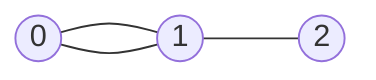

## 基础概念

### 什么是图

**图（Graph）** 是一种由 **节点（Node/Vertex）** 和 **边（Edge）** 组成的数据结构，用来描述事物之间的 **关系**。

- **节点（Vertex）**：代表事物本身（例如：人、城市、网页）。
- **边（Edge）**：代表事物之间的关系（例如：好友关系、道路、超链接）。

#### **例子1：社交网络**

- **节点**：每个用户（Alice、Bob、Charlie...）。
- **边**：用户之间的好友关系（Alice 和 Bob 是好友，Bob 和 Charlie 是好友）。

> 其中，每个用户有多少个好友，就叫作顶点的**度**（degree），就是跟顶点相连接的边的条数。

#### **例子2：交通路线**

- **节点**：城市（北京、上海、广州...）。
- **边**：城市之间的公路或航线（北京到上海的高铁，上海到广州的航班）。

### 图的关键特性

#### 有向图 vs 无向图

- **无向图**：边没有方向，关系是双向的。例如：微信好友（如果 Alice 是 Bob 的好友，Bob 也是 Alice 的好友）。
- **有向图**：边有方向，关系是单向的。例如：微博关注（Alice 关注了 Bob，但 Bob 不一定关注 Alice）。

> 在有向图中，我们把度分为**入度**（In-degree）和**出度**（Out-degree）。
>
> + 顶点的入度，表示有多少条边指向这个顶点；
> + 顶点的出度，表示有多少条边是以这个顶点为起点指向其他顶点。
>
> 对应到微博的例子，入度就表示有多少粉丝，出度就表示关注了多少人。

#### **权重图 vs 无权图**

- **无权图**：边只表示关系是否存在（例如：是否好友）。
- **权重图**：边有数值（权重），表示关系的强度或代价。例如：QQ 好友中好友间有亲密度的概念。

### 图的代码表示



#### 邻接矩阵（Adjacency Matrix）

用二维数组 `matrix[i][j]` 表示节点 `i` 和 `j` 是否相连（或权重）：

```python
# 无权图的邻接矩阵
graph = [
    [0, 1, 0],  # 节点 0 连接到节点 1
    [1, 0, 1],  # 节点 1 连接到节点 0 和 2
    [0, 1, 0]   # 节点 2 连接到节点 1
]
```

#### 邻接表（Adjacency List）

用哈希表或数组存储每个节点的邻居：

```python
# 邻接表（更节省空间）
graph = {
    0: [1],
    1: [0, 2],
    2: [1]
}
```

### 图的应用场景

1. **路径问题**：
   - 导航软件（最短路径：Dijkstra 算法）
   - 社交网络中的好友推荐（共同好友）
2. **网络分析**：
   - 网页排名（PageRank 算法）
   - 传染病的传播路径
3. **依赖关系**：
   - 课程选修顺序（拓扑排序）
   - 任务调度（检测循环依赖）


## 图的遍历

用邻接表（Adjacency List）存储图，每个节点维护一个邻居列表：

```typescript
class Graph<T> {
  // 使用 Map 存储节点及其邻居列表
  private adjacencyList: Map<T, T[]>;

  constructor() {
    this.adjacencyList = new Map();
  }

  // 添加节点
  addNode(node: T): void {
    if (!this.adjacencyList.has(node)) {
      this.adjacencyList.set(node, []);
    }
  }

  // 添加边（无向图）
  addEdge(node1: T, node2: T): void {
    if (!this.adjacencyList.has(node1)) this.addNode(node1);
    if (!this.adjacencyList.has(node2)) this.addNode(node2);
    
    this.adjacencyList.get(node1)?.push(node2);
    this.adjacencyList.get(node2)?.push(node1); // 有向图则删除此行
  }

  // 获取所有节点
  getNodes(): T[] {
    return Array.from(this.adjacencyList.keys());
  }

  // 获取邻居
  getNeighbors(node: T): T[] {
    return this.adjacencyList.get(node) || [];
  }
}
```

### 深度优先遍历（DFS）

从起点出发，尽可能深地探索分支，使用**栈**或**递归**实现。

#### 递归实现（隐式栈）

```typescript
class Graph<T> {

  // DFS 递归实现
  dfs(start: T): T[] {
    const visited = new Set<T>();
    const result: T[] = [];

    const dfsVisit = (node: T) => {
      if (visited.has(node)) return;
      visited.add(node);
      result.push(node);
      const neighbors = this.getNeighbors(node);
      for (const neighbor of neighbors) {
        dfsVisit(neighbor);
      }
    };

    dfsVisit(start);
    return result;
  }
}
```

#### 栈实现（显式栈）

```typescript
class Graph<T> {
  // DFS 栈实现
  dfsStack(start: T): T[] {
    const stack: T[] = [start];
    const visited = new Set<T>();
    const result: T[] = [];

    while (stack.length > 0) {
      const node = stack.pop()!; // 弹出栈顶
      if (!visited.has(node)) {
        visited.add(node);
        result.push(node);
        // 将邻居逆序入栈，保证顺序与递归一致
        const neighbors = this.getNeighbors(node).reverse();
        for (const neighbor of neighbors) {
          stack.push(neighbor);
        }
      }
    }
    return result;
  }
}
```

### 广度优先遍历（BFS）

按层探索，使用**队列**实现，适合最短路径问题。

```typescript
class Graph<T> {

  // BFS 队列实现
  bfs(start: T): T[] {
    const queue: T[] = [start];
    const visited = new Set<T>();
    const result: T[] = [];

    visited.add(start);

    while (queue.length > 0) {
      const node = queue.shift()!; // 从队列头部取出
      result.push(node);
      const neighbors = this.getNeighbors(node);
      for (const neighbor of neighbors) {
        if (!visited.has(neighbor)) {
          visited.add(neighbor);
          queue.push(neighbor);
        }
      }
    }
    return result;
  }
}
```

### **测试代码**

假设有以下无向图：

```
A —— B
|    |
C —— D
```

#### **构建图并测试遍历**

typescript

复制

```typescript
const graph = new Graph<string>();
graph.addEdge('A', 'B');
graph.addEdge('A', 'C');
graph.addEdge('B', 'D');
graph.addEdge('C', 'D');

// DFS 递归
console.log(graph.dfs('A'));      // 输出: ['A', 'B', 'D', 'C']

// DFS 栈
console.log(graph.dfsStack('A')); // 输出: ['A', 'B', 'D', 'C']

// BFS
console.log(graph.bfs('A'));      // 输出: ['A', 'B', 'C', 'D']
```

### **关键差异总结**

| **特性**       | **DFS（深度优先）**          | **BFS（广度优先）**          |
| :------------- | :--------------------------- | :--------------------------- |
| **数据结构**   | 栈（递归或显式栈）           | 队列                         |
| **遍历顺序**   | 深入到底再回溯               | 按层逐层扩展                 |
| **适用场景**   | 路径存在性、拓扑排序、连通块 | 最短路径（无权图）、层序遍历 |
| **空间复杂度** | O(H)（H为树的高度）          | O(W)（W为树的最大宽度）      |

### **常见问题**

1. **如何处理有向图？**
   在 `addEdge` 方法中只单向添加边即可。
2. **如何避免循环图中的无限循环？**
   必须用 `visited` 集合记录已访问节点。
3. **权重图如何处理？**
   邻接表可存储对象，例如：`Map<T, { node: T; weight: number }[]>`。

## 拓扑排序

拓扑排序（Topological Sorting）是处理**有向无环图（DAG）** 的重要算法，核心思想是找到一种节点顺序，使得图中所有边的方向都保持一致（即若存在边 `A → B`，则排序中 `A` 必须出现在 `B` 前面）。它在任务调度、依赖关系处理中非常有用（如课程选修顺序、编译顺序）。

### **拓扑排序的前提条件**

- **图必须是有向无环图（DAG）**，若图中有环，则无法进行拓扑排序。
- **输出结果不唯一**：可能存在多种合法顺序。

### **算法实现**

#### 方法一：Kahn 算法（基于入度）

通过不断删除入度为 0 的节点，并维护一个队列实现：

```typescript
class Graph<T> {

  // 添加边（有向图）
  addDirectedEdge(from: T, to: T): void {
    if (!this.adjacencyList.has(from)) this.addNode(from);
    if (!this.adjacencyList.has(to)) this.addNode(to);
    this.adjacencyList.get(from)?.push(to); // 只添加单向边
  }

  // Kahn算法实现拓扑排序
  topologicalSort(): T[] | null {
    // 初始化入度表
    const inDegree = new Map<T, number>();
    const queue: T[] = [];
    const result: T[] = [];

    // 初始化所有节点的入度为0
    this.adjacencyList.forEach((_, node) => inDegree.set(node, 0));

    // 计算所有节点的入度
    this.adjacencyList.forEach((neighbors, node) => {
      neighbors.forEach(neighbor => {
        inDegree.set(neighbor, (inDegree.get(neighbor) || 0) + 1);
      });
    });

    // 将入度为0的节点加入队列
    inDegree.forEach((degree, node) => {
      if (degree === 0) queue.push(node);
    });

    // 处理队列中的节点
    while (queue.length > 0) {
      const node = queue.shift()!;
      result.push(node);

      // 减少所有邻居的入度
      this.getNeighbors(node).forEach(neighbor => {
        const newDegree = (inDegree.get(neighbor) || 0) - 1;
        inDegree.set(neighbor, newDegree);
        if (newDegree === 0) queue.push(neighbor);
      });
    }

    // 检查是否存在环（结果长度是否等于节点总数）
    return result.length === this.adjacencyList.size ? result : null;
  }
}
```

#### 方法二：DFS 后序遍历反转

通过 DFS 遍历图，按后序完成顺序的反转得到拓扑排序：

```typescript
class Graph<T> { 

  // DFS实现拓扑排序
  topologicalSortDFS(): T[] | null {
    const visited = new Set<T>();
    const stack: T[] = [];
    const result: T[] = [];
    let hasCycle = false;

    const dfs = (node: T, visiting: Set<T>) => {
      if (visiting.has(node)) { // 发现环
        hasCycle = true;
        return;
      }
      if (visited.has(node)) return;

      visiting.add(node);
      this.getNeighbors(node).forEach(neighbor => dfs(neighbor, visiting));
      visiting.delete(node);
      visited.add(node);
      stack.push(node); // 后序压栈
    };

    this.getNodes().forEach(node => {
      if (!visited.has(node)) dfs(node, new Set<T>());
    });

    return hasCycle ? null : stack.reverse(); // 反转后序结果
  }
}
```

### **测试拓扑排序**

#### **测试用例1：课程表（无环）**

假设课程依赖关系如下（LeetCode 207题）：

- 课程1依赖课程0（边 `0 → 1`）
- 课程2依赖课程1（边 `1 → 2`）
- 课程3依赖课程1（边 `1 → 3`）

```typescript
const graph = new Graph<number>();
graph.addDirectedEdge(0, 1);
graph.addDirectedEdge(1, 2);
graph.addDirectedEdge(1, 3);

console.log(graph.topologicalSort());        
// 输出: [0, 1, 2, 3] 或 [0, 1, 3, 2]
console.log(graph.topologicalSortDFS());    
// 输出: [0, 1, 3, 2] 或类似
```

#### **测试用例2：有环图**

若存在环（例如 `0 → 1 → 0`），则无法排序：

```typescript
const cyclicGraph = new Graph<number>();
cyclicGraph.addDirectedEdge(0, 1);
cyclicGraph.addDirectedEdge(1, 0);

console.log(cyclicGraph.topologicalSort());    // 输出: null
console.log(cyclicGraph.topologicalSortDFS()); // 输出: null
```

------

### 关键点总结

| **特性**         | **Kahn算法**            | **DFS后序法**         |
| :--------------- | :---------------------- | :-------------------- |
| **数据结构**     | 队列 + 入度表           | 递归栈 + 后序栈       |
| **检测环的方式** | 最终结果长度 < 节点总数 | 在递归中发现重复访问  |
| **适用场景**     | 直观易懂，适合动态更新  | 适合需要DFS的其他操作 |
| **时间复杂度**   | O(V + E)                | O(V + E)              |

------

### 常见应用场景

1. **课程表问题**：判断能否完成所有课程（LeetCode 207）。
2. **任务调度**：确定任务执行顺序，避免循环依赖。
3. **编译顺序**：确定源代码文件的编译顺序（如 Makefile）。

------

### 结合 LeetCode 实战

**题目**：[207. 课程表](https://leetcode.com/problems/course-schedule/)
**题意**：判断是否能完成所有课程（即图是否为DAG）。
**解法**：直接使用拓扑排序，若存在环则返回`false`。

```typescript
function canFinish(numCourses: number, prerequisites: number[][]): boolean {
  const graph = new Graph<number>();
  prerequisites.forEach(([to, from]) => graph.addDirectedEdge(from, to));
  return graph.topologicalSort() !== null;
}
```
