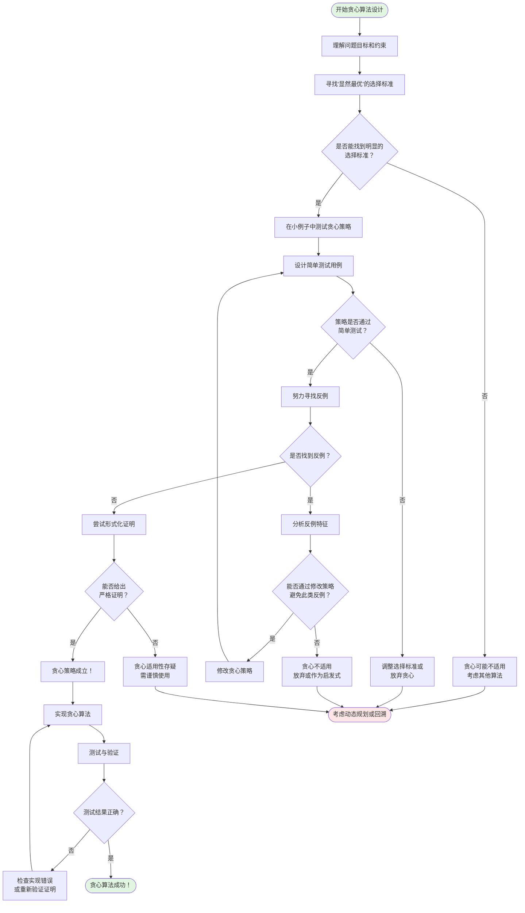

## 一、从生活直觉到算法思想

### 1.1 一个生活场景

想象你在超市购物，手里拿着购物清单和有限的预算。你会怎么做？

**直觉做法**：

1. 走到每个货架前
2. 看看当前商品的性价比
3. 如果价格合适就放进购物车
4. 钱花完了就结账离开

这就是**贪心思维**的原型：**在每一步都做出当前看起来最好的选择，不回头，不纠结**。

但这样真的能买到最优的商品组合吗？未必。也许你花了大部分钱买了打折的零食，却发现没钱买必需的大米了。

### 1.2 贪心思想的本质

贪心算法体现了一种**短视但高效的决策哲学**：

+ 人生的每一步，只看眼前的最优选择
+ 不瞻前顾后，不患得患失
+ 大胆前进，永不回头

这种思想有三个核心特征：

+ **特征1：局部视角（Local Perspective）**：只关注当前状态，不考虑未来所有可能性，决策信息是"贪婪地"局限在当下；
+ **特征2：不可逆性（Irreversibility）**：一旦做出选择，就不再更改，不走回头路，不做"如果当时我选了另一个..."的假设；
+ **特征3：希望的传递（Hope Propagation）**：相信每一步的最优能累积成全局最优，局部最优 → 局部最优 → ... → 全局最优，这是一种**乐观主义的算法哲学**。

## 二、思维模型：三种决策哲学的对比

让我用一个寻宝游戏来对比三种不同的算法哲学：

场景设定：你在一个迷宫里寻找宝藏，每个房间有不同数量的金币，你要收集最多的金币。

### 2.1 贪心策略（Greedy）

```typescript
// 思维模式："只看眼前"
function greedyTreasureHunt(maze: Room[][]): number {
  let position = { x: 0, y: 0 };
  let totalGold = 0;
  
  while (!reachedExit(position)) {
    // 贪心决策：看周围的房间，选金币最多的
    const neighbors = getNeighbors(position);
    const best = neighbors.reduce((max, room) => 
      room.gold > max.gold ? room : max
    );
    
    position = best.position;
    totalGold += best.gold;
    // 关键：再也不回来了！
  }
  
  return totalGold;
}
```

**心理画像**：

- 🎯 果断、高效、不纠结
- ⚡ 快速决策，立即行动
- 🚫 不回头看，不后悔
- ⚠️ 可能错过"大宝藏"（但也可能刚好找到最优路径）

### 2.2 动态规划策略（Dynamic Programming）

```typescript
// 思维模式："瞻前顾后"
function dpTreasureHunt(maze: Room[][]): number {
  const memo = new Map<string, number>();
  
  function maxGoldFrom(position: Position): number {
    // 动态规划：考虑所有未来的可能性
    // 计算"从这里出发的最优解"
    
    if (reachedExit(position)) return 0;
    if (memo.has(key(position))) return memo.get(key(position))!;
    
    let maxFutureGold = 0;
    for (const next of getNeighbors(position)) {
      // 递归探索每一种可能
      const futureGold = maxGoldFrom(next);
      maxFutureGold = Math.max(maxFutureGold, futureGold);
    }
    
    const result = currentGold(position) + maxFutureGold;
    memo.set(key(position), result);
    return result;
  }
  
  return maxGoldFrom({ x: 0, y: 0 });
}
```

**心理画像**：

- 🤔 深思熟虑，考虑周全
- 📊 分析所有可能性
- 💾 记住每个决策点的最优解
- ✅ 保证找到最优解
- 🐌 但要花更多时间和空间

### 2.3 回溯策略（Backtracking）

```typescript
// 思维模式："试错探索"
function backtrackTreasureHunt(maze: Room[][]): number {
  let maxGold = 0;
  const visited = new Set<string>();
  
  function explore(position: Position, currentGold: number): void {
    if (reachedExit(position)) {
      maxGold = Math.max(maxGold, currentGold);
      return;
    }
    
    visited.add(key(position));
    
    for (const next of getNeighbors(position)) {
      if (!visited.has(key(next))) {
        explore(next, currentGold + next.gold);
        // 回溯：撤销选择，尝试其他路径
        visited.delete(key(next));
      }
    }
  }
  
  explore({ x: 0, y: 0 }, 0);
  return maxGold;
}
```

**心理画像**：

- 🔍 尝试所有路径
- ↩️ 走不通就退回来
- 🗺️ 逐步绘制完整地图
- ✅ 保证找到最优解
- 🐢 最慢，但最全面

## 三、哲学本质：贪心算法的"信仰体系"

### 3.1 核心信念：单调性原理

贪心算法相信世界有一种"单调递进"的结构：**好的开始 + 好的第二步 + 好的第三步 + ... = 好的结果**。

这在数学上叫做**拟阵结构**（我们后面会详细讲），在哲学上是一种**局部到全局的同态映射**。

```typescript
// 抽象表达
interface MonotonicProperty {
  // 如果每一步都是局部最优
  localOptimal: (state: State, choice: Choice) => boolean;
  
  // 那么最终结果就是全局最优
  implies: () => boolean; // globalOptimal === true
}
```

### 3.2 隐含假设：世界的"友好性"

贪心算法能工作，是因为问题本身对这种"短视"行为很"宽容"。

**什么是友好的问题？** 想象一个山峰的地形：

```
不友好的地形（贪心失败）：
      峰2(全局最优)
      /\
     /  \
    /    \___  
峰1 /         \___
  /\              \___
 /  \                 \___海平面
    👆 贪心会困在这里

友好的地形（贪心成功）：
                    峰(全局最优)
                   /\
                  /  \
                 /    \
                /      \
               /        \
              /          \___海平面
```

**友好问题的特征**：

1. **无陷阱**：没有"局部最优陷阱"
2. **无遗憾**：早期的选择不会封死后面的机会
3. **可叠加**：好的部分解可以组合成好的完整解

### 3.3 哲学困境：确定性 vs 最优性的权衡

贪心算法体现了一个深刻的权衡：

+ 确定性：算法会快速给出一个答案
+ 最优性：但答案不一定是最好的
+ 效率：计算代价很小

| 维度           | 贪心算法          | 回溯算法               | 动态规划            |
| -------------- | ----------------- | ---------------------- | ------------------- |
| **哲学立场**   | "活在当下"        | "探索所有可能"         | "规划全局最优"      |
| **确定性**     | 快速确定解        | 可能找到所有解         | 确定最优解          |
| **最优性**     | 局部最优          | 全局最优（需完整搜索） | 全局最优            |
| **时间复杂度** | O(n) ~ O(n log n) | 指数级 (O(2ⁿ), O(n!))  | 多项式/伪多项式     |
| **空间复杂度** | 通常 O(1)         | 递归深度 O(n)          | 表格存储 O(n)~O(n²) |
| **决策策略**   | 不可撤销的选择    | 可撤销的选择           | 基于子问题的选择    |

这反映了计算理论的一个根本张力：**速度 vs 准确性 vs 可行性**

| 算法策略     | 对P问题的态度                        | 对NP问题的态度                                             |
| ------------ | ------------------------------------ | ---------------------------------------------------------- |
| **贪心算法** | 常常能得到精确最优解（如最小生成树） | 只能得到**近似解**，放弃最优性保证                         |
| **回溯算法** | 通常过度杀伤，有更简单的方法         | **唯一保证找到精确解**的方法（但可能极慢）                 |
| **动态规划** | 优雅高效地解决（如最短路径）         | 仅对**部分**NP问题有效（如背包问题），且可能是伪多项式时间 |

## 四 、认知科学视角：为什么人类喜欢贪心思维

### 4.1 认知负荷理论

人类大脑的工作记忆容量有限（约7±2个项目），贪心算法符合我们的认知特点：

| 维度             | 贪心算法 (活在当下)                                      | 回溯算法 (探索所有可能)                              | 动态规划 (系统化构建)                                 |
| ---------------- | -------------------------------------------------------- | ---------------------------------------------------- | ----------------------------------------------------- |
| **工作记忆**     | 只需记住**当前状态**和最近的选择                         | 需要记住**完整路径历史**和**所有尝试过的分支**       | 需要记住**完整的子问题解表格**或状态转移关系          |
| **决策复杂性**   | 只需**比较当前可见的有限选项**，选择局部最优             | 需要在**每个分支点考虑所有可能选择**，管理选择栈     | 需要理解**状态转移方程**，考虑所有可能的前驱状态      |
| **心理努力**     | **极低** - 直觉式决策，无需长远规划                      | **极高** - 需系统探索，处理回溯逻辑，避免循环        | **中等至高** - 需要设计合适的状态表示和转移方程       |
| **错误成本**     | **高** - 一旦选择错误无法撤销，可能导致全局失败          | **低** - 错误可回溯修正，但时间成本高                | **中等** - 设计错误导致算法失效，但实现正确则结果可靠 |
| **灵活性**       | **低** - 固定模式，难以适应变化                          | **高** - 可灵活添加剪枝条件、启发式                  | **中等** - 结构固定，但状态设计可调整                 |
| **认知模式**     | **反射性思维**  <br>快速、自动、基于模式识别             | **分析性思维**  <br>系统、全面、注重过程控制         | **建构性思维**  <br>从基础逐步构建，注重结构关系      |
| **学习曲线**     | **平缓**  <br>容易理解和实现                             | **陡峭**  <br>需要掌握递归、状态管理等复杂概念       | **中等偏陡**  <br>需要抽象建模能力，但掌握后适用广    |
| **思维负担分布** | **集中在前期的贪心策略证明**  <br>一旦证明正确，实施简单 | **均匀分布在整个搜索过程**  <br>需要持续管理搜索状态 | **集中在初期的状态设计**  <br>设计完成后实施相对机械  |
| **调试难度**     | **低**  <br>逻辑简单，错误容易定位                       | **高**  <br>递归深度、状态回溯容易出错               | **中等**  <br>状态转移或边界条件容易出错              |
| **认知优势**     | **快速决策**  <br>在信息不完整时仍能前进                 | **完备性保证**  <br>不遗漏任何可能解                 | **避免重复计算**  <br>通过记忆化提高效率              |
| **认知劣势**     | **短视风险**  <br>可能错过全局最优解                     | **组合爆炸**  <br>搜索空间可能过大无法处理           | **过度工程**  <br>可能为简单问题设计复杂状态          |

### 4.2 启发式偏差

心理学研究表明，人类天生倾向于使用"启发式"（快速决策规则），这和贪心算法非常相似：

- **可得性启发**：选择最容易想到的选项（局部信息）
- **代表性启发**：根据表面特征做判断（局部最优）
- **锚定效应**：被初始信息影响（第一步选择很关键）

```typescript
// 人类决策的贪心模式
class HumanDecisionMaking {
  makeChoice(options: Option[]): Option {
    // 不会分析所有可能性
    // 而是快速找一个"足够好"的
    return options.find(opt => 
      this.satisfiesThreshold(opt) // "满意即可"原则
    ) || options[0];
  }
  
  // 赫伯特·西蒙的"有限理性"理论
  // Bounded Rationality
}
```

## 五、建立思维框架：何时想到贪心

### 5.1 识别贪心信号

```typescript
interface GreedySignals {
  // 信号1：问题要求"最多"、"最少"、"最优"
  optimizationProblem: boolean;
  
  // 信号2：每一步的选择似乎很"自然"、很"明显"
  obviousChoice: boolean;
  
  // 信号3：问题有"排序"的味道
  // 比如：时间、价值、优先级
  orderableElements: boolean;
  
  // 信号4：选择之间相对独立
  independentChoices: boolean;
  
  // 信号5：局部最优看起来能叠加
  compositionalStructure: boolean;
}
```

**实战检查清单**：

```
遇到问题时问自己：
□ 这是优化问题吗？（最大、最小、最优）
□ 我能想到一个"显而易见"的选择策略吗？
□ 这个问题涉及排序或优先级吗？
□ 做出一个选择后，剩下的是类似的子问题吗？
□ 我能想象"每步最优→全局最优"的场景吗？

如果多数答案是"是"，尝试贪心！
```

### 5.2 思维流程图




## 六、核心概念的形式化定义

现在我们可以给出严格的定义了：

### 6.1 贪心算法的形式化

```typescript
/**
 * 贪心算法的数学定义
 */
interface GreedyAlgorithmDefinition<State, Choice, Solution> {
  // 1. 初始状态
  initialState: State;
  
  // 2. 选择函数：在当前状态下，确定可选的选择集合
  choices(state: State): Choice[];
  
  // 3. 选择标准：贪心策略，选择"最好"的一个
  // 这是贪心算法的灵魂
  greedyCriterion(choices: Choice[]): Choice;
  
  // 4. 状态转移：应用选择后的新状态
  transition(state: State, choice: Choice): State;
  
  // 5. 终止条件：什么时候停止
  isDone(state: State): boolean;
  
  // 6. 解的提取：从最终状态得到解
  extractSolution(finalState: State): Solution;
}

/**
 * 通用贪心算法框架
 */
function genericGreedy<State, Choice, Solution>(
  definition: GreedyAlgorithmDefinition<State, Choice, Solution>
): Solution {
  let state = definition.initialState;
  
  while (!definition.isDone(state)) {
    // 贪心循环的三部曲
    const availableChoices = definition.choices(state);
    const greedyChoice = definition.greedyCriterion(availableChoices);
    state = definition.transition(state, greedyChoice);
  }
  
  return definition.extractSolution(state);
}
```

### 6.2 实例：找零钱问题

让我们用这个框架来表达一个具体问题：

```typescript
// 问题：用最少的硬币数找零
interface CoinChangeState {
  remainingAmount: number;
  coinsUsed: number[];
}

const coinChangeProblem: GreedyAlgorithmDefinition
  CoinChangeState,
  number,
  number[]
> = {
  initialState: {
    remainingAmount: 63, // 要找63元
    coinsUsed: []
  },
  
  choices(state): number[] {
    // 假设有这些面额的硬币
    const denominations = [25, 10, 5, 1];
    // 只返回不超过剩余金额的面额
    return denominations.filter(d => d <= state.remainingAmount);
  },
  
  greedyCriterion(choices): number {
    // 贪心策略：选最大的面额
    return Math.max(...choices);
  },
  
  transition(state, choice): CoinChangeState {
    return {
      remainingAmount: state.remainingAmount - choice,
      coinsUsed: [...state.coinsUsed, choice]
    };
  },
  
  isDone(state): boolean {
    return state.remainingAmount === 0;
  },
  
  extractSolution(finalState): number[] {
    return finalState.coinsUsed;
  }
};

// 使用
const solution = genericGreedy(coinChangeProblem);
console.log(solution); // [25, 25, 10, 1, 1, 1]

// 但注意：这个贪心策略只对某些货币系统有效！
// 如果硬币是 [25, 10, 1]，找30元
// 贪心：25 + 1 + 1 + 1 + 1 + 1 = 6个硬币
// 最优：10 + 10 + 10 = 3个硬币
// 贪心失败！
```

## 七、元认知：理解自己的理解

### 7.1 自我检测问题

学完这一节后，问问自己：

1. 我能用自己的话解释什么是贪心算法吗？
2. 我能举出 3 个生活中的贪心决策例子吗？
3. 我理解贪心算法为什么不总是有效吗？
4. 我能区分贪心、动态规划、回溯的思维方式吗？
5. 遇到新问题时，我知道如何判断是否该用贪心吗？

### 7.2 概念地图

```
贪心算法
├─ 核心思想
│  ├─ 局部最优
│  ├─ 不可逆
│  └─ 希望累积
│
├─ 哲学本质
│  ├─ 单调性原理
│  ├─ 友好性假设
│  └─ 确定性vs最优性
│
├─ 认知基础
│  ├─ 符合人类直觉
│  ├─ 认知负荷低
│  └─ 启发式决策
│
├─ 适用信号
│  ├─ 优化问题
│  ├─ 显然的选择
│  ├─ 可排序性
│  └─ 独立性
│
└─ 形式化
   ├─ 状态
   ├─ 选择
   ├─ 策略
   └─ 转移
````

## 八、总结：核心要义

贪心算法的本质是：

> **在复杂问题中，通过一系列简单、果断的局部最优选择，希望能够到达全局最优解的一种算法策略。**

它的成功依赖于问题本身的结构性质（贪心选择性质和最优子结构），而不是算法本身的复杂度。

**关键洞察**：

1. 贪心不是万能的，但在适用的问题上极其高效
2. 识别贪心策略需要对问题的深刻理解
3. 证明贪心正确性至关重要
4. 贪心思维是人类自然的决策模式
