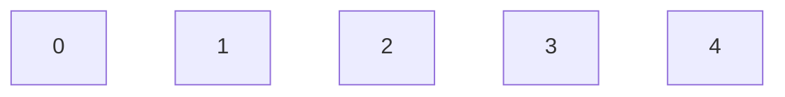
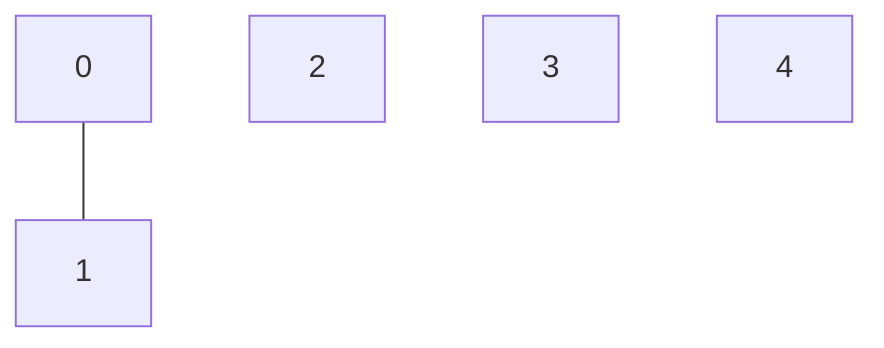
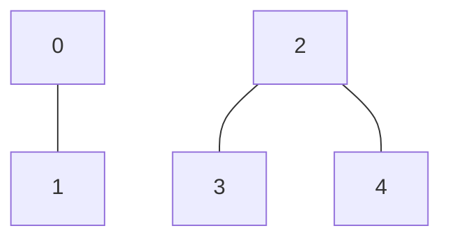
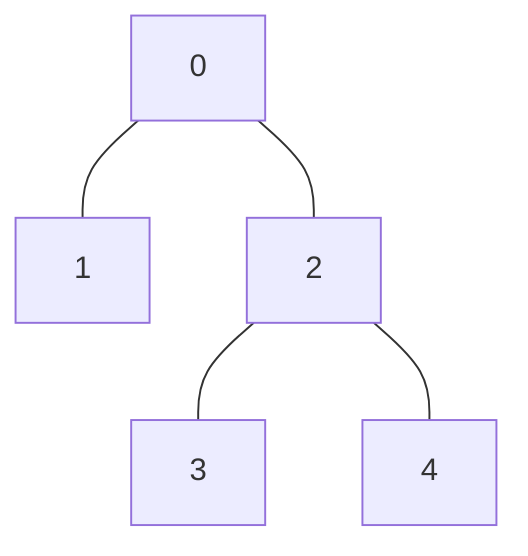

# 并查集：连通性问题的终极解决方案

## 一、为什么需要并查集？

假设你有一堆元素（比如网络中的电脑、社交网络中的用户），需要快速回答这些问题：

1. 元素 A 和元素 B 是否相连？（查）
2. 把元素 A 和元素 B 连接起来（并）

**举个具体例子：社交网络中的好友关系**。假设有 5 个人：0, 1, 2, 3, 4。他们的好友关系如下：

- 0 和 1 是好友 → **形成一个朋友圈**
- 2、3、4 是好友 → **另一个朋友圈**
- 此时，如果 1 和 2 成为好友 → **两个朋友圈合并**

**问题**：如何高效判断“任意两个人是否属于同一个朋友圈”？

### **传统方法的痛点**

如果用普通数组或哈希表存储关系：

- **查询是否连通**：需要遍历整个关系链，时间复杂度高（O(n)）
- **合并两个集合**：需要复制大量数据，效率低

并查集（Union-Find）正是为解决这类连通性问题而生的数据结构，其核心操作的时间复杂度近乎常数级。

## 二、核心概念

并查集用**树结构**表示集合：

- **每个集合用一棵树表示**：记录每个元素的父节点
- **查找（Find）**：找到元素的根节点（判断是否属于同一集合）
- **合并（Union）**：直接把一棵树挂到另一棵树的根节点下

### **具体操作示例**

**初始状态**：5 个人各自独立（5 个根节点）：



**合并 0 和 1**（假设以 0 为根）：



**合并 2、3、4**（假设以 2 为根）：



**合并 1 和 2**（把 2 的根挂到 0 下）：



**此时判断 3 和 0 是否连通**：

- 找 3 的根 → 0
- 找 0 的根 → 0
- 所以 3 和 0 是连通的！

### 优化策略

- **路径压缩**：查找时扁平化树结构
  - 比如查找 3 时，直接把 3 的父节点指向根节点 0；
  - 如上图，最后一步操作后，3 的根其实还是 2，查找后更新为 0；

- **按秩合并**：合并时总是让小树挂在大树下，控制树的高度

## 三、代码实现

```typescript
class UnionFind {
    private parent: number[];  // 父节点数组
    private rank: number[];    // 秩（树高度）

    constructor(size: number) {
        this.parent = Array.from({ length: size }, (_, i) => i);
        this.rank = Array(size).fill(1);
    }

    // 查找根节点（路径压缩）
    find(x: number): number {
        if (this.parent[x] !== x) {
            this.parent[x] = this.find(this.parent[x]); // 递归压缩路径
        }
        return this.parent[x];
    }

    // 合并集合（按秩合并）
    union(x: number, y: number): void {
        const rootX = this.find(x);
        const rootY = this.find(y);
        if (rootX === rootY) return;

        // 将较矮的树合并到较高的树
        if (this.rank[rootX] < this.rank[rootY]) {
            this.parent[rootX] = rootY;
        } else if (this.rank[rootX] > this.rank[rootY]) {
            this.parent[rootY] = rootX;
        } else {
            this.parent[rootY] = rootX;
            this.rank[rootX]++; // 树高度+1
        }
    }

    // 判断是否连通
    connected(x: number, y: number): boolean {
        return this.find(x) === this.find(y);
    }
}
```

## **四、应用场景**

1. **图的连通性**：如 Kruskal 算法中判断边是否成环。
2. **社交网络**：快速判断两人是否属于同一朋友圈。
3. **动态连通问题**：实时合并与查询数据集的连通状态。

