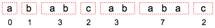
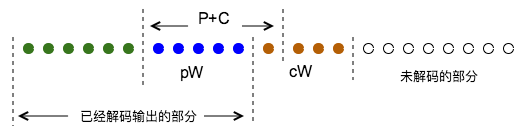

### 一个简单的例子

LZW编码 (Encoding) 的核心思想其实比较简单，就是把出现过的字符串映射到记号上，这样就可能用较短的编码来表示长的字符串，实现压缩，例如对于字符串：

```markdown
ABABAB
```

可以看到子串AB在后面重复出现了，这样我们可以用一个特殊记号表示AB，例如数字2，这样原来的字符串就可以表示为：

```markdown
AB22
```

这里我们称2是字串AB的记号(Symbol)。那么A和B有没有记号来表示？当然有，例如我们规定数字0表示A，数字1表示B。实际上最后得到的压缩后的数据应该是一个记号流 (Symbol Stream) :

```markdown
0122
```

这样我们就有一个记号和字符串的映射表，即字典 (Dictionary) ：

| Symbol | String |
| ------ | ------ |
| 0      | A      |
| 1      | B      |
| 2      | AB     |

有了压缩后的编码0122，结合字典，就能够很轻松地解码 (Decoding) 原字符串ABABAB。

当然在真正的LZW中A和B不会用数字0和1表示，而是它们的ASCII值。实际上LZW初始会有一个默认的字典，包含了所有256个8bit字符，单个字符的记号就是它自身，用数字表示就是ASCII值。在此基础上，编码过程中加入的新的记号的映射，从256开始，称为扩展表(Extended Dictionary)。在这个例子里是为了简单起见，只有两个基础字符，所以规定0表示A，1表示B，从记号2开始就是扩展项了。

### 字典的生成

这里有一个问题：为什么第一个AB不也用2表示？即表示为222，这样不又节省了一个记号？这个问题实际上引出的是LZW的一个核心思想，即压缩后的编码是**自解释** (self-explaining) 的。什么意思？即字典是**不会被写进压缩文件的**，在解压缩的时候，一开始字典里除了默认的0->A和1->B之外并没有其它映射，2->AB是在解压缩的过程中一边加入的。这就要求压缩后的数据自己能告诉解码器，完整的字典，例如2->AB是如何生成的，在解码的过程中**还原**出编码时用的字典。

用上面的例子来说明，我们可以想象ABABAB编码的过程：

1. 遇到A，用0表示，编码为0。
2. 遇到B，用1表示，编码为1。
3. 发现了一个子串AB，添加映射2->AB到字典里。
4. 后面又出现了AB子串，都用2来编码。

以上过程只是一个概述，并非真正LZW编码过程，只是为了表示它的思想。可以看出最前面的A和B是用来生成表项2->AB的，所以它们必须被保留在压缩编码里，作为表项2->AB生成的“第一现场”。这样在解码0122的时候，解码器首先通过01直接解析出最前面A和B，并且生成表项2->AB，这样才能将后面出现的2都解析为AB。实际上解码器是自己还原出了编码时2->AB生成的过程。

编码和解码都是从前往后步步推进的，同时生成字典，所以解码的过程也是一个不断还原编码字典的过程。解码器一边解码，向后推进，一边在之前已经解出的原始数据上**重现编码的过程**，构建出编码时用的字典。

### LZW算法详解

下面给出完整的LZW编码和解码的过程，结合一个稍微复杂一点的例子，来说明LZW的原理，重点是理解解码中的每一步是如何对应和还原编码中的步骤，并恢复编码字典的。

##### 编码算法

编码器从原字符串不断地读入新的字符，并试图将单个字符或字符串编码为记号 (Symbol)。这里我们维护两个变量，一个是**P** (Previous)，表示手头已有的，还没有被编码的**字符串**，一个是**C** (current)，表示当前新读进来的**字符**。

```
 1. 初始状态，字典里只有所有的默认项，例如0->a，1->b，2->c。此时P和C都是空的。
 2. 读入新的字符C，与P合并形成字符串P+C。
 3. 在字典里查找P+C，如果:
    - P+C在字典里，P=P+C。
    - P+C不在字典里，将P的记号输出；在字典中为P+C建立一个记号映射；更新P=C。
 4. 返回步骤2重复，直至读完原字符串中所有字符。
```

以上表示的是编码中间的一般过程，在收尾的时候有一些特殊的处理，即步骤2中，如果到达字符串尾部，没有新的C读入了，则将手头的P对应的记号输出，结束。

编码过程的核心就在于第3步，我们需要理解P究竟是什么。P是当前维护的，可以被编码为记号的子串。注意P是可以被编码为记号，但还并未输出。新的字符C不断被读入并添加到P的尾部，只要P+C仍然能在字典里找到，就不断增长更新P=P+C，这样就能将一个尽可能长的字串P编码为一个记号，这就是压缩的实现。当新的P+C无法在字典里找到时，我们没有办法，输出已有的P的编码记号，并为新子串P+C建立字典表项。然后新的P从单字符C开始，重新增长，重复上述过程。

这里用一个例子来说明编码的过程，之所以用小写的字符串是为了和P，C区分。

```markdown
ababcababac
```

初始状态字典里有三个默认的映射：

| Symbol | String |
| ------ | ------ |
| 0      | a      |
| 1      | b      |
| 2      | c      |

开始编码：

| Step | P    | C    | P+C  | P+C in Dict ？ | Action               | Output |
| ---- | ---- | ---- | ---- | -------------- | -------------------- | ------ |
| 1    | -    | a    | a    | Yes            | 更新P=a              | -      |
| 2    | a    | b    | ab   | No             | 添加3->ab，更新P=b   | 0      |
| 3    | b    | a    | ba   | No             | 添加4->ba，更新P=a   | 1      |
| 4    | a    | b    | ab   | Yes            | 更新P=ab             | -      |
| 5    | ab   | c    | abc  | No             | 添加5->abc，更新P=c  | 3      |
| 6    | c    | a    | ca   | No             | 添加6->ca，更新P=a   | 2      |
| 7    | a    | b    | ab   | Yes            | 更新P=ab             | -      |
| 8    | ab   | a    | aba  | No             | 添加7->aba，更新P=a  | 3      |
| 9    | a    | b    | ab   | Yes            | 更新P=ab             | -      |
| 10   | ab   | a    | aba  | Yes            | 更新P=aba            | -      |
| 11   | aba  | c    | abac | No             | 添加8->abac，更新P=c | 7      |
| 12   | c    | -    | -    | -              | -                    | 2      |

注意编码过程中的第3-4步，第7-8步以及8-10步，子串P发生了增长，直到新的P+C无法在字典中找到，则将当前的P输出，P则更新为单字符C，重新开始增长。

输出的结果为0132372，完整的字典为：

| Symbol | String |
| ------ | ------ |
| 0      | a      |
| 1      | b      |
| 2      | c      |
| 3      | ab     |
| 4      | ba     |
| 5      | abc    |
| 6      | ca     |
| 7      | aba    |
| 8      | abac   |

这里用一个图来展示原字符串是如何对应到压缩后的编码的:


\--

##### 解码算法

解码的过程比编码复杂，其核心思想在于解码需要还原出编码时的用的字典。因此要理解解码的原理，必须分析它是如何对应编码的过程的。下面首先给出算法：

解码器的输入是压缩后的数据，即记号流 (Symbol Stream)。类似于编码，我们仍然维护两个变量**pW** (previous word) 和**cW** (current word)，后缀W的含义是word，实际上就是记号 (Symbol)，一个记号就代表一个word，或者说子串。**pW**表示之前刚刚解码的记号；**cW**表示当前新读进来的记号。

注意cW和pW都是记号，我们用Str(cW)和Str(pW)表示它们解码出来的原字符串。

```
1. 初始状态，字典里只有所有的默认项，例如0->a，1->b，2->c。此时pW和cW都是空的。
2. 读入第一个的符号cW，解码输出。注意第一个cW肯定是能直接解码的，而且一定是单个字符。
3. 赋值pW=cW。
4. 读入下一个符号cW。
5. 在字典里查找cW，如果:
   a. cW在字典里：
     (1) 解码cW，即输出 Str(cW)。
     (2) 令P=Str(pW)，C=Str(cW)的**第一个字符**。
     (3) 在字典中为P+C添加新的记号映射。
   b. cW不在字典里:
     (1) 令P=Str(pW)，C=Str(pW)的**第一个字符**。
     (2) 在字典中为P+C添加新的记号映射，这个新的记号一定就是cW。
     (3) 输出P+C。
6. 返回步骤3重复，直至读完所有记号。
```

显然，最重要的是第5步，也是最难理解的。在这一步中解码器不断地在已经破译出来的数据上，模拟编码的过程，还原出字典。我们还是结合之前的例子来说明，我们需要从记号流

```
0 1 3 2 3 7 2
```

解码出：

```
a b ab c ab aba c
```

这里我用空格表示出了记号是如何依次对应解码出来的子串的，当然在解码开始时我们根本不知道这些，我们手里的字典只有默认项，即：

| Symbol | String |
| ------ | ------ |
| 0      | a      |
| 1      | b      |
| 2      | c      |

解码开始：
首先读取第一个记号cW=0，解码为a，输出，赋值pW=cW=0。然后开始循环，依此读取后面的记号：

| Step | pW   | cW   | cW in Dict ？ | Action                         | Output |
| ---- | ---- | ---- | ------------- | ------------------------------ | ------ |
| 1    | 0    | 1    | Yes           | P=a，C=b，P+C=ab，添加3->ab    | b      |
| 2    | 1    | 3    | Yes           | P=b，C=a，P+C=ba，添加4->ba    | ab     |
| 3    | 3    | 2    | Yes           | P=ab，C=c，P+C=abc，添加5->abc | c      |

好，先解码到这里，我们已经解出了前5个字符 a b ab c。一步一步走下来我们可以看出解码的思想。首先直接解码最前面的a和b，然后生成了3->ab这一映射，也就是说解码器利用前面已经解出的字符，如实还原了编码过程中字典的生成。这也是为什么第一个a和b必须保留下来，而不能直接用3来编码，因为解码器一开始根本不知道3表示ab。而第二个以及以后的ab就可以用记号3破译出来，因为此时我们已经建立了3->ab的关系。

仔细观察添加新映射的过程，就可以看出它是如何还原编码过程的。解码步骤5.a中，P=Str(pW)，C=Str(cW)的第一个字符，我们可以用下图来说明：


注意P+C构成的方式，取前一个符号pW，加上当前最新符号cW的第一个字符。这正好对应了编码过程中遇到P+C不在字典中的情况：将P编码为pW输出，并更新P=C，P从单字符C开始重新增长。

到目前为止，我们只用到了解码步骤5.a的情况，即每次新读入的cW都能在字典里找到，只有这样我们才能直接解码cW输出，并拿到cW的第一个字符C，与P组成P+C。但实际上还有一种可能就是5.b中的cW不在字典里。为什么cW会不在字典里？回到例子，我们此时已经解出了5个字符，继续往下走：

| Step | pW   | cW   | cW in Dict ？ | Action                            | Output |
| ---- | ---- | ---- | ------------- | --------------------------------- | ------ |
| 4    | 2    | 3    | Yes           | P=c，C=a，P+C=ca，添加6->ca       | ab     |
| 5    | 3    | 7    | No            | P=ab，C=a，P+C=aba，添加7->aba    | aba    |
| 6    | 7    | 2    | Yes           | P=aba，C=c，P+C=abac，添加8->abac | c      |

好到此为止，后面的 ab aba c 也解码出来了，解码过程结束。这里最重要的就是Step-5，新读入一个cW为7，可7此时并不在字典里。当然我们事实上知道7最终应该对应aba，可是解码器应该如何反推出来？

为什么解码进行到这一步7->aba还没有被编入字典？因为解码比编码有一步的延迟，实际上aba正是由当前的P=ab，和那个还未知的cw=7的第一个字符C组成的，所以cW映射的就是这个即将新加入的子串P+C，也因此cW的第一个字符就是pW的第一个字符a，cW就是aba。

我们看到解码器在这里做了一个推理，既然cW到目前为止还没有被加入字典，可解码却偏偏遇到了，说明cW的映射并不是很早之前加入的，而是就在当前这一步。对应到编码的过程，就是新的cW映射，即7->aba刚被写进字典，紧接着后面的一个字串就用到了它。读者可以对照后半部分 ab aba c 编码的过程，对比解码过程反推，理解它的原理。这也是解码算法中最难的部分。

### 总结

好了，LZW的编码和解码过程到此就讲解完毕了。其实它的思想本身是简单的，就是将原始数据中的子串用记号表示，类似于编一部字典。编码过程中如何切割子串，建立映射的方式，其实并不是唯一的，但是LZW算法的严格之处在于，它提供了一种方式，使得压缩后的编码能够唯一地反推出编码过程中建立的字典，从而不必将字典本身写入压缩文件。试想，如果字典也需要写入压缩文件，那它占据的体积本身就会很大，可能到最后起不到压缩的效果。下一章我会讲解另一种压缩算法，[算数编码](https://segmentfault.com/a/1190000011561822)。