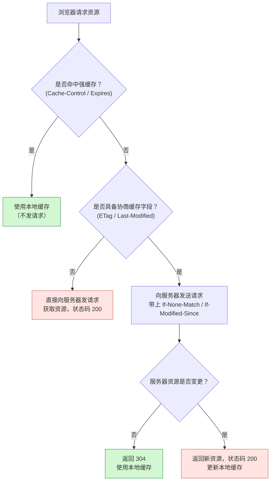

## 缓存的分类

从缓存是否需要向服务器发请求区分：

| 类型         | 是否发请求 | 服务端是否参与判断     | 状态码 |
| ------------ | ---------- | ---------------------- | ------ |
| **强缓存**   | ❌ 不发请求 | ❌ 服务端不参与         | -      |
| **协商缓存** | ✅ 会发请求 | ✅ 服务端根据请求头判断 | 304    |




## 强缓存

### 1. 生效时机

浏览器第一次请求资源，服务端返回资源 + 缓存策略，后续再次访问该资源，在未过期前浏览器直接从本地缓存中取出资源，不发起请求。

### 2. 关键响应头

| 响应头                                   | 作用                                     |
| ---------------------------------------- | ---------------------------------------- |
| `Cache-Control: max-age=3600`            | 控制资源在客户端可缓存时间（单位：秒）   |
| `Expires: Tue, 18 Jun 2025 10:00:00 GMT` | HTTP/1.0，表示资源过期时间点（GMT 时间） |

> `Cache-Control` 优先级高于 `Expires`，推荐使用前者

### 3. 示例响应头

```http
Cache-Control: max-age=31536000
Expires: Wed, 14 Jun 2026 12:00:00 GMT
```

### 4. 工作流程

```
首次请求 → 服务端返回资源 + 缓存头 → 缓存 → 过期前再次请求 → 直接使用缓存
```

## 协商缓存

强缓存失效后，浏览器会发请求问服务器：这个资源改过吗？如果没变，返回 304；如果变了，返回新资源。

### 1. 生效时机

- 浏览器缓存已过期
- 或者被强制刷新（Ctrl+F5 除外）

### 2. 请求头 & 响应头对

| 请求头              | 响应头          | 含义                           |
| ------------------- | --------------- | ------------------------------ |
| `If-Modified-Since` | `Last-Modified` | 根据上次修改时间判断是否变化   |
| `If-None-Match`     | `ETag`          | 用唯一标识判断是否变化（推荐） |

### 3. ETag 更精确

- 服务端为资源生成哈希（比如文件 MD5）
- 浏览器下次带 `If-None-Match`
- 服务端比较哈希是否一致，一致返回 `304 Not Modified`

### 4. 工作流程

```
首次请求 → 返回资源 + ETag/Last-Modified
再次请求 → 带上 If-None-Match / If-Modified-Since
服务端判断 → 没变 → 返回 304（不返回内容），变了 → 返回新资源 + 200
```

### 5. 实际案例

浏览器访问一张图片 `logo.png`

#### 第一次访问：浏览器还没有缓存

浏览器向服务器发起请求：

```http
GET /images/logo.png HTTP/1.1
Host: example.com
```

服务器返回响应，带上协商缓存相关的头：

```http
HTTP/1.1 200 OK
Content-Type: image/png
Content-Length: 12345
Cache-Control: max-age=3600, must-revalidate          
ETag: "abc123etag"
Last-Modified: Tue, 11 Jun 2024 08:00:00 GMT
```

+ `max-age=3600`：3600 秒强缓存有效
+ `must-revalidate`：过期后必须向服务器重新验证（进入协商缓存流程）
+ `ETag: "abc123etag"`：内容的唯一标识

浏览器把图片缓存下来，缓存时间 = 当前时间 + 3600s，并记录下 `ETag` 和 `Last-Modified`。

------

#### 第二次访问（在 3600 秒内）：

- 浏览器检查缓存发现还在 `max-age` 时间范围内

✅ 行为：完全不发请求！直接使用本地缓存副本

#### 第三次访问：刷新页面或过了 max-age

浏览器再次访问图片时，会带上两个**协商请求头**：

```http
GET /images/logo.png HTTP/1.1
Host: example.com
If-None-Match: "abc123etag"
If-Modified-Since: Tue, 11 Jun 2024 08:00:00 GMT
```

服务器收到后，进行判断：

- 当前资源的内容是否和 ETag `"abc123etag"` 一致？
- 最后修改时间是否和 `If-Modified-Since` 提供的值一致？

#### ✅ 如果内容没变（命中协商缓存）：

```http
HTTP/1.1 304 Not Modified
```

- 浏览器使用本地缓存文件
- 不返回 body
- 节省带宽和时间

#### ❌ 如果资源发生了变化：

```http
HTTP/1.1 200 OK
Content-Type: image/png
ETag: "xyz456etag"                   # 更新了 ETag
Last-Modified: Tue, 14 Jun 2025 09:30:00 GMT
Content-Length: 13337
```

- 浏览器丢弃旧缓存
- 替换为新的资源和缓存标识

## 实际使用策略

### 静态资源缓存策略

| 资源类型                       | 强缓存                          | 协商缓存     | 命名建议                          |
| ------------------------------ | ------------------------------- | ------------ | --------------------------------- |
| 图片、字体、JS/CSS（打包产物） | 长效强缓存 (`max-age=31536000`) | 不需要       | 文件名带 hash，如 `app.93d2a1.js` |
| HTML 页面                      | 不设置强缓存                    | 启用协商缓存 | 页面频繁变化，不能用强缓存        |

### Nginx 示例配置

```nginx
location ~* \.(js|css|png|jpg|woff2)$ {
  add_header Cache-Control "public, max-age=31536000";
}

location ~* \.html$ {
  add_header Cache-Control "no-cache";
  add_header ETag $upstream_http_etag;
}
```

## 常见行为对缓存的影响

| 操作                | 是否使用强缓存      | 是否使用协商缓存      |
| ------------------- | ------------------- | --------------------- |
| 普通地址访问        | ✅（命中则直接使用） | ✅（强缓存失效后使用） |
| F5（刷新）          | ❌                   | ✅                     |
| Ctrl+F5（强制刷新） | ❌                   | ❌（跳过所有缓存）     |