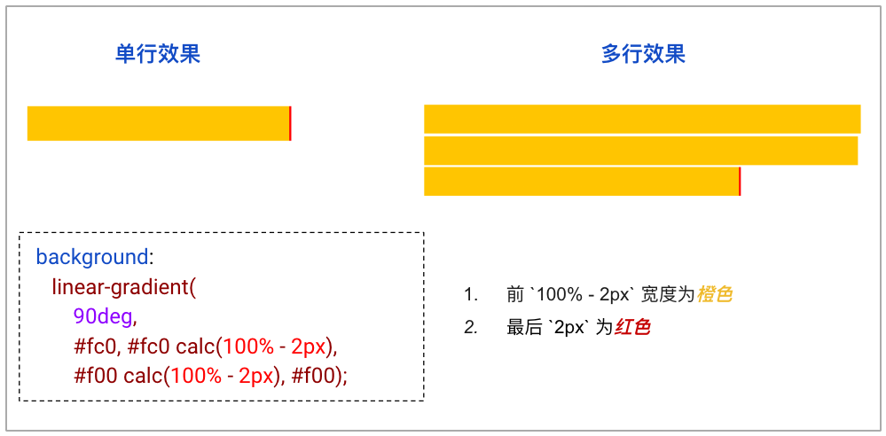
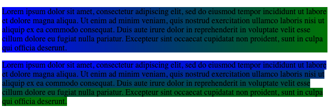
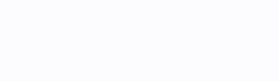

# 类 ChatGpt 多行文本打字效果


这个效果其实本身并非特别困难，实现的方式也很多，在本文中，**我们更多的会聚焦于整个多行打字效果最后的动态光标的实现**。

也就是如何在文本不断变长，在不确定行数的情况下，让文字的最末行右侧处，一直有一个不断闪烁的光标效果：


## 单行文本打字效果

单行打字效果，其核心就是就是让字符一个一个的出现，可以借助 `animation` 的 `steps` 的特性实现，也就是逐帧动画。

从左向右和从上向下原理是一样的，以从左向右为例，假设我们有 26 个英文字符，我们已知 26 个英文字符组成的字符串的长度，那么我们只需要设定一个动画，让它的宽度变化从 `0 - 100%` 经历 26 帧即可，配合 `overflow: hidden`，steps 的每一帧即可展出一个字符。

当然，这里需要利用一些小技巧，我们如何通过字符的数量知道字符串的长度呢？

划重点：**通过等宽字体的特性，配合 CSS 中的 `ch` 单位**。

CSS 中，`ch` 单位表示数字 “0” 的宽度。如果字体恰巧又是等宽字体，即每个字符的宽度是一样的，此时 `ch` 就能变成每个英文字符的宽度，那么 `26ch` 其实也就是整个字符串的长度。

利用这个特性，配合 animation 的 `steps`，我们可以轻松的利用 CSS 实现打字动画效果：

```html
<h1>Pure CSS Typing animation.</h1>
```

```css
h1 {
    font-family: monospace;
    width: 26ch;
    white-space: nowrap;
    overflow: hidden;
    animation: typing 3s steps(26, end);
}

@keyframes typing {
    0% {
        width: 0;
    }
    100% {
        width: 26ch;
     }
}
```

### 效果局限

当然，上述效果一开始已经写死了最终的文本。这一块，我们实际中可能是通过 Javascript 不断的赋值新内容。

不过，即便去除掉文本内容生成的方式这个因素，上述看似美好的动画效果，还有几个弊端：

1. **限制了等宽字体**，这其实就是非常大的一个问题，正常的页面，其实用的肯定都不是等宽字体，常见的衬线与非衬线字体，都不是等宽字体。
2. **限制了单行文本**，实际效果，类似于 GPT 吐答案这种，单行内容肯定是无法满足的，我们需要有一种光标效果能适配多行文本的方式。

## 巧用 background 实现多行光标效果

好，那接下来，我们尝试换一种思路实现一个适配单行和多行的文本打字效果。

首先，我们将文本内容的生成，替换成使用 Javascript 生成：

```html
<p id="content"></p>
```

```js

const text = 'Lorem ipsum dolor sit amet consectetur adipisicing elit......';
const contentElement = document.getElementById('content');
let index = 0;

function addNextCharacter() {
  if (index < text.length) {
    contentElement.textContent += text[index];
    index++;
    setTimeout(addNextCharacter, Math.random() * 150 + 30);
  }
}

addNextCharacter();
```

接下来，我们核心需要实现的就是**任意行数下动态光标的效果**。

也就是最开始的这个效果，文字最后的光标效果：



这里，我们可以使用行内元素的 background 渐变实现。

复习一下，之前我们讲过很多次是 background 在`display: inline` 和 `display: block` 下的不同表现。

其核心现象就是 `display: inline` 内联元素的 `background` 展现形式与 `display: block` 块级元素（或者 `inline-block`、`flex`、`grid`）不一致。

简单看个例子：

```html
<p>Lorem .....</p>
<a>Lorem .....</a>
```

这里需要注意，`<p>` 元素是**块级元素**，而 `<a>` 是**内联元素**。

我们给它们统一添加上一个从绿色到蓝色的渐变背景色：

```css
p, a {
  background: linear-gradient(90deg, blue, green);
}
```

看看效果（上为块级元素，下为内联元素）：



什么意思呢？区别很明显，块级元素的背景整体是一个渐变整体，而内联元素的每一行都是会有不一样的效果，整体连起来串联成一个整体。

基于上述的 Demo，我们可以给它们添加一个 `background-size` 的动画。像是这样：

```css
p, a {
    color: #000;
    background: linear-gradient(90deg, blue, green);
    background-size: 100% 100%;
    background-repeat: no-repeat;
    transition: all 1s linear;
}

p:hover ,
a:hover {
    background-size: 0 100%;
}
```

效果如下：


就可以得到这样不同的动画，可以看到，在 `display: inline` 的 `<a>` 标签下，动画效果是以行为单位进行变换的。

针对这个特性，我们将我们的文本容器，改为 `display: inline`，然后给他设置一个特殊的背景，前 `100% - 2px` 宽度为一个颜色，最后 `2px` 为一个颜色。

```css
p {
    display: inline;
    background: linear-gradient(90deg, #fc0, #fc0 calc(100% - 2px), #f00 calc(100% - 2px), #f00);
}
```

其中核心的背景代码 `background: linear-gradient(90deg, #fc0, #fc0 calc(100% - 2px), #f00 calc(100% - 2px), #f00)` 表达的含义就是前 `100% - 2px` 宽度为橙色，最后 `2px` 为红色。



基于上述这个效果：

1. 我们只需要把前 `100% - 2px` 宽度的橙色，设置为透明
2. 最后 2px 的红色，设置成 `#000` 黑色到 `transparent` 透明的动态变化

完整的 CSS 代码如下：

```css
:root {
    --pointerColor: #000;
}
p {
    display: inline;
    background: linear-gradient(90deg, transparent, transparent calc(100% - 2px), var(--pointerColor) calc(100% - 2px), var(--pointerColor));
    animation: colorChange .8s linear infinite;
    padding-right: 4px;
}
@keyframes colorChange {
    0%, 50% {
        --pointerColor: #000;
    }
    50%, 100% {
        --pointerColor: transparent;
    }
}
```

如此一来，我们就成功的实现了**任意行数下动态光标的效果**。

**整个方案的核心，在于理解如何利用内联元素的 background，巧妙的实现动态光标效果，需要好好理解其中的奥妙**。

当然，实现这个动态光标的方式还有很多，譬如，我们只需要用一个宽度为 `2px` 的 `<span>` 元素，插入到元素的最尾部，实现 `#000` 黑色到 `transparent` 透明的动态变化。

只是文中这种方式，我认为是元素最少，且最为巧妙的方式。
