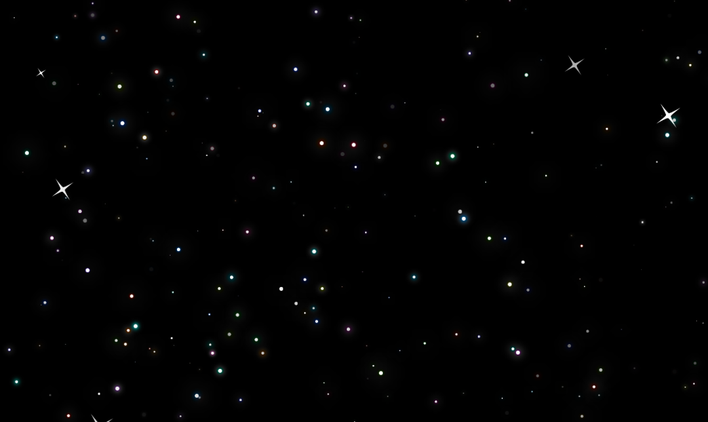
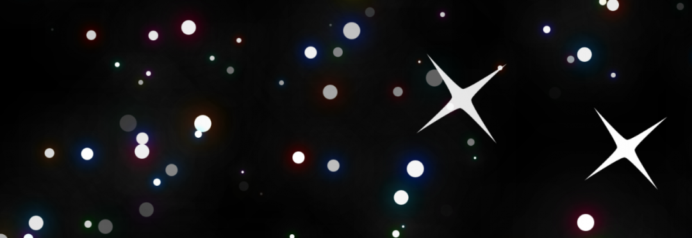
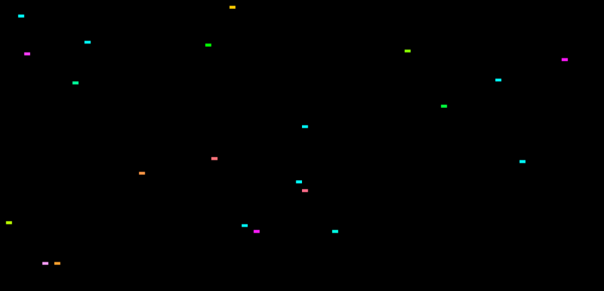

# 前端的随机魔法：CSS random() 全解析

在编程语言中，随机函数非常神奇。它们可以用来生成变化，让效果显得自然且新颖。而在此之前，CSS 里是没有办法生成随机数的。现在，`random()` 函数即将登场。你将能够创建一个随机的动画延迟、把内容随机放在屏幕上的某个位置、生成一个随机颜色，或者实现任何你想要的随机效果 —— 而这一切都不需要 JavaScript。

## 基础语法

这个新函数的参数模式是：`random(min, max, step)`。

你需要给出一个最小值和最大值，来定义随机数生成的范围。参数可以是任何类型的数值（整数、百分比、长度、角度等），只要三个参数的类型保持一致。`step` 参数是可选的，但当你需要生成 “整齐” 的数值时，它特别有用。例如：

- `random(0, 100, 2)`：会在 0 到 100 之间随机选择一个 偶数。
- `random(0turn, 1turn)`：则会返回一个角度的分数部分 —— 实际上就是 0 到 360 度之间的任意小数。

接下来我们通过几个示例来看看 `random()` 的用法。第一个例子是用 HTML 和 CSS 创建一个星空效果。

## 用 CSS 和 HTML 生成星空



一个纯 CSS 的星空效果，使用随机分布的小圆点、发光效果和四角星来实现。

```html
<html>
 <body>
     <div class=star></div>
     <div class=star></div>
     …
     <div class=star></div>
 </body>
 </html>
```

我们先为每一颗星星创建一个 HTML 元素。然后，把背景涂黑，用白色的小圆点来代表星星。把星星设置为固定定位 (`position: fixed`)，这样就能很方便地把它们随机分布到屏幕上。

```css
body {
   background-color: black;
}

.star {
   background-color: white;
   border-radius: 50%;
   aspect-ratio: 1/1;
   width: 3px;
   position: fixed;
}
```

接着，通过设置 `top` 和 `left` 属性为随机值，把星星分布到屏幕各处。这里 `top` 的范围是 0%–100%（Y 轴），`left` 也是单独生成的 0%–100%（X 轴）。默认情况下，每个 `random()` 函数都会基于均匀分布生成不同的随机值。

```css
.star {
   top: random(0%, 100%);
   left: random(0%, 100%);
 }
```

为了让效果更生动，可以把 “星星” 的大小也做成随机的。

```css
 .star {
    width: random(2px, 10px, 1px);
 }
```

注意这里 `top` 和 `left` 使用的是百分比，而 `width` 用的是像素。只要保证同一个参数里的单位一致，就可以自由选择。上面例子中的第三个参数 `1px`，确保星星的大小是按 1px 为步长变化的，这样生成的尺寸更加整齐，星空看起来也更有层次。

### 给星星加特效

在此基础上，还可以添加一些特效，比如用阴影和混合模式给星星加上微微的光晕。

```css
 .star {
     --star-size: random(--random-star-size, 1px, 7px, 1px);
     background-color: white;
     border-radius: 50%;
     aspect-ratio: 1/1;
     width: var(--star-size);
     position: fixed;
     top: random(0%, 100%);
     left: random(0%, 100%);
     filter: drop-shadow(0px 0px calc(var(--star-size) * 0.5) oklch(0.7 0.2 random(0, 100)))
             drop-shadow(0px 0px calc(var(--star-size) * 2) white);
     mix-blend-mode: hard-light;
 }
```

### 共享随机数与自定义属性

`--star-size` 这个自定义属性让我们可以重复使用生成的随机像素大小。但在 `random()` 中结合自定义属性时，有一些关键点需要注意。首先，你会注意到 `random()` 函数的第一个参数看起来像是另一个自定义属性。这里使用的 `--random-star-size` 被称为 ident。它的作用是确保同一个 ident 出现的地方，都能使用同一个随机值。

你可能会问，为什么这里需要这样做？关键在于要理解：把一个 CSS 函数赋值给自定义属性，并不像编程语言里那样存储了某个结果。自定义属性更像是一种 文本替换机制。也就是说，当你调用 `var()` 时，实际上发生的事情只是用你声明的属性内容替换掉 `var()`，相当于复制了一份定义，而不是使用函数运行后的结果。

在这个例子里，这意味着如果直接用 `random()`，每次替换都会重新生成随机数，而不是使用同一个值。

回到我们的例子，一个理想的星星光晕效果，需要基于星星的随机尺寸来确定模糊半径。这个时候，可以用 `calc()` 把星星大小作为基准，计算叠加阴影的模糊范围。但要实现这个效果，就必须确保用到的是同一个随机数，因此 使用命名 ident 就是正确做法。

在这个样式里，第一个投影还用 `random()` 生成了一个色相，通过 `oklch()` 给星星添加了鲜艳的颜色，再和白色光晕一起叠加，混合模式设为 `hard-light`。这样的组合让星星既有柔和的白光，又带着动态的彩色点缀。

### 随机发光的星点

使用命名 ident 可以让一个元素的多个属性共享相同的随机值。这只是 `random()` 支持的共享随机数方式之一。

除了 ident，`random()` 还提供了其他模式，比如 element-shared，可以让一个属性的随机值在所有匹配的元素之间共享；或者把两者结合使用，实现不同层级的共享。

不同点在于：

- ident：无论在何处使用相同的 ident，都会得到相同的随机值。
- element-shared：会让某个属性在所有元素上共享同一个随机值。

在星空的例子中，我们可以通过添加四角星来直观感受 `element-shared` 的效果：

```css
.star.fourpointed {
  --star-size: random(--random-four-point-size, 20px, 60px, 1px);
  	clip-path: shape(from 50% 0%,line to 50.27% 3.25%,curve to 56% 44% with 52.39% 28.72%/54.3% 42.3%,curve to 100% 50% with 57.77% 45.77%/72.43% 47.77%,line to 96.75% 50.27%,curve to 56% 56% with 71.28% 52.39%/57.7% 54.3%,curve to 50% 100% with 54.23% 57.77%/52.23% 72.43%,line to 49.73% 96.75%,curve to 44% 56% with 47.61% 71.28%/45.7% 57.7%,curve to 0% 50% with 42.23% 54.23%/27.57% 52.23%,line to 3.25% 49.73%,curve to 44% 44% with 28.72% 47.61%/42.3% 45.7%,curve to 50% 0% with 45.77% 42.23%/47.77% 27.57%,close);
  rotate: random(element-shared, -45deg, 45deg);
}
```



这里使用了 CSS 的 `shape()` 定义了一个四角星的图形来裁剪圆形背景。星星的大小依然是随机的，但要放大到几十像素才更逼真。更真实的效果来自模拟照片里星星的衍射光芒 —— 它们都沿着相同的角度排列，这和物理规律有关。

所以，尽管可以直接设定一个固定角度，但如果用随机角度会更有趣也更动态。不过要做到让所有四角星保持一致的旋转角度，就需要用到 element-shared。它会为所有元素的某个属性生成并共享同一个随机值，从而让所有四角星都以同样的随机角度旋转。

## 随机矩形

`random()` 还能用在很多其他场景。基于前面的星空例子，我们可以结合布局工具（比如 grid）来试试。



比如下面的例子，把页面划分成 100 行 100 列的网格，再在其中随机生成彩色矩形：

```html
<div class="grid">
  <div class="rectangle"></div>
  <div class="rectangle"></div>
  ...
</div>
```

```css
.grid {
   display: grid;
   --rows: 100;
   --columns: 100;
   grid-template-rows: repeat(var(--rows), 1fr);
   grid-template-columns: repeat(var(--columns), 1fr);
   width: 100vw;
   height: 100vh;
 }

 .rectangle {
   background-color: lch(100% 90% random(0deg, 360deg));
   grid-area: random(1, var(--rows), 1) / random(1, var(--columns), 1);
 }
```

## 照片堆叠效果

另一个有趣的用法是把 `random()` 用来模拟一叠随意放置的照片。

你可以花很多时间手动调整每张照片的角度和位置，或者干脆交给浏览器，每次加载页面时自动生成一个新的排布。


```css
 .stack img {
     width: 100%;
     grid-column: 1;
     grid-row: 1;
     border: 10px solid hsl(0, 100%, 100%);
     box-shadow: 10px 10px 40px hsl(0, 0%, 0%, 20%);

     --random-rotate: rotate(random(-1 * var(--rotate-offset), var(--rotate-offset)));

     transition: .3s ease-out;
     transform: var(--random-rotate);
     transform-origin: random(0%, 100%) random(0%, 100%);
 }
```

这里每张照片都会被随机旋转、随机偏移，看起来就像是随意扔在桌面上一样。

更妙的是，可以把随机性融入交互里。比如在 hover 状态下，让图片再随机平移一点，会更有趣：

```css
 .stack:hover img {
     transform: var(--random-rotate) translateX(random(-1 * var(--translate-offset), var(--translate-offset))) translateY(random(-1 * var(--translate-offset), 
 var(--translate-offset)));
 }
```

## 幸运转盘

`random()` 函数甚至可以用来创建需要 不可预测结果 的交互效果。一个幸运转盘的示例就很好地展示了这一点：

```css
 @keyframes spin {
     from {
         rotate: 0deg;
     }
     to {
         rotate: 10turn; /* 对不支持 `random()` 的浏览器的回退方案 */
         rotate: random(2turn, 10turn, by 20deg);
     }
 }
```

当点击 “SPIN” 按钮时，`@keyframes` 动画会用 `random()` 生成一个旋转值，决定转盘最后停在哪个位置。

这个例子凸显了现代 CSS 越来越强大的能力 —— 你可以仅靠样式表，就定义交互、随机性和动画。

## 随机性速查表

根据不同的需求，`random()` 有多种用法，也有不同方式在元素之间共享随机值。

### 最大随机性

每个属性都有不同的随机值，并且每个元素也都不同，结果是大量随机矩形。

```css
 .random-rect {
   width: random(100px, 200px);
   height: random(100px, 200px);
 }
```

### 在单个元素内通过名称共享

使用 ident，宽度和高度得到相同的值，但每个元素之间依然不同，因此会生成大量随机方形。

```css
 .random-square {
     width: random(--foo, 100px, 200px);
     height: random(--foo, 100px, 200px);
 }
```

### 在元素之间共享同一属性

使用 `element-shared`，宽度和高度分别是不同的值，但会在所有元素间共享，因此结果是许多相同大小的矩形。

```css
 .shared-random-rect {
     width: random(element-shared, 100px, 200px);
     height: random(element-shared, 100px, 200px);
 }
```

### 全局按名称共享

同时使用 命名 ident 和 element-shared，宽度和高度都会得到相同的随机值，而且在所有元素之间共享，因此结果是一堆大小相同的方形。

```css
 .shared-random-squares {
     width: random(--foo element-shared, 100px, 200px);
     height: random(--foo element-shared, 100px, 200px);
 }
```

## 现在就试试看

你可以在 Safari Technology Preview 中立即尝试 `random()`！

不过要注意：CSS 工作组还在讨论规范，关于这种实现方式是否最符合开发者需求，还有不少未决问题。
