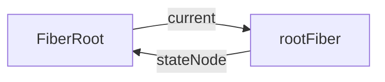
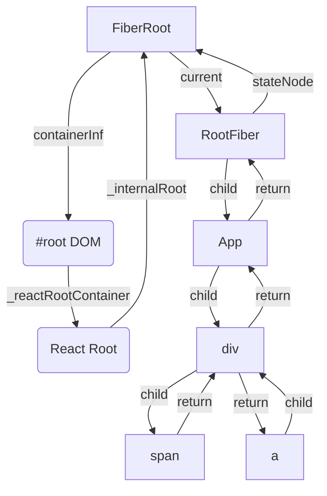

## FiberRoot 的含义与作用

+ `FiberRoot`是整个`React`应用的起点
+ `FiberRoot`包含应用挂载的目标节点（`<div id='root'></div>`）
+ `FiberRoot`记录整个`React`应用 更新过程中的各种信息

在`createFiberRoot()`中进行初始化：

+ 通过`createHostRootFiber`创建了`rootFiber`对象；
+ 创建了`FiberRoot`对象，将`current`属性赋值为`rootFiber`；
+ 将`FiberRoot`挂载到`rootFiber`的`stateNode`属性上；



### createFiberRoot 源码

```js
export function createFiberRoot(
  containerInfo: any,
  isConcurrent: boolean,
  hydrate: boolean,
): FiberRoot {
    
  const uninitializedFiber = createHostRootFiber(isConcurrent);

  let root;
  if (enableSchedulerTracing) {
    root = ({
      current: uninitializedFiber,
	  // ...
    }: FiberRoot);
  } else {
    root = ({
      current: uninitializedFiber,
	  // ...
    }: BaseFiberRootProperties);
  }
  uninitializedFiber.stateNode = root;
  return ((root: any): FiberRoot);
}
```

### FiberRoot 源码

```js
type BaseFiberRootProperties = {|
  // root节点，即 ReactDOM.render(<App/>, document.getElementById('root'))接收的第二个参数
  containerInfo: any,
  // 只有在持久更新中会用到，也就是不支持增量更新的平台，react-dom不会用到
  pendingChildren: any,
  // 当前应用对应的 Fiber 对象，是 RootFiber
  // ReactElement会有一个树结构，同时一个 ReactElement 对应一个 Fiber 对象，
  // 所以Fiber也会有树结构
  current: Fiber,

  // 一下的优先级是用来区分
  // 1) 没有提交(committed)的任务
  // 2) 没有提交的挂起任务
  // 3) 没有提交的可能被挂起的任务
  // 我们选择不追踪每个单独的阻塞登记，为了兼顾性能
  // 最老和新的在提交的时候被挂起的任务                    
  earliestSuspendedTime: ExpirationTime,
  latestSuspendedTime: ExpirationTime,
  // The earliest and latest priority levels that are not known to be suspended.
  // 最老和最新的不确定是否会挂起的优先级（所有任务进来一开始都是这个状态）
  earliestPendingTime: ExpirationTime,
  latestPendingTime: ExpirationTime,
  // The latest priority level that was pinged by a resolved promise and can
  // be retried.
  // 最新的通过一个promise被reslove并且可以重新尝试的优先级
  latestPingedTime: ExpirationTime,

  // 如果有错误被抛出并且没有更多的更新存在，我们尝试在处理错误前同步重新从头渲染
  // 在`renderRoot`出现无法处理的错误时会被设置为`true`
  didError: boolean,

  // 正在等待提交的任务的`expirationTime`
  pendingCommitExpirationTime: ExpirationTime,
  // 已经完成的任务的FiberRoot对象，如果你只有一个Root，那他永远只可能是这个Root对应的Fiber，或者是null
  // 在commit阶段只会处理这个值对应的任务
  finishedWork: Fiber | null,
  // 在任务被挂起的时候通过setTimeout设置的返回内容，用来下一次如果有新的任务挂起时清理还没触发的timeout
  timeoutHandle: TimeoutHandle | NoTimeout,
  // 顶层context对象，只有主动调用`renderSubtreeIntoContainer`时才会有用
  context: Object | null,
  pendingContext: Object | null,
  // 用来确定第一次渲染的时候是否需要融合
  +hydrate: boolean,
  // 当前root上剩余的过期时间
  // TODO: 提到renderer里面区处理
  nextExpirationTimeToWorkOn: ExpirationTime,
  // 当前更新对应的过期时间
  expirationTime: ExpirationTime,
  // List of top-level batches. This list indicates whether a commit should be
  // deferred. Also contains completion callbacks.
  // TODO: Lift this into the renderer
  // 顶层批次（批处理任务？）这个变量指明一个commit是否应该被推迟
  // 同时包括完成之后的回调
  // 貌似用在测试的时候？
  firstBatch: Batch | null,
  // root之间关联的链表结构
  nextScheduledRoot: FiberRoot | null,
|};
```

## Fiber 的含义和作用

+ 每一个`ReactElement`对应一个`Fiber`对象；
+ 记录节点的各种状态，比如`ClassComponent`中的`state`和`props`的状态就是记录在`Fiber`对象上的；
+ 只有当`Fiber`对象更新后，才会更新到`ClassComponent`上的`this.state`和`this.props`上；

> **`this`上的`state`和`props`是根据`Fiber`对象的`state`、`props`更新的。**
>
> 这实际上也方便了`ReactHooks`，因为`hooks`是为`FunctionalComponent`服务的。虽然`FunctionalComponent`没有`this`，但`Fiber`上有，是可以拿到`state`和`props`的；

+ 串联整个应用形成树结构,每个`ReactElement`通过**`props.children`**与其他`ReactElement`连结起来

> `ReactElement`只会把子节点（`props.children`）的**第一个子节点当做`child`节点**，其余的子节点（也就是第一个子节点的兄弟节点）都是从第一个子节点开始，依次**单向连接**至后一个兄弟节点；
>
> 每个子节点都会指向父节点（红箭头），也就是`Fiber`对象的`return`属性；

### Fiber 源码

```js
// Fiber对应一个组件需要被update处理或者已经update处理了，一个组件可以有一个或者多个Fiber
type Fiber = {|
  // 标记不同的组件类型，有原生的DOM节点，有React自己的节点
  tag: WorkTag,

  // ReactElement里面的key
  key: null | string,

  // ReactElement.type，也就是我们调用`createElement`的第一个参数
  elementType: any,

  // 异步组件resolved之后返回的内容，一般是`function`或者`class`
  type: any,


  // 跟当前Fiber相关本地状态（比如浏览器环境就是DOM节点）
  // 不同类型的实例都会记录在stateNode上
  // 比如DOM组件对应DOM节点实例
  // ClassComponent对应Class实例
  // FunctionComponent没有实例，所以stateNode值为null
  // state更新了或props更新了均会更新到stateNode上 
  stateNode: any,

  // 指向他在Fiber节点树中的`parent`，用来在处理完这个节点之后向上返回
  return: Fiber | null,

  // 单链表树结构
  // 指向自己的第一个子节点
  child: Fiber | null,
  // 指向自己的兄弟结构
  // 兄弟节点的return指向同一个父节点
  sibling: Fiber | null,
  index: number,

  // ref属性
  ref: null | (((handle: mixed) => void) & {_stringRef: ?string}) | RefObject,

  // 新的变动带来的新的props
  pendingProps: any, 
  // 上一次渲染完成之后的props
  memoizedProps: any,

  // 该Fiber对应的组件产生的Update会存放在这个队列里面
  updateQueue: UpdateQueue<any> | null,

  // 上一次渲染的时候的state
  // 新的state由updateQueue计算得出，并覆盖memoizedState
  memoizedState: any,

  // 一个列表，存放这个Fiber依赖的context
  firstContextDependency: ContextDependency<mixed> | null,

  // 用来描述当前Fiber和他子树的`Bitfield`
  // mode有conCurrentMode和strictMode
  // 共存的模式表示这个子树是否默认是异步渲染的
  // Fiber被创建的时候他会继承父Fiber
  // 其他的标识也可以在创建的时候被设置
  // 但是在创建之后不应该再被修改，特别是他的子Fiber创建之前
  mode: TypeOfMode,

  // Effect 用来记录Side Effect
  effectTag: SideEffectTag,

  // 单链表用来快速查找下一个side effect
  nextEffect: Fiber | null,

  // 子树中第一个side effect
  firstEffect: Fiber | null,
  // 子树中最后一个side effect
  lastEffect: Fiber | null,

  // 代表任务在未来的哪个时间点应该被完成
  // 不包括该Fiber的子树产生的任务
  expirationTime: ExpirationTime,

  // 快速确定子树中是否有不在等待的 update
  childExpirationTime: ExpirationTime,

  // 在Fiber树更新的过程中，每个Fiber都会有一个跟其对应的Fiber
  // 我们称他为`current <==> workInProgress`
  // 在渲染完成之后他们会交换位置
  // doubleBuffer: Fiber在更新后，不用再重新创建对象，
  // 而是复制自身，并且两者相互复用，用来提高性能
  alternate: Fiber | null,

  // 下面是调试相关的，收集每个Fiber和子树渲染时间的

  actualDuration?: number,

  // If the Fiber is currently active in the "render" phase,
  // This marks the time at which the work began.
  // This field is only set when the enableProfilerTimer flag is enabled.
  actualStartTime?: number,

  // Duration of the most recent render time for this Fiber.
  // This value is not updated when we bailout for memoization purposes.
  // This field is only set when the enableProfilerTimer flag is enabled.
  selfBaseDuration?: number,

  // Sum of base times for all descedents of this Fiber.
  // This value bubbles up during the "complete" phase.
  // This field is only set when the enableProfilerTimer flag is enabled.
  treeBaseDuration?: number,

  // Conceptual aliases
  // workInProgress : Fiber ->  alternate The alternate used for reuse happens
  // to be the same as work in progress.
  // __DEV__ only
  _debugID?: number,
  _debugSource?: Source | null,
  _debugOwner?: Fiber | null,
  _debugIsCurrentlyTiming?: boolean,
|};
```

## Fiber 树例子

通过图来了解一下这个 `fiber` 树的结构。

```react
const APP = () => (
    <div>
        <span></span>
        <a></a>
    </div>
)
ReactDom.render(<APP/>, document.querySelector('#root'))
```

假如说我们需要渲染出以上组件，那么它们对应的 `fiber` 树应该长这样：



