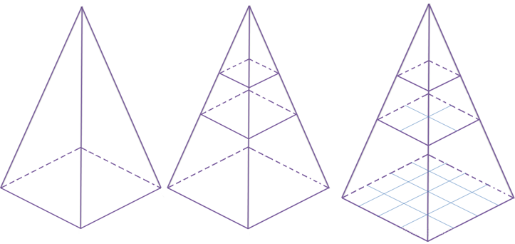
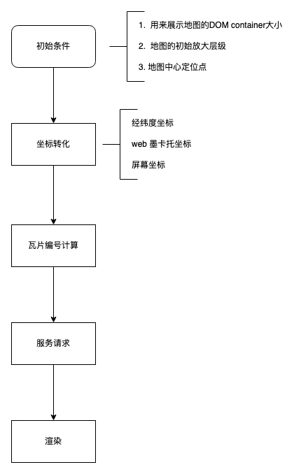

# Web GIS 开发入门

## 坐标系

总所周知，地球不是一个标准的球体，而是一个近似的椭球体，越靠近赤道则越宽。既然是一个三维物体，那么进行坐标系定位一般来说需要 x，y，z 一个三维坐标系来定义。但是为了更好的在球面上进行定位，所以就采取了使用经纬度的方式，在 GIS 开发中，以经度、维度以及相对高度所组成的坐标系将其称作为**地理坐标系（Geographic Coordinate System， 简称 GCS）** 。

而在平时使用手机地图或者网页地图的时候，展现在我们面前的则是一个平面地图。如果说此时我们需要查询自己去某个饭店有多远，手机会告诉我们距离多少公里或者多少米，所以我们得到两个地点之间的距离是平面距离，使用米或者千米做单位。而此时的定位坐标系，就被称作为**投影** **坐标系（Projection Coordinate System，简称PCS）** 。

很显然，我们平时使用的平面地图，肯定是做了这样一件事情，那就是将地理坐标系转换成投影坐标系。但是，一个球面从直观上是无法展开成一个连续的，没有褶皱的平面的，因此我们需要一定的数学方法进行转换。

其实从投影坐标系的名称也可以看出，坐标系转化的方法就是投影。可以想象一下，一个3D的物品被光照射之后的影子，是不是就是2D平面了。当然坐标系的转换肯定不是随便投影就行，为了让投影之后的坐标系有一定的使用价值，**投影的方式一般都会具备一定的规律，比如投影后距离不变，或者角度不变**等。

## 墨卡托投影

**墨卡托投影**（Mercator Projection） 是在1569年，当时的地理学家杰拉杜斯·墨卡托提出的一种角度不变的投影方式，又被称作为等角正切圆柱投影。我们可以想象一下，将地球置于一个空心圆柱体中，其中地球的赤道正切于圆柱体。然后**假设地心有一个灯泡**，灯泡的光线能够透过地表照射到圆柱体表面，那么地球球面上的绝大部分区域都会相应的被投影到圆柱体上。此时将圆柱体展开，以赤道的投影为横坐标，以本初子午线的投影的纵坐标，就得到了以墨卡托投影所构成的平面坐标系。


我们可以看到该投影有以下特点：

- 经线、纬线分别为平行直线，并且经纬线之间互相垂直
- 纬度越高的地方，投影面积形变越大，而在纬度无限接近于极点的位置，面积则会无限大，因此纬度的上限和下限分别是北纬 89° 和南纬 89°。
- 虽然在面积上有形变，但是是各个方向上的均等扩大，所以保证了地图方向、角度以及位置关系的正确性。

## Web 墨卡托

**Web墨卡托，也称伪墨卡托（Pseudo Mercator Projection）** ，属于一种不严格的墨卡托投影方式，其被 Google Map 最先发明，后续又被 Bing，百度， OSM 等各个网络地图服务商使用，因此成为了互联网电子地图最常见的投影方式。

其和墨卡托投影的最大区别在于，墨卡托投影是建立在地球是一个椭球体的基础上进行投影公式计算的，而 Web 墨卡托在其计算公式上**直接将椭球体变成了球体**，大大简化了投影转化的计算方法，其计算公式为：
$$
\left\{ {\begin{array}{*{20}{c}}
{x = \alpha  \times \theta }\\
{y = \alpha \times \ln \tan (\frac{\pi }{4} + \frac{\varphi }{2})}
\end{array}} \right.
$$
其中 x, y 为投影坐标系中的坐标值， $\alpha$ 为赤道半径， $\theta$ 为经度， $\varphi$ 为纬度。

此外，web 墨卡托投影一般默认为一个正方形。已知赤道半径为 6378137 米，则赤道的周长则为 $2\pi \alpha$ = 40075016.68557849，所以投影坐标系中 X 轴的范围为 [-20037508.342789244, 20037508.342789244]，则 Y 轴的范围也为 [-20037508.342789244, 20037508.342789244]，可以通过上面公式反算出纬度被限制在了[-85.0511287， 85.0511287] 范围内。

在日常地图使用中，使用 web 墨卡托投影的地图已经足够了。但是如果有一些其他的要求，比如说要精确描述区域面积，则一般使用圆锥投影，比如阿尔伯斯投影、兰伯特投影等，这里就不再具体展开，感兴趣的可以看一下 常见的地图投影方式[1]。

## EPSG

上个小节提到了地理坐标系和投影坐标系，还提到了一些投影方法。就拿墨卡托和web墨卡托来说，前者是将地球看作一个椭球体，后者将地球看作了一个球体。所以说我们并没有一个严格的标准且统一的方式来表述某个点的位置。

当没有统一标准的时候，就会存在很多体系标准，而当各种体系标准变得庞大且失去统一管理的时候，人们想将不同体系之间的坐标互相转化的话就会变得异常困难。EPSG[2] 就是来管理这些坐标体系的一个组织。

EPSG 通过 WKID 来管理不同的坐标体系，WKID 简单理解就是 ID，每个坐标体系拥有独一无二的ID。拿一些常用的WKID 举例：

### WGS84 （WKID = 4326）

在介绍 WGS84 之前，我们需要弄清楚一个概念：**大地坐标系**。大地坐标系是**以参考椭球面为基准面**而建立起来的坐标系，也可以简单理解成属于地理坐标系的一种。大地坐标系又分为参心大地坐标系和地心大地坐标系。其中参心坐标系是以椭球几何中心为原点构建的坐标系，一般用来对局部地区大地测绘使用（合适的参心坐标系可以使得某一地区的地图投影变形最小），而地心坐标系是以地球质心为原点构建的坐标系，一般用来对地球整体大地测绘使用。

WGS84 则属于地心大地坐标系，是世界上第一个统一的大地坐标系，所以也被称为世界大地坐标系，而我们常说的 GPS 定位系统就是依据此坐标系建立的。除了中国地区以外，很多电子地图比如谷歌、Bing 等都是用的是 WGS84。

### CGCS2000（WKID = 4490）

我国在上世纪50年代和80年代分别建立了北京54和西安80参心大地坐标系，之后随着社会经济，科学的发展，中国测绘、地震部门和科学院有关单位重新建立了中国新一代地心大地坐标系，也就是  CGCS2000，所以也被称为 2000 国家大地坐标系。

和 WGS84 相比，两者本质上可以算是一致的，只是在计算过程中采用的参数有细微的差别。这个差别映射到地图上，也只会有 cm 级别的不同，因此如果在精度不需要严格到 cm 级别的应用中，两者可以默认相容。

### Web 墨卡托 （WKID = 3857)

Web 墨卡托也在 EPSG 的管理范围下，可见 EPSG 管理的坐标系不仅仅只有地理坐标系，同样也包括投影坐标系。

其实原本 EPSG 不准备将 web 墨卡托纳入 WKID，因为 web 墨卡托毕竟是采用了不严谨的假设，使得原本是等角投影的墨卡托变成了近似等角，从而直接影响到投影坐标的精度。但是随着 web 墨卡托在 web 领域被广泛使用从而名声大噪，EPSG 也只能将其接受。

## GCJ02 和 BD09

GCJ02 是中国国家测绘局所制定的坐标系统，其本质就是在 WGS84 经纬度的基础上进行了一层加密。由于国家相关安全保密规定，我国所有对外的地图系统都需要进行加密。所以高德以及谷歌的中国地图都是使用 GCJ02 坐标系。所以，如果在 GCJ02 的坐标系下直接使用 GPS 的经纬度坐标，那么就会得到一个错误的定位地点。

比如在手机上下载一个GPS定位软件（部分硬件设备获取的GPS信息是原始的GPS信息，而一般地图软件的定位信息都是GCJ02加密过后的），得到天安门的经纬度是 39.907375,116.391349。

但是在高德地图上，使用该坐标点则定位到其他地方，所以 GCJ02 坐标系在业内也常常被称为**火星坐标系**。

而百度在 GCJ02 的基础上又进行了一层加密，这就是 BD09。

至于 GCJ02 的加密算法是不对外公开的，只有通过相关地图资质的审核，有关部门才会提供相应的加密算法。而国内一些拿到资质的厂商也提供了相应的 API 对外提供，可供用户将 WGS84的坐标转换成 GSJ02 的坐标。

严格意义上并没有 GCJ02 转化成 WGS84 的反向转化算法。

---

[1] 常见的地图投影方式: _https://pro.arcgis.com/zh-cn/pro-app/latest/help/mapping/properties/list-of-supported-map-projections.htm_

[2] EPSG: _https://epsg.io/_

[3] 高德API: _https://lbs.amap.com/api/webservice/guide/api/convert/_

[4] 几种互联网地图服务背后的解读（WMS，WFS，WMTS，TMS）: _https://zhuanlan.zhihu.com/p/398998331_

[5] 参心坐标系和地心坐标系: _https://www.jianshu.com/p/7bbbd86dec82_

[6] 墨卡托投影‒ ArcGIS Pro | 文档: _https://pro.arcgis.com/zh-cn/pro-app/latest/help/mapping/properties/mercator.htm_

[7] 聊聊GIS中的坐标系|再版: _https://zhuanlan.zhihu.com/p/98839097_


## 数据服务

通过了解坐标系原理，我们知道了如何将三维的地理坐标系转换成平面的投影坐标系。但是光有坐标系肯定是不行的，我们还是需要将对应的数据呈现在坐标系中才能有一个完整的地图，那么就不得不去了解地图常见的数据服务。

### OGC

OGC （开放地理空间联盟 Open Geospatial Consortium）是一个制定空间信息和基于位置服务相关标准的国际化组织。严格来说，OGC 并不算是一个“官方”组织，但是由于 OGC 有着ESRI、Google、Oracle 等业界强势企业作为其成员，同时还和 W3C、ISO、IEEE 等协会或组织结成合作伙伴关系。因此在 GIS 开发领域，绝大部分开发者或者企业都会依据 OGC 标准来提供地图数据服务。

在地图数据服务中最显而易见的肯定是图片服务，用图片来承载一个地理信息数据，这个理所应当很好理解。所以当地理信息数据被封装成了图片信息并且可以根据用户的请求而动态返回的服务就被称作 **WMS** **(web map service)** 。

除了图片资源以外，地图上还会有道路信息，POI 信息等，而这些数据往往是灵活的，可编辑的，因此肯定不能通过图片信息进行传递，因此就有了矢量资源。而一般地图的矢量数据会包含空间数据和属性数据，拿常见的 GeoJSON 格式举例：

```json
{   
    "type": "FeatureCollection",  
    "features": [  
        {  
            "type": "Feature",  
            "geometry": {  
                "type": "Point",  
                "coordinates": [102.0, 0.5] // 空间数据  
            },  
            "properties": { // 属性数据  
                "name": "xx超市"，  
            }  
        }  
    ]  
}
```

这种提供给用户矢量数据并且支持增删改查的服务就被称作 **WFS(web feature service)**。

在实际应用中 WMS 和 WFS 也不能够完全胜任要求，比如我打开一张世界地图，服务返回给我一张世界地图的图片，但是我想通过放大的方式来定位到我的家，那么要实现这个功能这个图片的分辨率就会高的不可思议。这种要求显然是不合理的，所以 OGC 在 WMS 服务端的基础上制定了 **WMTS(web map tile service)** ，也就是我们常说的瓦片服务。此外常见的瓦片服务还有 **TMS(tiled map service)** ，但是这个服务不是 OGC 创建的协议。

### 瓦片

不同于 WMS，瓦片服务提供的图片是提前制定好的静态图片，可以通过下面的示意图来理解瓦片。



在上面的金字塔模型中，世界地图分成了多层级别的瓦片服务。这个层就对应着地图的放大级别。在最上层，也就是地图缩小到最小程度时，只提供一张图片来展示世界的全貌。用户如果进行放大操作提升地图的放大级别，那么世界地图相应的展示第二个层级的图片，而实际上展示的地理位置区域大小没有变化，只是原本一张图片展示世界全貌，变成了和原本图片同等大小的四张图片来展示世界全貌。和原本相比，就会更加清晰一些。

同样，用户继续放大，用来展示的层级所拥有的图片数量就会越多，展示的细节就会越来越清晰。但是由于屏幕大小范围有限，所以可以只选择在屏幕范围之内的图片进行下载，这样就避免了下载一张超大的图片，从而减轻了服务压力提升了体验性能。而这种被分割的图片，就被叫做瓦片。

拿高德地图举例，因为是使用的 web 墨卡托投影，所以呈现的地图是正方形的。其瓦片排布编码的规律如下，其中 z 为放大层级，每个瓦片大小默认为 256 * 256，第 z 层级的瓦片数量为 $2^{2z}$。

高德地图瓦片链接为 http://webrd01.is.autonavi.com/appmaptile?lang=zh_cn&size=1&scale=1&style=8&x={x}&y={y}&z={z}，其中 z 为放大层级，x, y 为该瓦片在所在层级的编码。

当然这种瓦片排布的规律不是通用的，不同厂商制定的瓦片服务都可能存在着一些差别，所以在使用瓦片服务的时候要注意一些。

## 定位渲染

在知道坐标系和地图数据服务之后，我们其实就可以简单的模拟一下地图上的点是如何渲染的了。

1. 已知初始条件
	+ 定义 DOM container 大小为 1200 * 1000
	+ 初始放大层级为 12
	+ 中心定位点为天安门，也就是 GCJ02坐标系下的 116.397588,39.908775
	+ Web 墨卡托投影正方形的边长为 $l=40075016.68557849$
2. 计算 container 要展示出的地图区域
	+ 放大层级为 12，横轴或纵轴存在的瓦片个数为 $2^{12}=4096$
	+ 像素长度比为 $ratio = l \div 4096 \div 256 = {\rm{38}}{\rm{.2185141425881290435791015625}}$
	+ container 展示的地图面积为 $area = \left( {1200 \times radio} \right) \times \left( {1000 \times radio} \right) = 1,752,785,787.9206505990036522605952$
	+ 中心点的投影坐标点为
		$$
		\left\{ {\begin{array}{*{20}{c}}
		{x = \alpha  \times \theta =12957320.225725248}\\
		{y = \alpha \times \ln \tan (\frac{\pi }{4} + \frac{\varphi }{2}) = 4852694.552998661}
		\end{array}} \right.
		$$
	+ container 展示的地图区域为
		+ 所在横轴区间 [12934389.117239695, 12980251.334210802]
		+ 所在纵轴区间 [4833585.295927367, 4871803.810069955]
3. 计算出要展示的瓦片
	+ 瓦片编号计算公式
	$$
\begin{array}{l}
{n_x} = \left\{ {\begin{array}{*{20}{l}}
{  (x + l/2){\rm{  }}\ \bmod \  {\rm{ }}(256 \times ratio)}\\
{{\rm{       }}x{\rm{        }}\ \bmod \  {\rm{ (}}256 \times ratio{\rm{)}}}
\end{array}{\rm{  }}\begin{array}{*{20}{c}}
\ \ \ {x \ge 0}\\
\ \ \ {x < 0}
\end{array}} \right.\\\\
{n_y} = (l/2 - y){\rm{ \  mod \  (256}} \times {\rm{ratio)}}
\end{array}
		$$

	+ 瓦片编号区间：
		+ 横轴瓦片编号区间 [3370, 3374]  
		+ 纵轴瓦片编号区间 [1550, 1553]
	
	那么屏幕可视区范围展示的瓦片分布就应该是：
	
4. 验证
	在 ID 编辑器上，将背景配置成高德瓦片，并将放大层级设定为12，中心定位到天安门，可以得到如下图所示内容，发现屏幕内瓦片展示和我们之前手动算出来的结构保持一致。