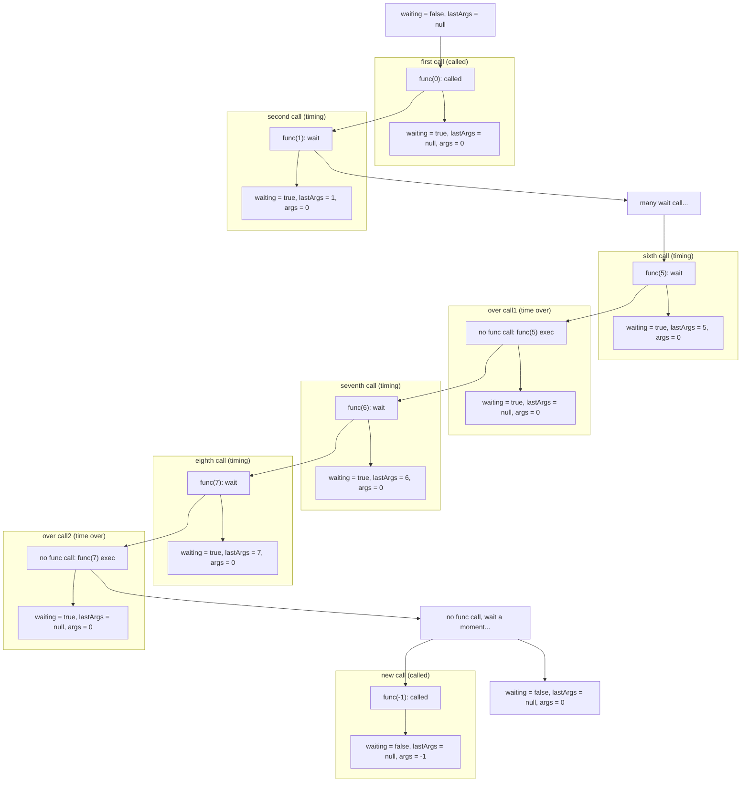

## 1. implement curry()

```js
const join = (a, b, c) => {
   return `${a}_${b}_${c}`
}

const curriedJoin = curry(join)

curriedJoin(1, 2, 3) // '1_2_3'

curriedJoin(1)(2, 3) // '1_2_3'

curriedJoin(1, 2)(3) // '1_2_3'

function curry(fn) {
  return function curried(...args) {
    if (args.length >= fn.length){
      return fn.apply(this, args)
    } else {
      return (...other) => {
        return curried.apply(this, args.concat(other))
      }
    }
  }
}
```

> + https://javascript.info/currying-partials
>
> + https://lodash.com/docs/4.17.15#curry

## 2. implement curry() with placeholder support

```js
const  join = (a, b, c) => {
   return `${a}_${b}_${c}`
}

const curriedJoin = curry(join)
const _ = curry.placeholder

curriedJoin(1, 2, 3) // '1_2_3'

curriedJoin(_, 2)(1, 3) // '1_2_3'

curriedJoin(_, _, _)(1)(_, 3)(2) // '1_2_3'
```

第二题，相比于第一题，多了一个 placeholder 占位符的处理，根据样例，后来的参数需要放置在之前的placeholder的地方。 大概想法和第一问是一样的，除了在**判断参数是否够用的时候，需要过滤掉 placeholder**：

```js
const expectedArgLength = func.length
const isArgsEnough = args.length >= expectedArgLength &&
  args.slice(0, expectedArgLength)
    .every(arg => arg !== curry.placeholder)
```

如果参数不够，和之前一样我们需要把参数和后来调用的参数合并在一起，再递归。 但是 这里不能简单的  `concat`，而需要寻找 placeholder 然后 merge：

```js
function curry(fn) {
  return function curried(...args) {
    const expectedArgLength = fn.length
    const isArgsEnough = args.length >= expectedArgLength &&
      args.slice(0, expectedArgLength)
        .every(arg => arg !== curry.placeholder)
    if (isArgsEnough) {
      return fn.apply(this, args)
    } else {
      return function (...newArgs) {
        const finalArgs = []
        let i = 0
        let j = 0
        while (i < args.length && j < newArgs.length) {
          if (args[i] === curry.placeholder) {
            finalArgs.push(newArgs[j])
            i += 1
            j += 1
          } else {
            finalArgs.push(args[i])
            i += 1
          }
        }

        while (i < args.length) {
          finalArgs.push(args[i])
          i += 1
        }

        while (j < newArgs.length) {
          finalArgs.push(newArgs[j])
          j += 1
        }
        return curried(...finalArgs)
      }
    }
  }
}
```

## 3. implement Array.prototype.flat()

```js
function flat(arr, depth = 1) {
  return depth ? 
    arr.reduce((acc, curr) => {
      return [...acc, ...(Array.isArray(curr) ? flat(curr, depth - 1) : [curr])]
    }, []) : arr;
}
```

## 4. implement basic throttle()

再次说明一下，`throttle(func, delay)`返回一个function，这个function无论多么频繁地调用，原始的 func 的调用也不会超过指定的频率。

比如，这是throttle之前的调用

```js
─ A ─ B ─ C ─ ─ D ─ ─ ─ ─ ─ ─ E ─ ─ F ─ G
```

按照3个单位进行throttle过后

```js
─ A ─ ─ ─ C ─ ─ ─D ─ ─ ─ ─ E ─ ─ ─ G 
```

注意到

- A 因为不在任何的冷却时间，所以立即被执行
- B 被跳过了，因为B和C都在A的冷却时间里。

**注意**

1. 请按照以上 spec 完成代码。以上逻辑和`lodash.throttle()`并不完全一致
2. 因为 `window.setTimeout` 和 `window.clearTimeout` 并不精确。所以在test你写的代码的时候，这两个方法会被替换为静态的实现。不过不用担心，interface 是一样的。

```js
function throttle(func, wait) {
    let waiting = false, lastArgs = null;
    return function(...args) {
        if(!waiting) {
            func.apply(this, args)
            waiting = true;
            let timeout = () => setTimeout(() => {
                waiting = false;
                if(lastArgs){
                    func.apply(this, lastArgs);
                    waiting = true;
                    lastArgs = null;
                    timeout();
                }
            }, wait);
            timeout();
        } else {
            lastArgs = args
        }
    }
}
```

`throttle` 是一个很考验闭包功底的练习，两个变量维护在闭包内：

+ `waiting`：记录当前是否处理等待状态；
+ `lastArgs`：记录上一次 throttle 调用的参数；



我们从上图，一步步分析其中闭包变量变化，以及 throttled func （throttle 函数返回的函数）的执行：

+ 根据题目要求，第一次调用  throttled func 时需要执行一次，然后进入 waiting 状态；
+ 进入 waiting 状态时，会执行一个 setTimeout，等待时间则是传入的 wait，在这个时间间隔内， throttled func 都不会执行，而是将其参数保存到闭包中；
+ 之后的 func(1) ~ func(5) 都在 wait 间隔中调用了，每次调用都会更新 lastArgs，args 并没有随着 func 调用而更新；
+ 之后没有 func 调用，直到 wait 时间 timeout 了，获取到最新的 lastArgs = 5，调用原函数，并置空 lastArgs；
+ 紧接着 func(6)，func(7) 调用，仍在 wait 时间间隔内，类似操作，更新 lastArgs；
+ 之后没有 func 调用，使用 lastArgs = 7 执行原函数，置空 lastArgs；
+ 等到 wait 时间间隔外后，仍没有 func 调用，waiting = true，状态复原，将开启新一轮 throttled；
+ func(-1) 调用，首次直接执行，此时更新了 args；

> 这里的一个疑惑点，在于为什么要保留使用 lastArgs 保留上一次的 args ？
>
> 上述详细的分析可知，每次 timeout 闭包捕获的 args，其实都是 timeout 函数声明定义时观测到的作用域，也就是 timeout 的递归调用不结束，args 总是第一次执行时的值。
>
> 这不是主要原因，重点是，在 wait timeout 前的 throttled  时间内，如何忽略掉多次频繁的调用？
>
> 出于这个首要目的，我们首先要以 timeout 时间点为基准，之前的调用都不执行，只是记录调用的参数；
>
> timeout 后，获取最后一次传参执行函数，并以该参数为判断依据，决定是否需要继续 wait。
>
> 因为执行原函数后，仍会递归调用一次 timeout 函数，在内部判断是否存在 lastArgs，有值则继续 wait；
>
> 为空则清空 waiting 状态，等待新的 throttle 。

## 5. implement throttle() with leading & trailing option

该题目是4. 手写throttle()的后续，请先完成第4题。

本题目中你需要实现一个增强的throttle()，使其支持第三个参数option: {leading: boolean, trailing: boolean}

+ leading: 是否立即执行
+ trailing: 是否在冷却后执行

4. 手写throttle() 实际上是 {leading: true, trailing: true}的特殊情形。

具体说明：

同样地按照之前的3单位的throttle来举例。

```
─ A ─ B ─ C ─ ─ D ─ ─ ─ ─ ─ ─ E ─ ─ F ─ G 
```

用`{leading: true, trailing: true} `来 throttle 后，我们得到

```
─ A ─ ─ ─ C ─ ─ ─ D ─ ─ ─ ─ E ─ ─ ─ G 
```

如果是 `{leading: false, trailing: true}`，A 和 E 被跳过了

```
─ ─ ─ ─ C ─ ─ ─ D ─ ─ ─ ─ ─ ─ ─ G 
```

如果是 `{leading: true, trailing: false}`，只有 A D E 被保留

```
─ A ─ ─ ─ ─ D ─ ─ ─ ─ ─ ─ E
```

如果是 `{leading: false, trailing: false}`，显而易见，什么都不会发生

这个难度没有增加，只是简单的扩展，代码如下：

```js
function throttle(func, wait, option = { leading: true, trailing: true }) {
  let waiting = false, lastArgs = null;
  const { leading, trailing } = option
  return function (...args) {
    if (!waiting) {
      if (leading) {
        func.apply(this, args)
      }
      waiting = true;
      let timeout = () => setTimeout(() => {
        waiting = false;
        if (lastArgs && trailing) {
          func.apply(this, lastArgs);
          waiting = true;
          lastArgs = null;
          timeout();
        }
      }, wait);
      timeout();
    } else {
      lastArgs = args
    }
  }
}
```

## 6. implement basic debounce()

你能够自己实现一个基本的`debounce()`吗？

+ 当事件触发时，相应的函数并不会立即触发，而是会等待一定的时间；
+ 当事件密集触发时，函数的触发会被频繁的推迟；
+ 只有等待了一段时间也没有事件触发，才会真正的执行响应函数；

```js
function debounce(func, wait) {
  let cancel = null;
  return (...args) => {
    clearTimeout(cancel)
    cancel = setTimeout(() => func(...args), wait)
  }
}
```

## 7. implement debounce() with leading & trailing option

本题目中你需要实现一个增强的 debounce()，使其支持第三个参数 option: {leading: boolean, trailing: boolean}

+ leading: 是否立即执行
+ trailing: 是否在冷却后执行

6. 手写 debounce() 实际上是 {leading: false, trailing: true}的特殊情形。

```js
function debounce(func, wait, option = {leading: false, trailing: true}) {
  let cancel = null
  return (...args) => {
    let isCalled = false;
    if(!cancel && option.leading){
      func(...args)
      isCalled = true;   // 已经立即执行, 阻止下次触发的立即执行
    }
    clearTimeout(cancel)

    cancel = setTimeout(()=> {
      cancel = null
      if(!isCalled && option.trailing){
        func(...args)
      }
    }, wait)
  }
}
```

### with cancel method

```js
function debounce(func, wait, option = {leading: false, trailing: true}) {
  let timer = null
  
  _debounce(...args) => {
    let isCalled = false;
    if(!cancel && option.leading){
      func(...args)
      isCalled = true;   // 已经立即执行, 阻止下次触发的立即执行
    }
    clearTimeout(cancel)

    cancel = setTimeout(()=> {
      timer = null
      if(!isCalled && option.trailing){
        func(...args)
      }
    }, wait)
  }
  _debounce.cancel = function() {
    if (timer) clearTimeout(timer)
    timer = null
    isInvoke = false
  }
  return _debounce
}
```

## 8. can you shuffle() an array?

能否手写一个shuffle() ?

当传入一个数组的时候，shuffle() 需要更换元素的顺序，每一种最终的数列都需要被相等的概率生成。

比如：

```js
const arr = [1, 2, 3, 4]
```

以上的数组共有 4! = 24 中不同的排列：

```js
[1, 2, 3, 4]
[1, 2, 4, 3]
[1, 3, 2, 4]
[1, 3, 4, 2]
[1, 4, 2, 3]
[1, 4, 3, 2]
[2, 1, 3, 4]
[2, 1, 4, 3]
[2, 3, 1, 4]
[2, 3, 4, 1]
[2, 4, 1, 3]
[2, 4, 3, 1]
[3, 1, 2, 4]
[3, 1, 4, 2]
[3, 2, 1, 4]
[3, 2, 4, 1]
[3, 4, 1, 2]
[3, 4, 2, 1]
[4, 1, 2, 3]
[4, 1, 3, 2]
[4, 2, 1, 3]
[4, 2, 3, 1]
[4, 3, 1, 2]
[4, 3, 2, 1]
```

你写的 `shuffle()` 需要按照相同的概率(1/24)来返回上述排列中的一种。

```js
function shuffle(arr) {
  for(let i = arr.length - 1; i > 0; i--){
    let j = Math.floor(Math.random() * (i + 1));
    [arr[j], arr[i]] = [arr[i], arr[j]];
  }
}
```

## 9. decode message

在一个字符串的二维数组中，有一个隐藏字符串。

```js
I B C A L K A
D R F C A E A
G H O E L A D 
```

可以按照如下步骤找出隐藏消息

1. 从左上开始，向右下前进
2. 无法前进的时候，向右上前进
3. 无法前进的时候，向右下前进
4. 2和3的重复

无法前进的时候，经过的字符就就是隐藏信息

比如上面的二维数组的话，隐藏消息是`IROCLED`

注：如果没有的话，返回空字符串

高赞答案

```js
function decode(message) {
  let i = 0, j = 0, cols = message[0]?.length
  let decoded = '', step = 1

  while(j < cols) {
    decoded += message[i][j]
    if(!message[i+step]){
      step *= -1
    }
    i += step
    j++
  }

  return decoded
}
```

我的答案

```js
function decode(message) {
  let word = "";
  let goingDown = true;
  let col = 0, row = 0, wallRow = message.length;
  if(wallRow === 0) return "";
  let wallCol = message[0].length;
  if(wallCol === 0 ) return "";
  while (col < wallCol) {
    word += message[row][col];
    if(row === wallRow - 1){
      goingDown = false;
    } else if(row === 0) {
      goingDown = true;
    }
    if(goingDown){
      row++;
    }else{
      row--;
    }
    col++;
  }
  return word;
}
```

## 10. first bad version

一个程序有多个版本，不知道什么时候开始有个bug混在其中。请你找到第一个坏掉的版本。

特定版本是否有bug，可以用`isBad(revision)`进行判定。

*注意*

1. 传入的都是非负整数
2. 如果没有找到，返回-1

```js
function firstBadVersion(isBad) {
    // 一个二分法查找
  return (version) => {
    let start = 0, end = version;
    while (start <= end) {
      const mid = Math.floor((start + end) / 2);
      if(isBad(mid)){
        end = mid - 1;
      } else {
        start = mid + 1;
      }
    }
    return start > version ? -1 : start; 
  }
}
```

