# 说说浏览器一帧的执行流程

考察你对浏览器渲染管线（Render Pipeline）和**一帧内执行流程**的理解。

## 时间预算

在 60fps 情况下：

```plaintext
1 秒 = 1000ms → 每帧时间 ≈ 1000 / 60 = 16.66ms
```

一帧中必须完成以下任务：

| 阶段                 | 时间预算（理想） | 说明                                 |
| -------------------- | ---------------- | ------------------------------------ |
| JS 执行              | 0 ~ 5ms          | 包括事件回调、setTimeout、动画逻辑等 |
| 样式计算             | < 1ms            | CSS 规则匹配、继承、计算样式值       |
| Layout（重排，回流） | 1 ~ 3ms          | 计算每个元素的位置和尺寸             |
| Paint（重绘）        | 1 ~ 4ms          | 绘制文本、背景、边框等像素           |
| Composite            | 1 ~ 3ms          | 图层合成，传给 GPU                   |
| 剩余                 | buffer 时间      | 提前结束，浏览器可提前渲染下一帧     |
## 执行触发点

由系统驱动，浏览器有一个内部“刷新时钟”（`vsync` 垂直同步信号），每隔 ~16ms 触发一次：

- 浏览器检测屏幕是否需要刷新
- 如果页面有更新请求（DOM 改了 / CSS 改了），就开始处理新一帧
## JS 执行

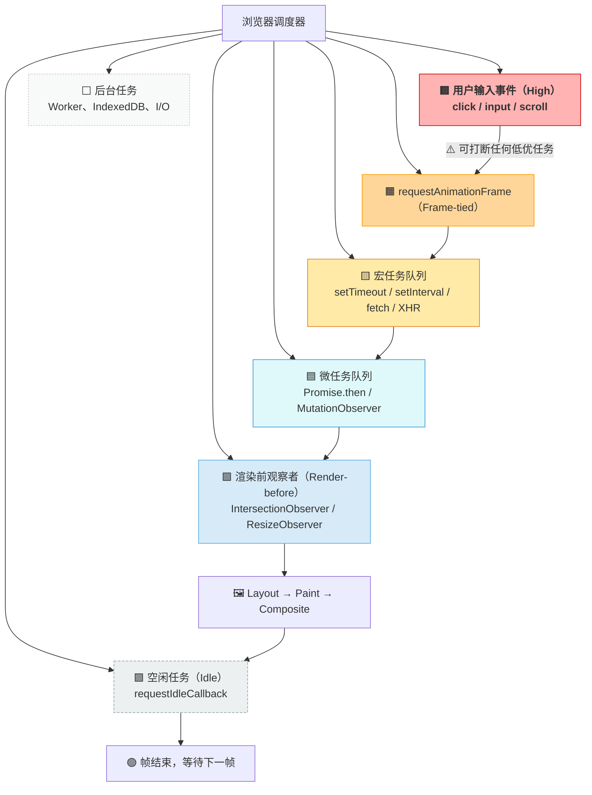

| 调度任务       | 说明                                                         |
| -------------- | ------------------------------------------------------------ |
| 🟥 用户输入任务 | 高优先级，实时性，可以“打断”正在等待执行的 rAF、setTimeout 等任务 |
| 🟧 rAF 回调     | 帧驱动渲染，紧跟用户输入，为动画准备数据                     |
| 🟨 宏任务       | 一般性逻辑处理、I/O                                          |
| 🟦 微任务       | Promise 后处理、DOM Mutation，永远在宏任务之后立即执行       |
| 🟩 渲染前回调   | 仅在帧结束前触发，适合懒加载判定                             |
| 🟪 空闲任务     | 仅在主线程空闲时执行，不保证执行，非关键逻辑使用             |
| ⬜ 后台任务     | 无实时要求，可并发                                           |

## 样式计算

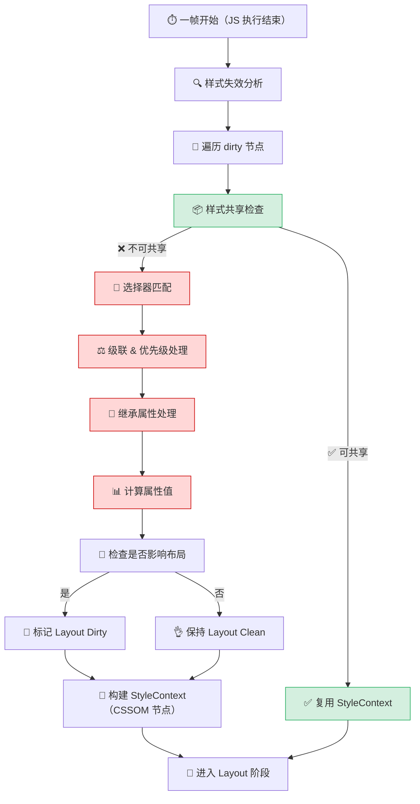

###  样式失效分析

浏览器维护一套**样式依赖关系系统**，在以下情况触发 *style invalidation*：

- 添加/删除/切换 class
- 伪类状态变化（`:hover`, `:focus`）
- 改变 DOM 结构（如 `appendChild`、移动节点）
- `media query` 变化（如视口变化）

浏览器并不会立即计算样式，而是将相关节点**标记为 dirty（待计算）**。

### 样式共享检查

在 Blink 中，**Style Sharing 是核心性能优化机制之一**。**判断当前 dirty 节点，是否能重用已有节点的 computed style？**

判断标准：

- 是否拥有完全相同的 class / id / tag / parent 样式
- 伪类状态是否一致
- 是否没有 inline style
- 没有 animation 或 transition 参与

如果可复用：

+ 直接复用已有 StyleContext，跳过整个计算流程
+ 否则进入下一个阶段：选择器匹配

### 选择器匹配

对每个 dirty 节点执行：

- 遍历样式规则表（含 UA stylesheet、作者 stylesheet、用户 stylesheet）
- 匹配所有选择器 `.card.active > h2:hover`，根据 *selector specificity* 算出优先级
- 收集所有匹配规则及其声明属性

大量使用复杂结构选择器会增加选择器匹配（Selector Matching）的成本（如 `div > ul li.active span`）。

### 样式级联

[[front-end/css/basic-css-cascading/index|样式级联]]（Cascading）阶段，对每个属性（如 `font-size`, `color`, `display`）：

- 按照优先级（specificity）决定哪条规则生效
  - 级联层优先级
  - 来源优先级
  - 选择器权重计算
- 处理 `!important` 冲突
- 行内 style 最后比对

### 继承处理

- 某些属性（如 `font`, `color`, `line-height`）是 **可继承属性**
- 如果当前元素没有明确定义这些属性，会从父节点的 `computed style` 继承值
- 浏览器可能缓存父级样式片段以提升继承性能（Style Inheritance Chain）

### 计算属性值

- 字体度量计算
  - 解析 `font-size` → 计算 `em`/`ex` 基准值
  - 字体回退链会影响最终尺寸
- 视口单位转换
  - `vw/vh` 基于当前视口尺寸实时计算
  - 滚动条宽度会影响最终值
- CSS变量解析
  - 需要作用域链查找 + 类型检查

这一步的产物被称为：**Resolved Style（用于 layout）**，并存储在每个元素的 `StyleContext`（Blink）或 `RenderStyle`（WebKit）中。

### 布局影响标记

判断当前变更的样式属性中，是否包含会影响布局的属性，并据此将元素标记为 “需要 Layout” 状态，或生成 **LayoutInvalidationMap**，传递给下一个阶段。

| 属性                                      | 是否影响 layout                              |
| ----------------------------------------- | -------------------------------------------- |
| `width`, `height`, `margin`, `padding`    | ✅ 是                                         |
| `color`, `background-color`, `box-shadow` | ❌ 否                                         |
| `display`, `position`, `float`            | ✅ 是，且可能影响子树                         |
| `font-size`                               | ✅ 是，因为可能改变 line box                  |
| `transform`, `opacity`                    | ❌ 否（走 compositing 合成层，不参与 layout） |

### 构建 CSSOM 节点

为当前 DOM 节点分配一个 `StyleContext` 实例：

- 包含所有计算属性
- 标记为 clean
- 后续可以被 layout 引用（包括继承路径）

## 重排

**Layout（重排，又称回流）**阶段负责根据每个元素的样式（computed style）和 DOM 结构，计算它们在页面中的几何位置（x/y 坐标）和尺寸（width/height），构建布局树，供 Paint（重绘）阶段使用。

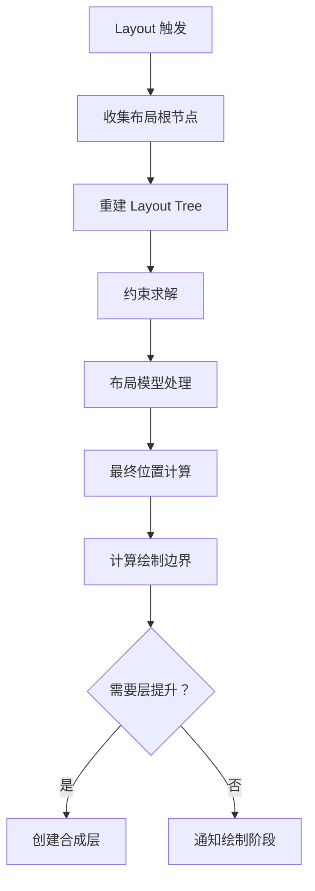


### 收集布局根节点

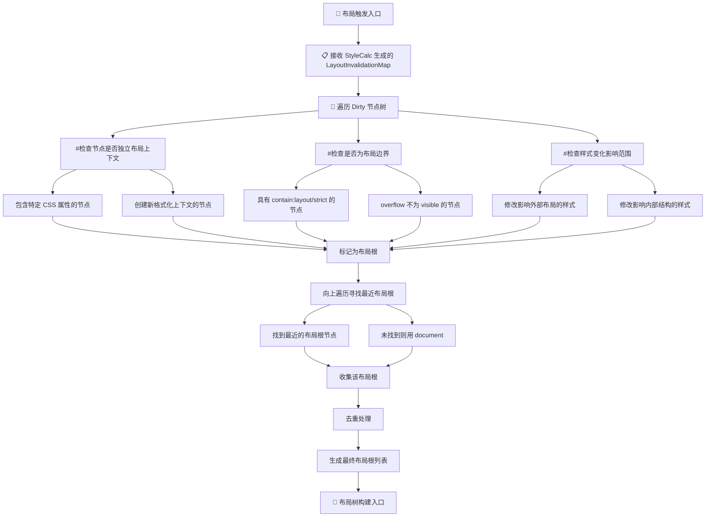

#### 1. 分析 Dirty 节点样式变化

检查每个脏节点的变更类型：

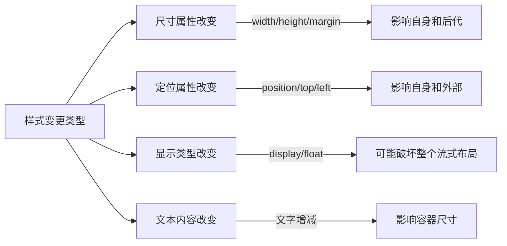

#### 2. 确定节点在布局树中的角色

```typescript
enum LayoutRole {
  CONTEXT_ROOT,  // 布局根节点
  BOUNDARY,       // 布局边界节点
  FLOW_CHILD,     // 普通流内子节点
  OUT_OF_FLOW     // 绝对定位元素
}
```

#### 3. 向上寻找最近布局根

核心算法伪代码：

```c++
LayoutObject* FindLayoutRoot(LayoutObject* dirtyNode) {
  LayoutObject* current = dirtyNode;
  
  while (current) {
    if (current->IsLayoutContextRoot()) 
      return current;
      
    if (current->IsLayoutBoundary()) 
      return current->Parent();
      
    current = current->Container();
  }
  
  return GetDocument().GetLayoutView();
}
```

#### 实际场景示例

**案例 1：修改 flex 容器内子项尺寸**

```html
<div class="container" style="display: flex"> <!-- 布局根 -->
  <div class="item" style="width: 100px"></div> <!-- 脏节点 -->
</div>
```

**处理流程**：

1. .item 标记为尺寸变更脏节点
2. 检查到直接父容器 .container 是 flex 上下文
3. .container 被收集为布局根
4. **仅**在 .container 子树内进行布局

**案例 2：修改绝对定位元素位置**

```html
<body>
  <div style="position: relative">
    <div class="abs" style="position: absolute"> <!-- 脏节点 -->
  </div>
</body>
```

**处理流程**：

1. .abs 标记为位置变更脏节点
2. 向上查找到 position:relative 容器（布局边界）
3. 该容器被收集为布局根
4. 布局范围限制在该容器内

**案例 3：文本变化导致容器扩大**

```html
<div class="article"> <!-- 普通块级 -->
  <p>...长文本...</p> <!-- 文本变更 -->
</div>
```

**处理流程**：

1. 标记为文本变更脏节点
2. 向上未找到特殊布局边界
3. 整个 document 成为布局根
4. 需要全局重新布局（性能较差！）

#### 性能优化机制

**1. 布局限制（Containment）**：将布局影响限制在组件内部，避免外部重新布局

```css
.widget {
  contain: layout; /* 强烈建议添加 */
}
```

**2. 增量布局标记**：

**3. 布局状态缓存**：浏览器缓存未变更区域的布局结果。

### 重建 Layout Tree

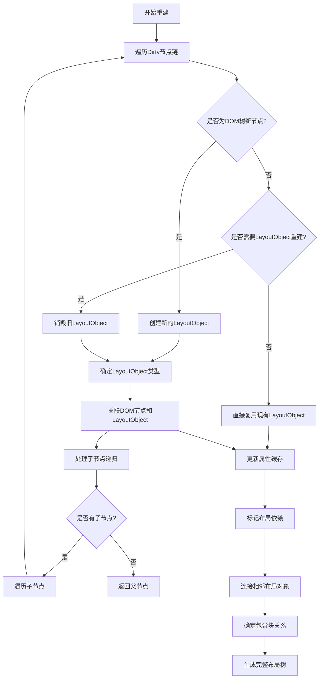

#### 1. 判断是否需要创建 LayoutObject

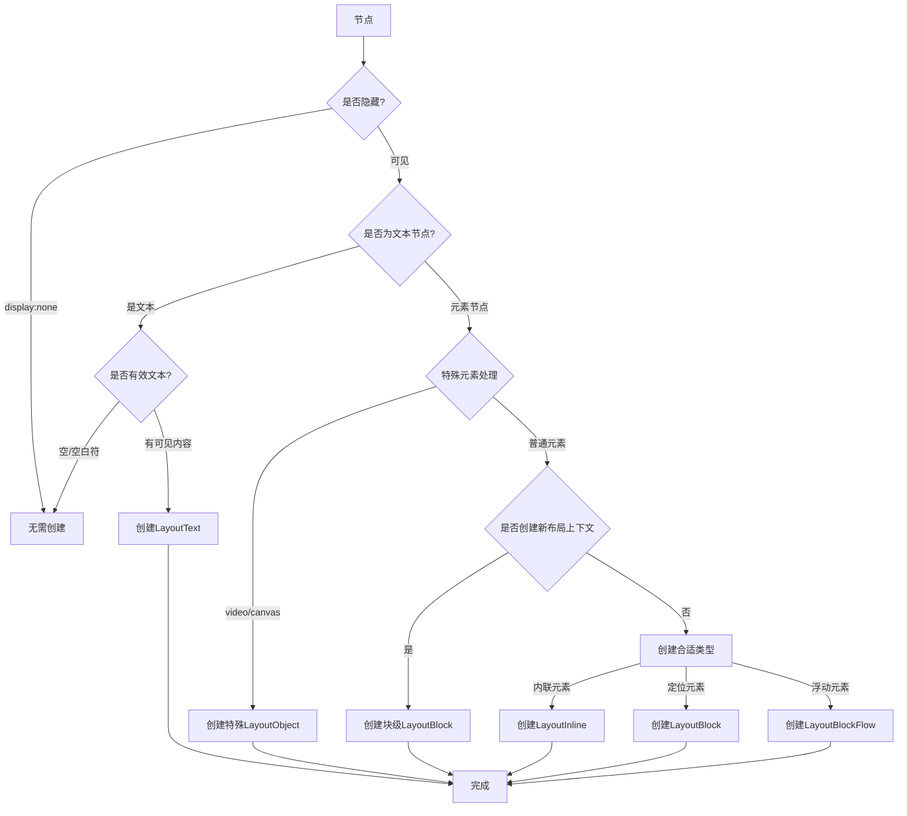

浏览器判断规则伪代码：

```c
LayoutObject* CreateLayoutObjectForNode(Node* node) {
  // 1. 检查是否需要创建布局对象
  if (!node->GetDocument().GetFrame() 
      || node->IsInDisplayNoneSubtree() 
      || node->StyleRef().Display() == EDisplay::kNone) {
    return nullptr;
  }
  
  // 2. 文本节点处理
  if (node->IsTextNode()) {
    return LayoutText::CreateEmptyText(node);
  }
  
  // 3. 元素节点处理
  Element* element = ToElement(node);
  const ComputedStyle& style = element->GetComputedStyle();
  
  // 4. 特殊元素处理
  if (element->IsMediaElement()) {
    return new LayoutMedia(element);
  }
  if (element->IsCanvasElement()) {
    return new LayoutCanvas(element);
  }
  
  // 5. 根据显示类型创建布局对象
  switch (style.Display()) {
    case EDisplay::kBlock:
    case EDisplay::kFlowRoot:
      return new LayoutBlockFlow(element);
      
    case EDisplay::kInline:
      return new LayoutInline(element);
      
    case EDisplay::kInlineBlock:
    case EDisplay::kInlineTable:
      return new LayoutBlockFlow(element);
      
    case EDisplay::kListItem:
      return new LayoutListItem(element);
      
    case EDisplay::kTable:
      return new LayoutTable(element);
      
    case EDisplay::kFlex:
    case EDisplay::kInlineFlex:
      return new LayoutFlexibleBox(element);
      
    case EDisplay::kGrid:
    case EDisplay::kInlineGrid:
      return new LayoutGrid(element);
      
    default:
      // 回退处理
      return new LayoutBlockFlow(element);
  }
}
```

#### 2. 创建 LayoutObject 的实际过程

当浏览器决定创建新的 LayoutObject 时：

1. **内存分配**

   - 从布局内存池申请空间（Chromium 的 PartitionAlloc）
   - 初始化对象的内存为空白状态

2. **设置基本属性**

   ```c
   void InitializeLayoutObject() {
     SetNode(node_);         // 关联DOM节点
     SetStyle(style_);       // 应用计算样式
     SetIsText(IsText());    // 设置类型标志
     SetNeedsLayout(true);   // 标记为需要布局
     SetShouldDoFullPaintInvalidation(); // 标记需要重绘
   }
   ```

3. **插入到布局树中**

   ```mermaid
   sequenceDiagram
     LayoutObject->>Parent: 添加子节点请求
     Parent->>Sibling: 找到合适位置
     Sibling-->>Parent: 返回位置参考点
     Parent->>LayoutObject: 设置前一个兄弟
     Parent->>Parent: 更新子节点链表
     LayoutObject->>NextSibling: 设置后一个兄弟
   ```


#### 3. 更新已有 LayoutObject

当 DOM 节点变化但不需要重建布局对象时：

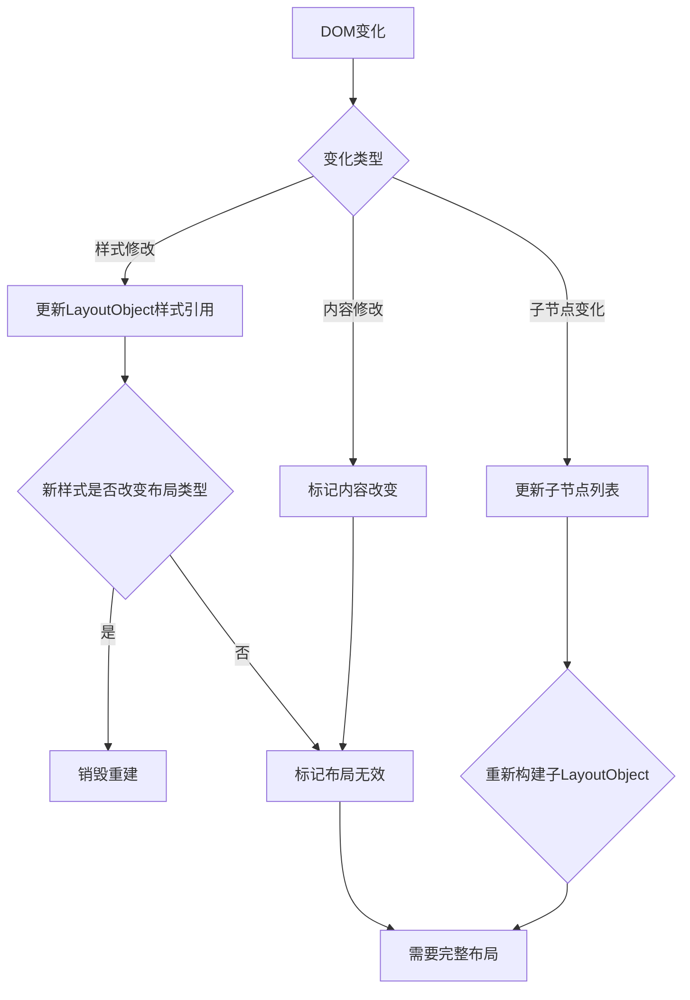

#### 4. 确定包含块 (Containing Block)

在布局树重建过程中最关键的任务：建立包含块关系

|   元素类型   |           包含块规则            |
| :----------: | :-----------------------------: |
| 静态定位元素 |       最近的块级祖先元素        |
| 相对定位元素 |  自身正常流位置作为包含块原点   |
| 绝对定位元素 | 最近的定位祖先(position≠static) |
| 固定定位元素 |              视口               |
|   表格元素   |       最近的表格相关祖先        |
|   弹性项目   |            弹性容器             |

建立算法：

```js
function findContainingBlock(layoutObject) {
  // 固定定位元素
  if (layoutObject.style.position === 'fixed') {
    return viewport;
  }
  
  // 绝对定位元素
  if (layoutObject.style.position === 'absolute') {
    let parent = layoutObject.parent;
    while (parent) {
      if (parent.isPositioned()) { // positioned = relative/absolute/fixed/sticky
        return parent;
      }
      parent = parent.parent;
    }
    return document.body; // 后备
  }
  
  // 其他元素
  return layoutObject.parent;
}
```

#### 5. 处理浮动和定位关系

浏览器在重建布局树时需要处理特殊位置关系：

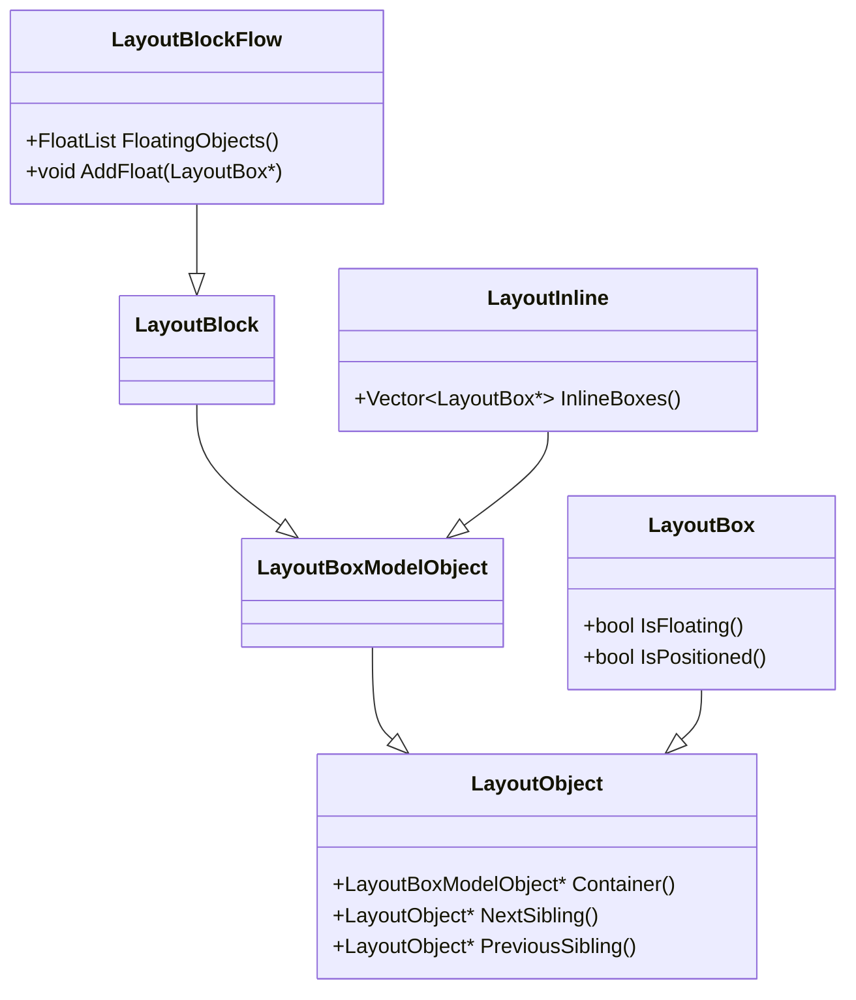


#### 性能优化策略

**1. 布局树节点缓存**

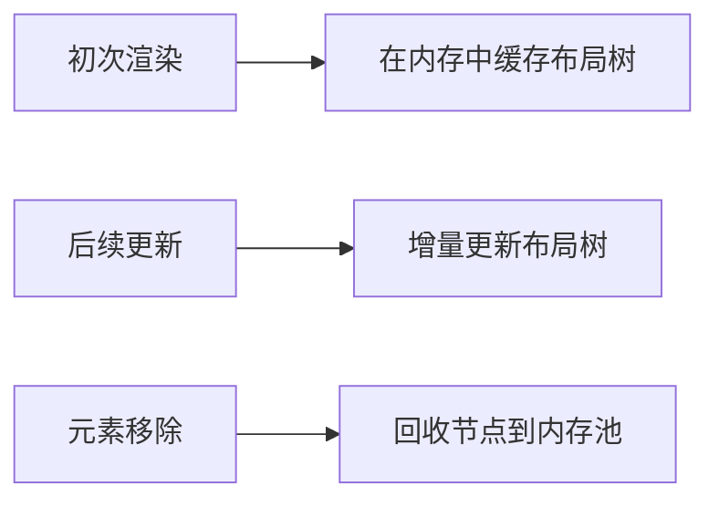

**2. 惰性创建**：只有当元素可见时才创建 `LayoutObject`。

**3. 子树复制**：当DOM结构未变化时直接克隆整个子树，避免递归创建的开销。


### 约束求解

当多个元素的几何属性相互依赖时，浏览器需要通过一套规则计算出最终可行且符合规范的布局结果。这本质上就是一个**约束满足问题**：

1. **输入：**
   - 格式化上下文规则（如：Block、Flexbox、Grid、Table等）
   - CSS 规则：`width`， `height`， `margin`， `padding`， `border`， `position`， `display`， `float`， `box-sizing`， `min-/max-width/height` 等
   - DOM 结构：父子关系、兄弟关系
   - 可用空间：包含块（Containing Block）的尺寸
2. **输出：** 每个元素最终计算出的精确几何值：
   - `x`， `y` 坐标（相对于其包含块）
   - `width`， `height`（内容、内边距、边框区域尺寸）

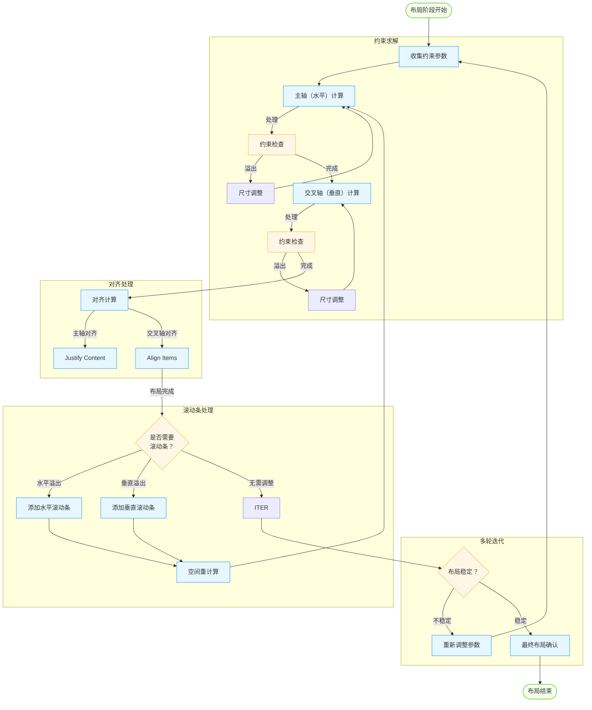

#### 水平约束求解 (主轴)

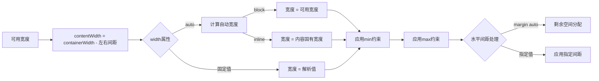

#### 垂直约束求解 (交叉轴)

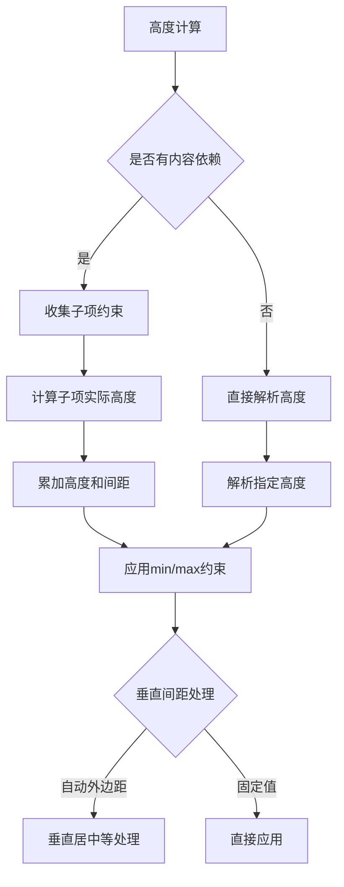

#### 约束一致性检查与迭代

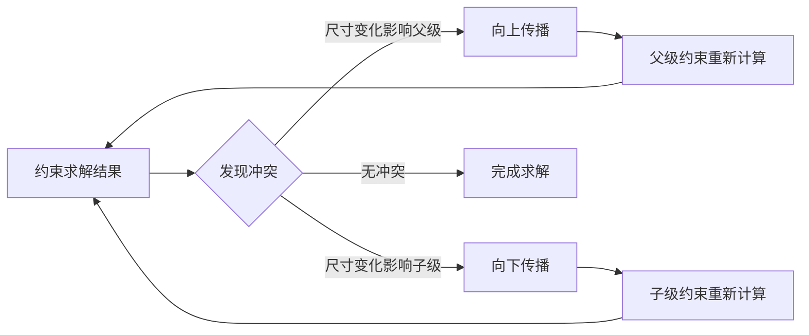


## 重绘

**Paint（重绘）阶段**是浏览器将重排（Layout）阶段计算出的**几何信息**与**样式信息（颜色、背景、文字、边框等）**合并，生成**绘制指令（Display Items / Paint Records）**，最终将页面元素绘制为图像。

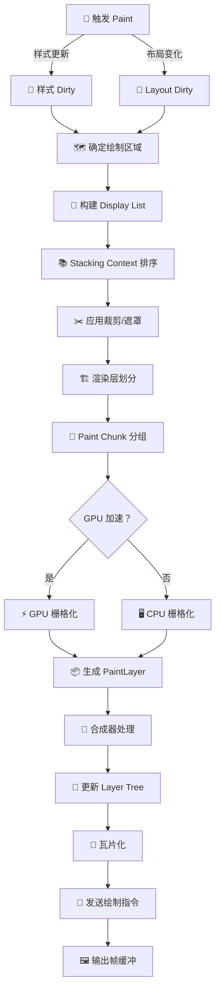

### 构建 Display List 

Display List，这是一个有序的绘制指令集，包含元素的绘制操作（如绘制矩形、文本、图片等）及其样式（颜色、边框、阴影等）。

+ 遍历渲染树，为每个可见元素生成绘制指令。
+ 指令包括绘制形状（如矩形、圆形）、文本渲染、图片加载等。
+ 考虑元素的层级关系（如 z-index）和透明度（opacity）。

### Stacking Context 排序

**层叠上下文（Stacking Context）**：由某些 CSS 属性（如 z-index、position: absolute、opacity < 1、transform）触发的层叠规则，决定元素的绘制顺序。

根据元素的层叠上下文对绘制指令进行排序，确保正确的绘制顺序：

+ 根据层叠上下文规则，将元素分组为不同的层叠上下文。

+ 在每个层叠上下文中，按照 z-index 和 DOM 顺序排序绘制指令。

+ 确保前景元素覆盖背景元素（如高 z-index 的元素后绘制）。


### 应用裁剪/遮罩 (Clip)

对绘制内容应用裁剪（Clip）或遮罩（Mask），限制绘制范围或实现特殊效果。

- 裁剪：通过 overflow: hidden、clip-path 等属性限制绘制区域。例如，一个 div 设置了 overflow: hidden，其子元素超出部分不会被绘制。
- 遮罩：使用 mask 或 clip-path 实现复杂的图形遮罩效果，如圆形裁剪或渐变遮罩。
- 实现方式：
  - 浏览器在 Display List 中添加裁剪指令，指定绘制区域的边界。
  - 对于复杂遮罩，可能需要额外的图像处理（如 alpha 混合）。


### 渲染层划分 (Layerization)

将绘制内容划分为独立的渲染层（Layers），以优化性能和支持硬件加速。

- 渲染层：浏览器将页面拆分为多个独立层（如背景层、前景层），每个层可以独立绘制和合成。
- 触发条件：
  - 某些 CSS 属性（如 transform、opacity、will-change）会自动创建渲染层。
  - 3D 变换、视频、Canvas、固定定位（position: fixed）等也可能触发。


### Paint Chunk 分组 (PaintChunking)

将绘制指令分组为 Paint Chunks，便于后续的栅格化和合成。

- Paint Chunk：一组相关的绘制指令，通常对应一个渲染层或逻辑单元（如一个元素的完整绘制过程）。
- 分组过程：
  - 浏览器根据渲染层、裁剪区域、层叠上下文等，将 Display List 中的指令分组。
  - 每个 Paint Chunk 包含绘制所需的完整信息（如颜色、位置、变换）。


### GPU 加速检查 (GPUCheck)

决定是否使用 GPU 进行栅格化（Rasterization）。

- 栅格化：将绘制指令转换为像素数据（位图）的过程。
- GPU 加速条件：
  - 元素位于独立的渲染层（如使用了 transform 或 will-change: transform）。
  - 硬件支持 GPU 加速（如 WebGL、CSS 3D 变换）。
  - 复杂效果（如滤镜、阴影）更适合 GPU 处理。
- 如果不满足 GPU 加速条件，浏览器使用 CPU 进行栅格化，通常用于简单内容或低端设备。


### 栅格化 (Raster) 

将 Paint Chunks 转换为像素数据，生成位图。

- GPU 栅格化：
  - 使用 GPU 的并行计算能力，快速处理复杂图形（如 3D 变换、滤镜）。
  - 涉及 OpenGL/WebGL 或 Metal（macOS/iOS）等图形 API。
  - 输出到 GPU 纹理（Texture），供后续合成使用。
- CPU 栅格化：
  - 使用 Skia（Chrome）或 Cairo（Firefox）等 2D 图形库。
  - 适合简单内容或低端设备，但速度较慢。

## 合成

**Compositing（合成）**是浏览器将不同的绘制结果（Paint Record 或图层）分配到独立的合成层（compositing layers），并交由 GPU **组合、变换、混合**，最终输出一张完整页面位图并显示在屏幕上。

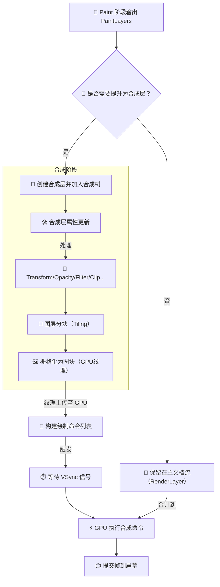


### PaintLayers

重绘（Paint）阶段完成后，生成一组 PaintLayers，作为合成阶段的输入。每个 PaintLayer 包含一个渲染层的栅格化结果（位图或 GPU 纹理）以及元数据（如位置、尺寸、透明度、变换矩阵等）。

+ 在重绘阶段，浏览器根据渲染树（Render Tree）和绘制指令（Display List）生成位图。

+ 这些位图按渲染层（Layers）组织，每个层对应页面的一部分（如一个独立元素或一组元素）。


### 提升为合成层

浏览器决定是否将某个 PaintLayer 提升为独立的**合成层**（Composited Layer），以支持硬件加速或优化渲染。

**合成层**是一个独立的渲染单元，通常由 GPU 处理，具有自己的纹理（Texture）。合成层允许浏览器在不重绘的情况下直接应用变换（如平移、旋转）或透明度变化。

- CSS 属性触发：
  - 使用 transform（如 translate、rotate）。
  - 设置 opacity 小于 1。
  - 使用 filter（如 blur、drop-shadow）。
  - 设置 will-change: transform, opacity（显式提示浏览器创建合成层）。
  - 使用 position: fixed 或 position: sticky。
  - 包含 `<video>`、`<canvas>`、WebGL 或 iframe 等复杂内容。
- 浏览器优化：
  - 浏览器可能因性能优化自动提升某些层（如频繁动画的元素）。
  - 滚动区域（如设置 overflow: scroll）可能被提升为合成层以优化滚动性能。


### 创建合成层并加入合成树

为需要提升的 PaintLayer 创建独立的合成层，并将其加入 合成树（Compositing Layer Tree）。

合成树：一个树状结构，描述所有合成层的层级关系、变换信息和绘制属性。类似 DOM 树，但专用于合成阶段。

- 为每个满足条件的 PaintLayer 分配一个合成层。
- 将栅格化结果（位图）上传至 GPU 纹理。
- 记录层的元数据（如位置、尺寸、变换矩阵、透明度）。
- 根据层叠上下文（Stacking Context）和 z-index，确定层在合成树中的顺序。

合成树结构：

- 根节点通常是整个页面或视口。
- 子节点对应独立的合成层（如动画元素、固定定位元素）。
- 层级关系反映视觉叠放顺序（前景层覆盖背景层）。


### 保留在主文档流

未提升为合成层的 PaintLayer 保留在主文档流的 RenderLayer 中，稍后合并到合成阶段。

+ RenderLayer：主文档流的渲染层，通常由 CPU 管理，包含未独立为合成层的元素。

处理方式：

- 这些 PaintLayer 的栅格化结果存储在主线程的内存中（而不是 GPU 纹理）。
- 在合成阶段，RenderLayer 的内容被合并到最终的合成输出。


### 合成阶段

#### 合成层属性更新

更新合成层的属性（如位置、变换、透明度），准备后续处理。

更新的属性：

- 几何信息：层的位置、尺寸、边界框。
- 视觉效果：透明度（opacity）、滤镜（filter）、遮罩（mask）。
- 变换：CSS 变换（如 translate、rotate、scale）。

更新过程：

- 浏览器根据 CSS 属性或 JavaScript 修改，重新计算合成层的状态。
- 更新合成树中对应节点的元数据（如变换矩阵）。


#### Transform/Opacity/Filter/Clip 等处理

应用 CSS 变换、透明度、滤镜、裁剪等效果到合成层。

处理类型：

- Transform：应用 2D 或 3D 变换矩阵（如平移、旋转、缩放）。
- Opacity：调整层的透明度，进行 alpha 混合。
- Filter：应用视觉效果，如模糊（blur）、阴影（sepia）、亮度调整。
- Clip：基于 clip-path 或 overflow 限制绘制区域。

实现方式：

- 变换和更新由 GPU 执行，使用着色器（Shader）处理。
- 变换矩阵直接应用于层的纹理坐标，无需重绘。
- 滤镜和裁剪可能需要额外的 GPU 计算（如生成新纹理）。


#### 图层分块

将合成层拆分为小块（Tiles），便于高效管理和渲染。

瓦片化：将大尺寸的合成层分割为固定大小的瓦片（如 256x256 或 512x512 像素），每个瓦片独立栅格化。

- 支持并行处理，多个瓦片可同时栅格化。
- 便于缓存，仅更新变化的瓦片（如滚动时）。
- 适合动态视口，只加载显示区域的瓦片。

实现方式：

- 浏览器维护瓦片网格（Tile Grid），记录每个瓦片的纹理和状态。
- 根据视口和优先级（如靠近视口的瓦片优先）动态调度瓦片。


#### 栅格化为图块（GPU 纹理）

将瓦片栅格化为 GPU 纹理，生成可供合成的像素数据。

+ 栅格化：将瓦片的绘制指令转换为位图，存储为 GPU 纹理。

实现方式：

- 使用 GPU 图形 API（如 OpenGL、Metal、Vulkan）执行。
- 每个瓦片的 PaintLayer 数据（如颜色、形状、文本）被渲染为像素。
- 涉及着色器处理（如 alpha 混合、滤镜）。


### 纹理上传到 GPU

栅格化的瓦片纹理上传到 GPU 内存，准备合成。

+ 栅格化后的位图通过图形 API（如 OpenGL 的 glTexImage2D）上传到 GPU。

+ 每个瓦片对应一个纹理对象，存储在 GPU 显存中。


### 构建绘制命令列表

生成 GPU 的绘制命令列表，描述如何将纹理合成为最终画面。

+ 绘制命令：一组 GPU 可执行的指令，指定纹理的绘制顺序、位置、变换、混合模式等。

生成过程：

- 浏览器根据合成树，生成绘制命令（如 glDrawArrays 或 vkCmdDraw）。
- 命令包括：
  - 纹理（瓦片）。
  - 变换矩阵（位置、旋转）。
  - 着色器参数（如透明度、滤镜）。
  - 绘制顺序（基于层叠上下文）。

### 等待 VSync 信号

同步绘制与显示器刷新率，确保画面平滑无撕裂。

- 浏览器通过操作系统（如 vsync 事件）获取信号。
- GPU 在 VSync 触发时执行绘制，更新帧缓冲区。


### GPU 执行合成命令

GPU 执行绘制命令，将所有纹理合成为最终画面。

+ 根据命令列表，绘制各合成层和瓦片的纹理。

+ 应用变换、透明度、滤镜等效果。

+ 按层叠顺序进行 alpha 混合。


### 提交帧到屏幕

将合成的最终图像提交到屏幕显示。

提交：将 GPU 帧缓冲区的图像通过显示驱动呈现到屏幕。

- 使用双缓冲技术（如 OpenGL 的 Swap Buffer）。
- GPU 将渲染结果写入后台缓冲区，VSync 时交换到前台。
