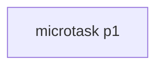
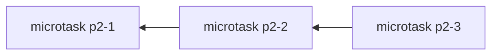
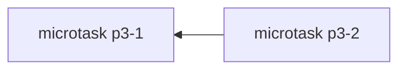

```js
async function p1() {
	return "p1";
}
async function p2() {
	return Promise.resolve('p2');
}
async function p3() {
	return await Promise.resolve("p3");
}

p2().then((o) => console.log(o));
p1().then((o) => console.log(o));
p3().then((o) => console.log(o));
```

## p1

`p1` 里没有 `await` 表达式，同时 `return` 的也不是其它 `promise` 对象，意味着在代码同步执行完后，`p1()` 返回的那个 `promise` 对象，就已经是 `fulfilled` 状态了，`promise` 的值正是函数返回的 `"p1"`。

在同步代码执行完后，微任务队列里只有一个微任务：



原代码执行的效果基本等价于：

```js
queueMicrotask(() => console.log("p1"))
```
## p2

`p2` 里同样没有 `await` 表达式，但它 `return` 的却是一个 `promise` 对象，这个时候 `p2()` 返回的 `promise` 对象就不是 `fulfilled` 了，而是 `pending` 状态。

引擎会新建一个微任务，来调用 `Promise.resolve("p2")` 这个 `promise` 的 then 方法，再加上这个 `then` 的回调也会再另外一个微任务里执行。

再加上打印的微任务，一共三个微任务，相较于 `p1` 慢了两拍：



原代码的效果等价于：

```js
queueMicrotask(() => {
  queueMicrotask(() => {
    queueMicrotask(() => {
      console.log("p2");
    });
  });
});
```

## p3

`p3` 较于 `p2` 多了个 `await`，而且 `await` 的是 `promise`，它等价于：

```js
async function p3() {
  const value = await Promise.resolve("p3");
  return value;
}
```

`await Promise.resolve("p3")` 这行代码，会使用一个微任务来执行，然后 `return "p3"` 和 `p1` 一样不需要额外的处理，再加上 `p3().then()` 这里的微任务，一共两个：



用 `queueMicrotask` 实现的话是：

```js
queueMicrotask(() => {
  queueMicrotask(() => {
    console.log("p3");
  });
});
```

现在一起综合起来看，原代码执行后，微任务队列是这样演进的：


其中前三个微任务是代码同步执行完后就存在的，顺序是和代码书写顺序一致的，后面 3 个是前面的微任务执行后又插入的。

一共有 6 个微任务存在过，并且按插入顺序执行。该题目也给出了一个结论：

**那就是 return await promise 比 return promise 更快！**

> 目前的规范也的确是这样规定的。但在几年前，这个结果刚好相反，曾经的规范里，`await promise` 也会经历类似”包装新 promise“的流程，导致了原题目中 `p3` 也会经历类似 `p2` 更慢两拍的表现。
> 2018 年 [V8](https://zhida.zhihu.com/search?content_id=651228137&content_type=Answer&match_order=1&q=V8&zhida_source=entity) 的人推动并优化了规范里 await promise 慢两拍的问题 [Normative: Reduce the number of ticks in async/await by MayaLekova · Pull Request #1250 · tc39/ecma262](https://link.zhihu.com/?target=https%3A//github.com/tc39/ecma262/pull/1250)

