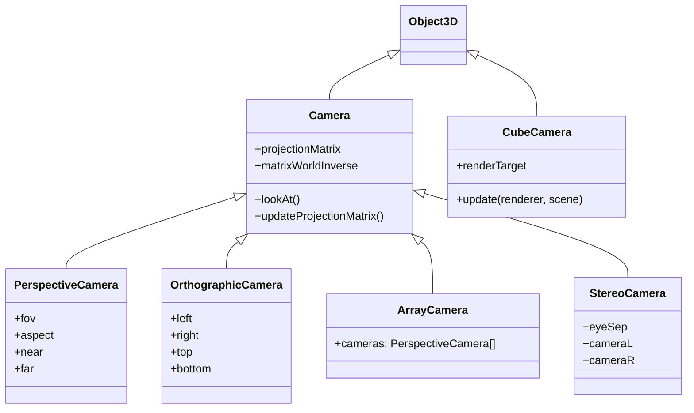

## 简介

Three.js 中的相机（`THREE.Camera`）继承自 `Object3D`，所以它也有 `position`、`rotation` 等属性。但相机的核心职责是：

> **将 3D 世界转换为 2D 图像**，也就是把立体场景渲染到屏幕上。





## 各相机详解

### 1. **PerspectiveCamera（透视相机）**

```js
const camera = new THREE.PerspectiveCamera(
  75, // 视角 FOV（角度）
  window.innerWidth / window.innerHeight, // 宽高比
  0.1, // 近裁剪面
  1000 // 远裁剪面
);
```

- 像人眼/现实摄像机那样看东西，远小近大，真实感强
- 常用于 3D 场景、游戏、可视化

### 2. **OrthographicCamera（正交相机）**

- 没有透视缩小效果，所有物体在屏幕上一样大
- 适合 UI、2D 平铺、建筑图纸等

```js
const camera = new THREE.OrthographicCamera(
  left,   // 左边界
  right,  // 右边界
  top,    // 上边界
  bottom, // 下边界
  near,   // 近平面
  far     // 远平面
);
```

`left/right/top/bottom`：决定了你能看到的区域边界（相当于一个裁剪框）。

它定义了一个类似「盒子」的视锥，而不是像 `PerspectiveCamera` 那样的「锥形视锥」。

正交相机不像透视相机有 `fov`，你要自己控制可视范围：

```js
const aspect = window.innerWidth / window.innerHeight;
const size = 5;

const camera = new THREE.OrthographicCamera(
  -size * aspect, size * aspect,
  size, -size,
  0.1, 100
);
```

#### 使用场景举例

| 场景             | 说明                                  |
| ---------------- | ------------------------------------- |
| UI / HUD 层      | 2D 按钮、文字、指示图标，不随 3D 变化 |
| 2D 地图 / 小游戏 | 类似《饥荒》《贪吃蛇》那种上帝视角    |
| 工程可视化       | CAD、图纸、正投影展示，不允许透视失真 |
| 多视角分屏       | 顶视图、侧视图等辅助摄像头            |

### 3. ArrayCamera（数组相机）

```js
const arrayCamera = new THREE.ArrayCamera([
  new THREE.PerspectiveCamera(50, 1, 1, 1000),
  new THREE.PerspectiveCamera(50, 1, 1, 1000)
]);
```

+ 多视角渲染，类似于电影的多视角组合
+ WebXR / VR 中有时也会用
+ 一组 PerspectiveCamera 作为视角数组

### 4. StereoCamera（立体相机）

- VR 用得多，自动生成左右眼相机
- 用于模拟人眼双视角，生成立体图像

```js
const stereo = new THREE.StereoCamera();
stereo.update(camera);
renderer.render(scene, stereo.cameraL);
renderer.render(scene, stereo.cameraR);
```

### 5. CubeCamera（立方体相机）

+ 由 6 个相机组成，朝 6 个方向拍照

+ 用于生成**动态环境贴图**，实现镜面反射、玻璃、金属等视觉效果

+ 输出结果为 `WebGLCubeRenderTarget.texture`

```js
const cubeCamera = new THREE.CubeCamera(near, far, cubeRenderTarget);
cubeCamera.update(renderer, scene); // 更新六面贴图
```

## 相机的常见操作

```js
// 移动相机
camera.position.set(0, 0, 5);
// 让相机朝向一个点
camera.lookAt(new THREE.Vector3(0, 0, 0));

// 调整窗口大小时需要更新相机参数
window.addEventListener('resize', () => {
  camera.aspect = window.innerWidth / window.innerHeight;
  camera.updateProjectionMatrix();
});
```

## 相机的视锥体

相机其实构建了一个**视锥体**（Viewing Frustum）：

- **近裁剪面（near）** 和 **远裁剪面（far）** 决定能看到的范围
- 只有在这个范围内的东西才会被渲染
- `fov` 控制视角宽度，越大视角越广

可以加个 `CameraHelper` 来可视化它：

```js
const helper = new THREE.CameraHelper(camera);
scene.add(helper);
```

