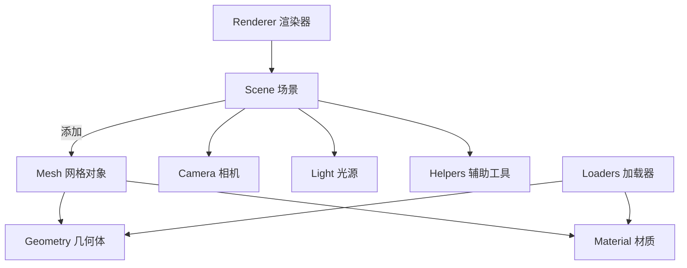

## 核心结构概览

+ **场景构建（Scene Graph）**
+ **渲染器（Renderer）**
+ **几何体与材质（Geometry & Material）**
+ **相机（Camera）**
+ **光源（Light）**
+ **加载器（Loaders）**
+ **辅助工具（Helpers）**

## 各模块简介

- **Scene**：容器，用来装载所有你要渲染的内容（模型、光源、相机等）。
  
- **Mesh**：由 Geometry（几何体）和 Material（材质）组合而成的可渲染物体。
  
- **Geometry**：描述模型的形状，比如 `BoxGeometry`、`SphereGeometry`。
  
- **Material**：描述表面外观，比如颜色、贴图、反光等。
  
- **Camera**：相机定义了你从哪个角度、距离观察场景。最常用的是 `PerspectiveCamera`。
  
- **Light**：光源模拟真实世界的光照环境，有平行光、点光源、环境光等。
  
- **Renderer**：比如 `WebGLRenderer`，负责把场景渲染到页面的 `<canvas>` 上。
  
- **Loaders**：如 `GLTFLoader`、`TextureLoader` 用来加载模型、贴图等资源。
  
- **Helpers**：如坐标轴辅助线（`AxesHelper`）、灯光辅助器等，方便调试。