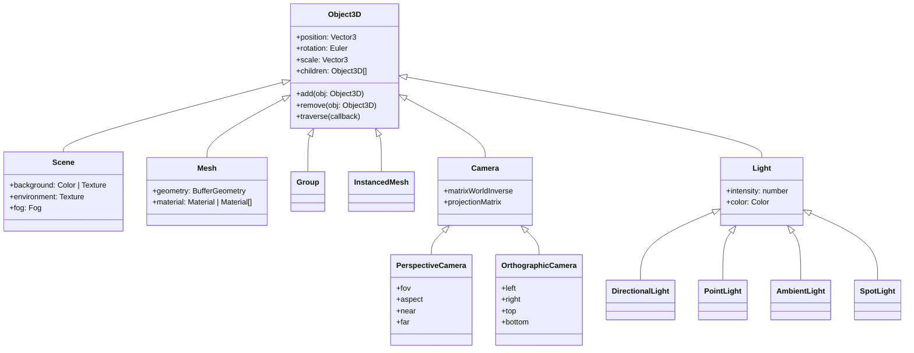
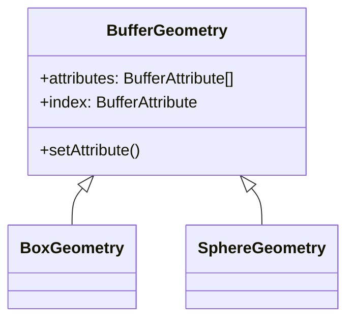
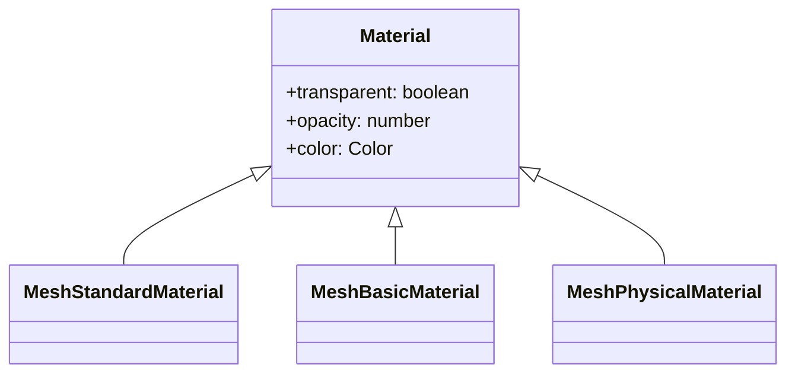
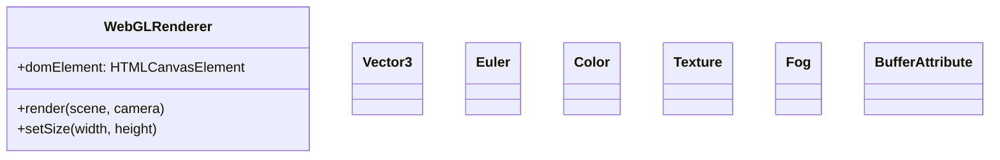

```mermaid
classDiagram
  %% === 核心基础 ===
  class Object3D {
    +position: Vector3
    +rotation: Euler
    +scale: Vector3
    +children: Object3D[]
    +add(obj: Object3D)
    +remove(obj: Object3D)
    +traverse(callback)
  }

  class Scene {
    +background: Color | Texture
    +environment: Texture
    +fog: Fog
  }

  class Mesh {
    +geometry: BufferGeometry
    +material: Material | Material[]
  }

  class Group
  class InstancedMesh

  Object3D <|-- Scene
  Object3D <|-- Mesh
  Object3D <|-- Group
  Object3D <|-- InstancedMesh


  %% === 相机 ===
  class Camera {
    +matrixWorldInverse
    +projectionMatrix
  }

  class PerspectiveCamera {
    +fov
    +aspect
    +near
    +far
  }

  class OrthographicCamera {
    +left
    +right
    +top
    +bottom
  }

  Object3D <|-- Camera
  Camera <|-- PerspectiveCamera
  Camera <|-- OrthographicCamera

  %% === 光源 ===
  class Light {
    +intensity: number
    +color: Color
  }

  class DirectionalLight
  class PointLight
  class AmbientLight
  class SpotLight

  Object3D <|-- Light
  Light <|-- DirectionalLight
  Light <|-- PointLight
  Light <|-- AmbientLight
  Light <|-- SpotLight


```

```mermaid
classDiagram
%% === 几何体 ===
  class BufferGeometry {
    +attributes: BufferAttribute[]
    +index: BufferAttribute
    +setAttribute()
  }

  class BoxGeometry
  class SphereGeometry

  BufferGeometry <|-- BoxGeometry
  BufferGeometry <|-- SphereGeometry
```

```mermaid
classDiagram
%% === 材质 ===
  class Material {
    +transparent: boolean
    +opacity: number
    +color: Color
  }

  class MeshStandardMaterial
  class MeshBasicMaterial
  class MeshPhysicalMaterial

  Material <|-- MeshStandardMaterial
  Material <|-- MeshBasicMaterial
  Material <|-- MeshPhysicalMaterial
```

```mermaid
classDiagram
%% === 渲染器 ===
class WebGLRenderer {
    +render(scene, camera)
    +setSize(width, height)
    +domElement: HTMLCanvasElement
}
%% === 工具 ===
  class Vector3
  class Euler
  class Color
  class Texture
  class Fog
  class BufferAttribute
```

+ 所有场景中的对象基本都继承自 `Object3D`，这意味着它们都可以有位置、旋转、缩放，也都可以添加子对象；
+ `Mesh` 是最常见的渲染对象，由几何体和材质组合而成；
+ 不同种类的 `Material` 和 `Light` 可以组合出各种光影效果；
+ `Scene` 是一个特殊的 `Object3D`，是整个渲染树的根节点；