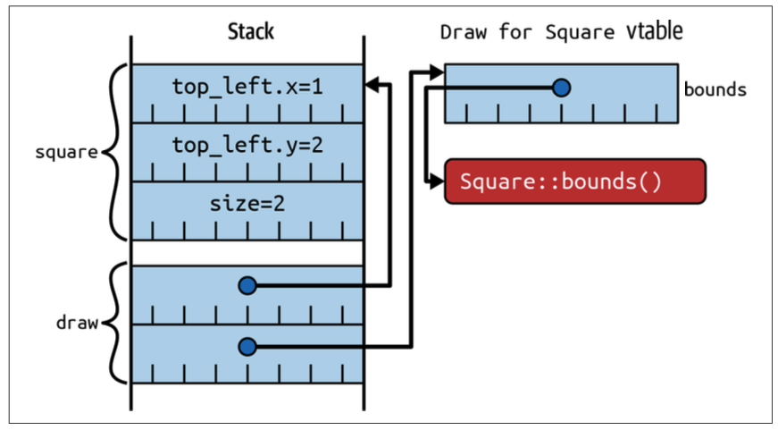
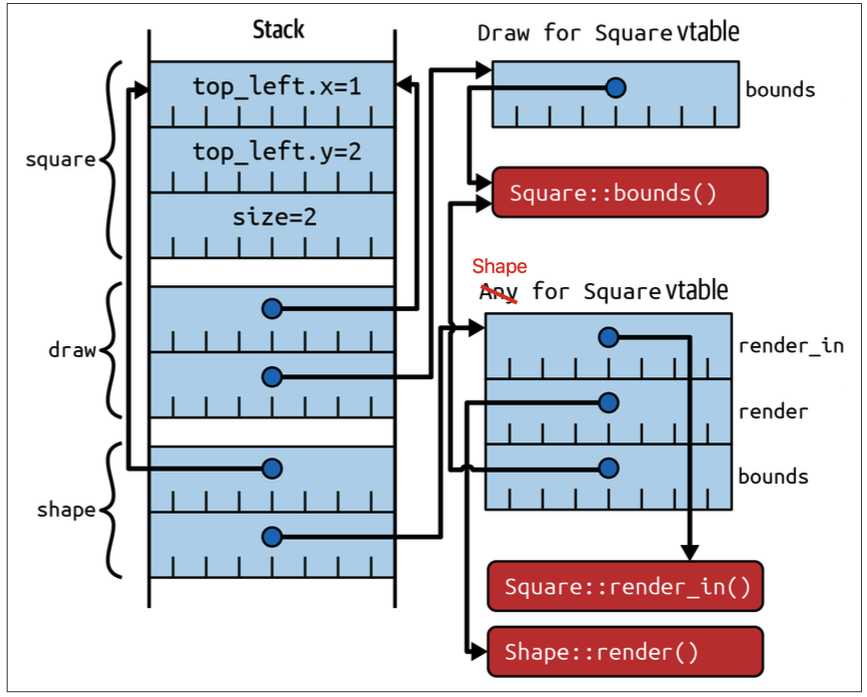

# Rust 多态的两种实现：Trait Bound 与 Trait Object 深度解析

在 Rust 编程中，实现多态（Polymorphism）主要有两种核心机制：**Trait Bound** 和 **Trait Object**。虽然两者都基于 `trait`，但它们的设计理念、底层实现和适用场景却截然不同。本文将带你从概念到具体的内存布局，深入探究这两种多态方式的本质。

### 1. 从一个基本问题说起

设想我们有一个 `trait Draw`，它定义了绘制的方法。`Square` 结构体实现了这个 `trait`。

```rust
trait Draw {
    fn bounds(&self) -> (i32, i32, i32, i32); // 假设定义了边界方法
    // ... 其他绘制相关方法
}

struct Square {
    top_left: Point,
    size: i32,
}

struct Point {
    x: i32,
    y: i32,
}

impl Draw for Square {
    fn bounds(&self) -> (i32, i32, i32, i32) {
        (self.top_left.x, self.top_left.y, self.size, self.size)
    }
}
```

现在，我们如何编写一个函数来处理 `Square`，并调用它的 `bounds` 方法呢？这就是 **Trait Bound** 和 **Trait Object** 登场的时机。

### 2. Trait Bound：编译期的静态多态

**Trait Bound** 的核心思想是**编译期特化（Monomorphization）**。它通过泛型参数 `T` 来约束类型，确保该类型实现了某个 `trait`。

```rust
fn print_bounds<T: Draw>(item: T) {
    let (x, y, w, h) = item.bounds();
    println!("边界: x={}, y={}, width={}, height={}", x, y, w, h);
}

let square = Square { top_left: Point { x: 1, y: 2 }, size: 2 };
print_bounds(square); // T 被特化为 Square
```

**底层原理：静态分发（Static Dispatch）**

在编译时，编译器会为 Square 类型生成一份 print_bounds 函数的独立代码。当调用 print_bounds(square) 时，程序直接调用为 Square 特化的版本，无需在运行时查找。

**优点与缺点**

- **零运行时开销**：性能极致，与直接调用具体函数无异。
- **代码膨胀（Code Bloat）**：如果有很多不同的类型都实现了 `Draw`，编译器就会生成多份 `print_bounds` 的代码。
- **语法糖**：`fn print_bounds(item: impl Draw)` 是 `fn print_bounds<T: Draw>(item: T)` 的语法糖，两者在底层实现和性能上是完全等价的。

------

### 3. Trait Object：运行时的动态多态

现在，我们面临一个新问题：如果想把不同类型但都可绘制的对象放入同一个 `Vec` 集合中怎么办？例如，我们有一个 `Square` 和一个 `Circle`（假设 `Circle` 也实现了 `Draw`），我们不能直接 `vec![square, circle]`，因为 `Vec` 要求所有元素是**同一种具体类型**。

**Trait Object** 的核心思想是**类型擦除（Type Erasure）**，它允许我们将实现了相同 `trait` 的不同类型实例统一处理。

```rust
// 假设 Circle 也实现了 Draw trait
let circle = Circle { /* ... */ };

let square = Square {
  top_left: Point { x: 1, y: 2 },
  size: 2
};

// 这里的 `dyn` 关键字表示动态类型
let draw_object: Box<dyn Draw> = Box::new(square);

// 可以将不同类型但都实现了 Draw 的对象放入 Vec 中
let drawable_items: Vec<Box<dyn Draw>> = vec![Box::new(square), Box::new(circle)];
```

**底层原理：动态分发（Dynamic Dispatch）**

Box<dyn Draw> 是一个胖指针（Fat Pointer）。它包含两个部分：

1. **数据指针**：指向堆上实际的对象（例如 `Square` 实例）。
2. **虚表指针**：指向一张静态生成的**虚函数表（vtable）**。

当调用 `draw_object.bounds()` 时，程序会在**运行时**通过胖指针找到虚表，再从虚表中找到正确的方法地址并执行。



上图展示了 `&dyn Draw` 这个 `trait object` 的内存布局：

**栈（Stack）**：

- `square`：原始的 `Square` 实例，其数据（`top_left.x`, `top_left.y`, `size`）直接存储在栈上，大小在编译时可知。
- `draw`：这是一个 `&dyn Draw` 类型的胖指针。它也存储在栈上，但其大小是固定的（两个指针的大小，通常是 16 字节在 64 位系统上）。
  - 胖指针的**第一个部分**指向 `square` 实例的实际数据地址。
  - 胖指针的**第二个部分**指向 `Draw for Square vtable`。

**虚表（Vtable）**：

- `Draw for Square vtable`：这是一个在编译时为 `Square` 类型和 `Draw` `trait` 的组合而生成的**静态只读表**。它包含了 `Square` 实现 `Draw` `trait` 所需的所有信息，其中最重要的是 `Square::bounds()` 方法的实际内存地址。

通过 `draw` 胖指针调用 `draw.bounds()` 时，Rust 运行时会：

1. 读取 `draw` 胖指针中的虚表指针。
2. 通过虚表指针找到 `Draw for Square vtable`。
3. 从虚表中找到 `bounds()` 方法的地址（即 `Square::bounds()` 的地址）。
4. 调用该地址处的函数，并将胖指针中的数据指针作为 `self` 参数传递。

> **虚表是与类型-trait 组合绑定的，而不是与实例绑定的。** 无论有多少个 `&dyn Draw` 类型的胖指针，只要它们都引用同一个 `Square` 实例，或者不同的 `Square` 实例，它们的虚表指针都会指向**同一张**静态生成的 `Draw for Square vtable`。虚表是全局唯一的，为每种类型-trait 组合只生成一份。

### 4. 复杂场景下的内存布局：组合 Trait Object

当 `trait object` 组合多个 `trait` 时，比如 `&dyn Draw + Shape`，底层机制会更加精巧。

- **单 Trait Object**：`&dyn Draw` 和 `&dyn Shape` 是两个独立的胖指针，分别指向为 `Square`-`Draw` 和 `Square`-`Shape` 组合生成的**独立虚表**。
- **组合 Trait Object**：`&dyn Draw + Shape` 是一个**单一的胖指针**。它指向一张包含了**所有组合 `trait` 方法地址的联合虚表**。

假如说我们定义的 `Shape` trait 如下：

```rust
/// Anything that implements `Shape` must also implement `Draw`.
trait Shape: Draw {
  /// Render that portion of the shape that falls within `bounds`.
  fn render_in(&self, bounds: Bounds);

  /// Render the shape.
  fn render(&self) {
      // Default implementation renders that portion of the shape
      // that falls within the screen area.
      if let Some(visible) = overlap(SCREEN_BOUNDS, self.bounds()) {
        self.render_in(visible);
      }
  }
}
```

现有如下代码：

```rust
let square = Square {
  top_left: Point { x: 1, y: 2 },
  size: 2,
};
let draw: &dyn Draw = &square;
let shape: &dyn Shape = &square;
```



**栈（Stack）**：

- `square`：原始 `Square` 实例，不变。
- `draw`：`&dyn Draw` 胖指针，指向 `Square` 数据和 `Draw for Square vtable`。
- `shape`：这是一个**新的、独立的** `&dyn Shape` 胖指针。它同样指向 `Square` 数据，但其虚表指针指向的是 `Shape for Square vtable`。

**虚表（Vtable）**：

- `Draw for Square vtable`：为 `Square` 和 `Draw` 组合生成的虚表，它包含了 `bounds()` 方法的指针。
- `Shape for Square vtable`：为 `Square` 和 `Shape` 组合生成的**另一个独立的虚表**。它包含了 `Square::render_in()` 、`Square::bounds()`和 `Shape::render()` 方法的地址。

> 总结：如果你有**多个独立的 `trait object` 类型**（如 `&dyn Draw` 和 `&dyn Shape`），即使它们引用的是**同一个底层数据**，它们各自的胖指针也会指向**各自独立的虚表**。

### 5. Trait Object 的安全约束

为了在实现动态多态的同时保证内存安全，Rust 对 **trait object** 施加了严格的限制：

- **`Sized` 约束**：`dyn Trait` 是一个 DST，其大小在编译时未知。因此，它必须通过指针（`&`、`Box`、`Rc`、`Arc` 等）引用。
- **方法限制**：`trait object` 的 `trait` 方法不能是泛型方法，也不能返回 `Self`。这是因为编译器无法为泛型方法生成虚表条目，也无法确定返回 `Self` 的返回值大小。例如，`Clone` `trait` 因为其 `clone` 方法返回 `Self`，所以不能直接作为 `trait object`。
- **生命周期**：`trait object` 的生命周期会与它所引用的数据的生命周期绑定，防止悬空指针（`use-after-free`）问题。

### 总结

| 特性         | Trait Bound (泛型)    | Trait Object (动态)          |
| ------------ | --------------------- | ---------------------------- |
| **多态类型** | **静态多态**          | **动态多态**                 |
| **分发方式** | **静态分发** (编译时) | **动态分发** (运行时)        |
| **性能开销** | **零开销**            | **轻微开销** (虚表查找)      |
| **底层原理** | **编译期特化**        | **类型擦除 + 胖指针/虚表**   |
| **大小类型** | `Sized`               | `Unsized` (必须通过指针引用) |
| **典型应用** | 极致性能、类型已知    | 异构集合、插件化、通用接口   |
