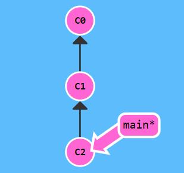
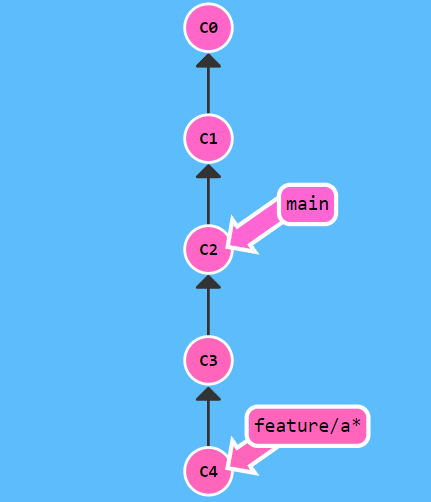
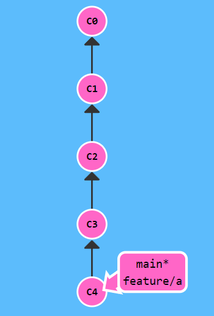
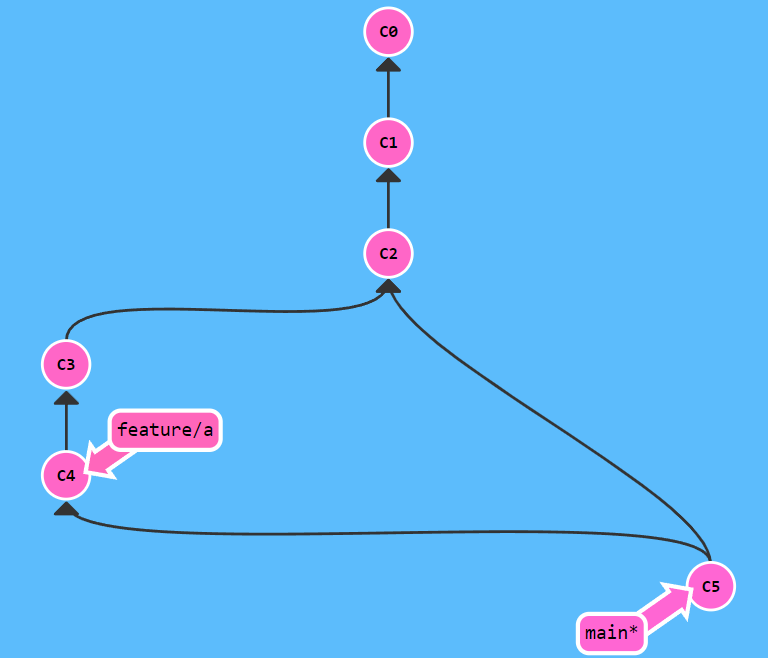
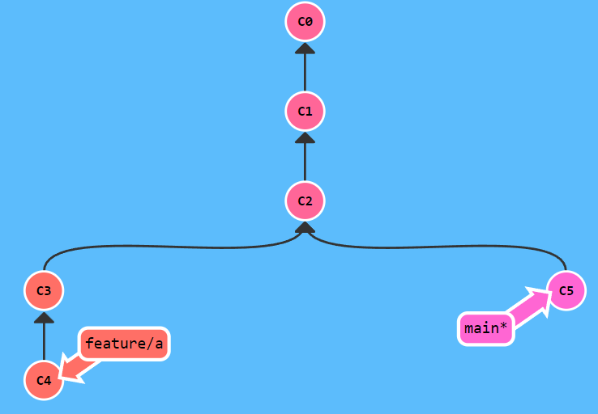
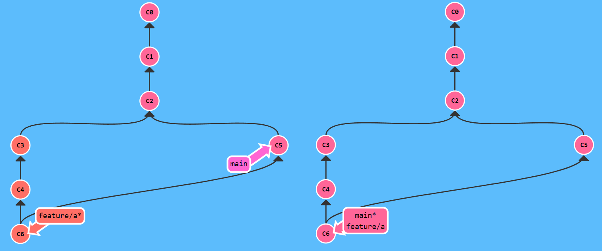
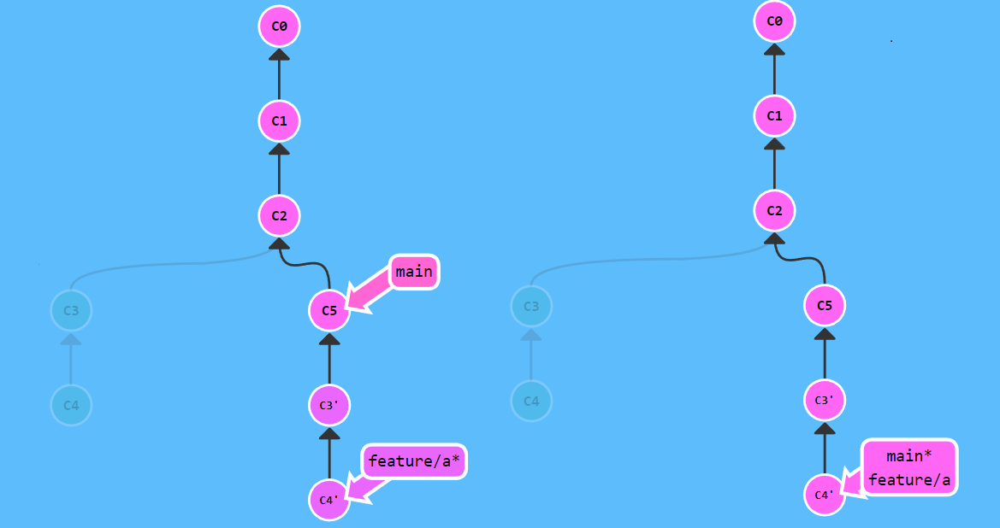
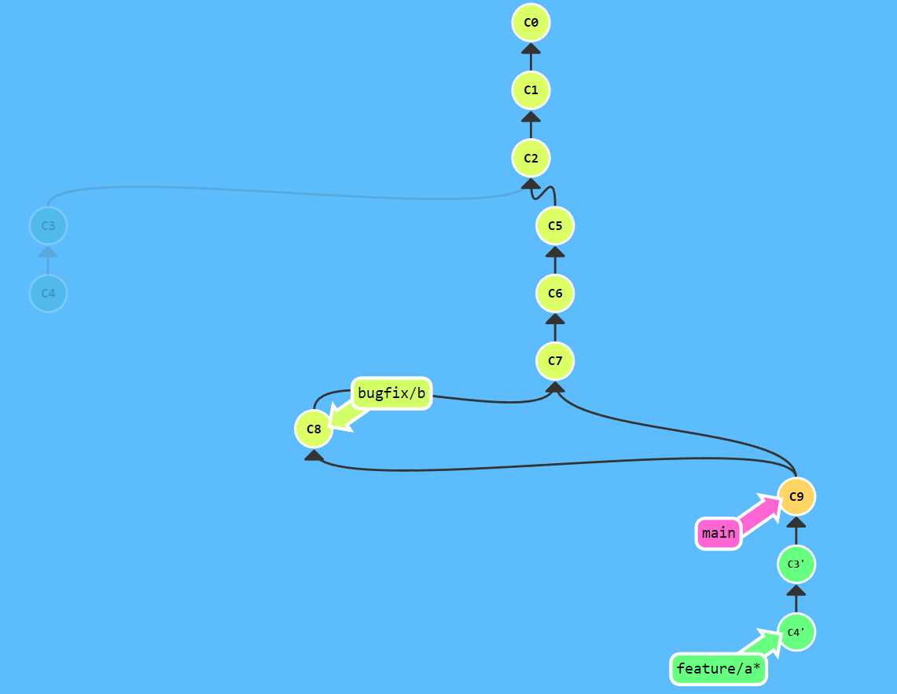

> [图解Git分支和命令](https://mp.weixin.qq.com/s/G-X9hj7TR-CfZyvSBi27-w)
>
> [Learn Git Branching](https://learngitbranching.js.org/?locale=zh_CN)

## 主分支

在 Git 中新建一个项目后，默认有一个分支，即主分支。主分支一般表示项目的稳定版本，主分支应该包含稳定没有 Bug 的代码，并保持随时可以发布的状态，对于小型项目来说，只有一个主分支就够用了，每次我们提交都会创建一个`commit`节点。

```bash
$ git commit -m "C0"
$ git commit -m "C1"
$ git commit -m "C2"
```

上面的命令会创建三个`commit`节点，此时`main`分支如下图所示：



主分支上应该只包合并提交，所有的迭代应该都在分支上进行，如果是简单的改动，直接在主分支修改也是可以的；

如果功能较复杂，且需要多次提交，不建议在主分支直接修改。

## 功能分支

当有新的功能要开发时，应该新建一个功能分支，命令如下：

```bash
$ git checkout -b feature/a
```

接下来在分支上创建两个提交，命令如下：

```bash
$ git commit -m "C3"
$ git commit -m "C4"
```

此时提交树如下图所示：



当功能分支开发完成后，需要合并回主分支，合并回主分支有两种选择，快速合并和非快速合并，二者的区别在于是否创建提交节点，命令如下：

```bash
$ git merge feature/a 			# 快速合并
$ git merge --no-ff feature/a 	# 非快速合并
```

> 合并分支前，需要将`HEAD`切换到`main`分支；

快速合并的结果，会直接将 `master` 指向了 `feature/a`，如下图所示：



非快速合并的结果，会在 `main` 分支**创建合并提交节点**，如下图所示：

> 此时我们需要撤销上一次快速合并，可以使用命令：`git reset --hard C2`



两种合并方式都可以，如果选择快速合并，需要保证每个提交都是独立且完整的，如果不满足要求，Git 支持修改提交历史，需要修改后再次合并。

修改历史可以使用 `rebase` 命令，下面的命令可以修改最近四个提交，将第二个提交的 pick 改为 `squash`，可以合并第一个和第二个提交，将第三个提交的 pick 改为 `edit`，可以修改第三个提交的提交信息。

```bash
$ git rebase -i HEAD~3

# Commands:
# p, pick <commit> = use commit
# r, reword <commit> = use commit, but edit the commit message
# e, edit <commit> = use commit, but stop for amending
# s, squash <commit> = use commit, but meld into previous commit
# f, fixup <commit> = like "squash", but discard this commit's log message
# x, exec <command> = run command (the rest of the line) using shell
# b, break = stop here (continue rebase later with 'git rebase --continue')
# d, drop <commit> = remove commit
```

---

在创建当前分支之后，主分支可能又有新的提交，如下图所示：



在合并之前，建议先将主分支新的提交合并到当前分支，有两种策略可以选择，合并和变基，合并操作更简单，变基操作提交树更清晰，建议使用变基的方式。

先来看下合并操作的过程，命令如下：

```bash
$ git checkout feature/a	# 先切到 feature/a 分支
$ git merge main			# 左图
$ git checkout main
$ git merge feature/a		# 右图
```

合并操作过程的提交树如下图所示：



变基会修改`feature/a`分支的历史，就像 `feature/a` 是在 `master` 之后开发的一样，变基命令如下：

```bash
$ git rebase main		# 左图
$ git checkout main
$ git merge feature/a	# 右图
```

变基操作后的提交树如下图所示，暗色的提交是`feature/a`变基之前的状态，在变基后，暗色的提交不再有分支指向，但并不会删除，而是变成 Git 中的游离节点，在 Git 执行 GC（垃圾清理）操作后，节点才会彻底删除。



## 故障分支

如果发现存在 Bug，要尽快修复，此时可以基于主分支新建故障分支，命令如下：

```bash
$ git checkout -b bugfix/b
```

当验证没问题后，故障分支需要合并回主分支，并在主分支上发布新的补丁版本，命令如下：

```bash
$ git checkout main
$ git merge --no-ff bugfix/b  # 测试 构建 打标签 发布到npm
```

主分支更新后，下游的公共分支要及时同步变更，建议**使用变基进行同步**，命令如下：

```bash
$ git checkout feature/a
$ git rebase main
```

故障分支模型如下图所示，`bugfix/b` 分支合并到 `main` 后，`feature/a` 分支进行了变基操作。



## 标签与历史

每次发布新版本时都要打标签，版本号需要符合语义化版本规范，一般功能分支发布次版本号，故障分支发布修订版本号，使用 Git 添加 tag 的命令如下所示：

```bash
# 假设当前版本是 1.1.0
$ git tag 1.1.1 # 修改次版本号
$ git tag 1.2.0 # 修改主版本
```

Git 的版本号，还可以添加 v 前缀，两种风格都可以，建议在一个项目里面保持统一，添加 v 前缀的版本示例如下：

```bash
# 假设当前版本是 v1.1.0
$ git tag v1.1.1 # 修改次版本号
$ git tag v1.2.0 # 修改主版本号
```

出于各种原因，存在需要维护历史版本的需求，对于还有用户使用需求的历史版本，需要提供 bug 修复的支持。

此时创建的标签就起作用了，可以**基于标签新建一个版本分支**，并在版本分支上修复 bug，且发布新的版本，历史版本分支，不需要再次合并回主干分支，创建标签分支的示例如下：

```bash
$ git checkout -b v0.0.x v0.0.1
```

